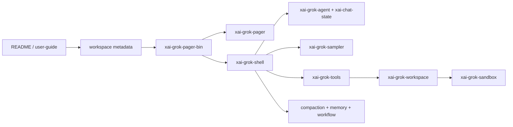

# 01 仓库结构与源码地图

我会把 Grok Build 先看成“一个产品闭包”，再看成“一个 Rust workspace”。前者帮助理解运行时，后者帮助定位源码。两张图缺一不可。

本文按 [公开仓库 `ed6d543`](https://github.com/xai-org/grok-build/commit/ed6d543643628663873c5de28298e022ed634238) 记录；仓库的 `SOURCE_REV` 是内部 monorepo 同步点，不能和公开仓库提交混为一谈。

## 根目录的几层意思

| 目录 | 对初学者最重要的含义 |
| --- | --- |
| `crates/codegen/` | 面向 Grok Build 产品的主要 crate，入口和绝大多数业务都在这里 |
| `crates/common/` | 可以被多个产品 crate 复用的协议、runtime 和基础库 |
| `crates/build/` | 构建期代码，例如 proto codegen |
| `prod/mc/` | 产品侧共享类型或服务闭包中的 crate |
| `third_party/` | vendored 第三方源码，例如 Mermaid 图栈，不要和一方业务实现混读 |
| `bin/` | 由 DotSlash 管理的 hermetic 工具，README 特别提到 `protoc` |
| `crates/codegen/xai-grok-pager/docs/user-guide/` | 面向用户的 24 篇使用文档，是功能入口，不等于实现分层 |

根 `Cargo.toml` 是生成文件，适合查 workspace 成员和依赖闭包，不应把它当成普通手写配置。真正要改或细读某个包时，进入该包自己的 `Cargo.toml` 和 `src/lib.rs`。

## 81 个 package 应该怎样分组

我不把每一个 leaf crate 都写成一章，而是用下面的清单确保它们没有悄悄消失：

| 组 | 代表 package | 阅读目的 |
| --- | --- | --- |
| 入口与 UI | `xai-grok-pager-bin`、`xai-grok-pager`、`xai-grok-pager-render`、`xai-grok-pager-minimal` | 启动、TUI、渲染、minimal 模式 |
| Agent 与会话 | `xai-grok-agent`、`xai-chat-state`、`xai-grok-shell`、`xai-agent-lifecycle` | prompt、session、turn、ACP 接线 |
| 模型 | `xai-grok-sampler`、`xai-grok-sampling-types`、`xai-grok-models`、`xai-grok-http` | request、stream、model catalog、HTTP |
| 工具 | `xai-grok-tools`、`xai-grok-tools-api`、`xai-tool-runtime`、`xai-tool-protocol`、`xai-tool-types` | 工具定义、分发、协议和结果 |
| 主机与安全 | `xai-grok-workspace`、`xai-grok-workspace-client`、`xai-grok-workspace-types`、`xai-grok-sandbox`、`xai-grok-secrets` | 文件、命令、VCS、sandbox、凭据 |
| 长任务能力 | `xai-grok-compaction`、`xai-grok-memory`、`xai-workflow`、`xai-grok-subagent-resolution` | 压缩、记忆、工作流和子 agent |
| 扩展与产品服务 | `xai-grok-mcp`、`xai-grok-hooks`、`xai-hooks-plugins-types`、`xai-grok-plugin-marketplace`、`xai-grok-update` | MCP、hooks、插件、更新 |
| 诊断与基础设施 | `xai-grok-config`、`xai-grok-config-types`、`xai-grok-auth`、`xai-grok-telemetry`、`xai-crash-handler`、`xai-tracing` | 配置、认证、遥测、崩溃和 trace |
| 支撑 leaf | `xai-file-utils`、`xai-fsnotify`、`xai-gix-status`、`xai-fast-worktree`、`xai-token-estimation`、`xai-ratatui-inline` 等 | 只在主路径需要时下钻 |

<details>
<summary>当前快照的 workspace package 名单</summary>

下面这份名单是用 `cargo metadata --no-deps` 生成的，作用是防止我把没有展开的 crate 误写成“仓库里没有”。它不是建议的阅读顺序。

```text
dagre_rust
graphlib_rust
mermaid-to-svg
ordered_hashmap
prod-mc-cli-chat-proxy-types
ptyctl
ptyctl-cli
xai-acp-lib
xai-agent-lifecycle
xai-chat-state
xai-circuit-breaker
xai-codebase-graph
xai-computer-hub-core
xai-computer-hub-mcp-adapter
xai-computer-hub-sdk
xai-crash-handler
xai-fast-worktree
xai-file-utils
xai-fsnotify
xai-gix-status
xai-grok-agent
xai-grok-announcements
xai-grok-auth
xai-grok-compaction
xai-grok-config
xai-grok-config-types
xai-grok-env
xai-grok-extra-ca
xai-grok-hooks
xai-grok-http
xai-grok-markdown
xai-grok-markdown-core
xai-grok-mcp
xai-grok-memory
xai-grok-mermaid
xai-grok-models
xai-grok-pager
xai-grok-pager-bin
xai-grok-pager-minimal
xai-grok-pager-pty-harness
xai-grok-pager-render
xai-grok-paths
xai-grok-plugin-marketplace
xai-grok-sampler
xai-grok-sampling-types
xai-grok-sandbox
xai-grok-secrets
xai-grok-shared
xai-grok-shell
xai-grok-shell-base
xai-grok-shell-session-support
xai-grok-subagent-resolution
xai-grok-telemetry
xai-grok-test-support
xai-grok-tools
xai-grok-tools-api
xai-grok-update
xai-grok-version
xai-grok-voice
xai-grok-workspace
xai-grok-workspace-client
xai-grok-workspace-types
xai-hooks-plugins-types
xai-hunk-tracker
xai-interjection-core
xai-mixpanel
xai-prompt-queue
xai-proto-build
xai-ratatui-inline
xai-ratatui-textarea
xai-sqlite-journal
xai-system-power
xai-test-utils
xai-token-estimation
xai-tool-protocol
xai-tool-runtime
xai-tool-types
xai-tracing
xai-tracing-macros
xai-tty-utils
xai-workflow
```

</details>

完整 package 名可以用这条命令得到，不需要手工维护一份可能过期的复制品：

```bash
cargo metadata --no-deps --format-version 1 \
  | jq -r '.packages[] | [.name, .manifest_path] | @tsv' \
  | sort
```

## 从哪条路径开始读



这张图表达的是我推荐的阅读顺序，不是 Cargo 的精确依赖方向。比如 `xai-grok-shell` 会同时接触认证、leader、MCP、插件、session 和远端服务，不能把它当成一个只负责“调用 Agent”的薄层。

## 搜索大型仓库的手法

```bash
rg -n "fn main|async_main|run_agent_command" crates/codegen/xai-grok-pager-bin
rg -n "pub (struct|enum|trait)|impl .*Session|SamplerActor" crates/codegen/xai-grok-shell crates/codegen/xai-grok-sampler
rg --files crates/codegen/xai-grok-tools/src/implementations | sort
```

我通常先搜“被调用的名字”，再打开定义；不要从 `lib.rs` 开始一层层读到几百个模块后才问它们干什么。

## 哪些文件暂时不需要读

`third_party`、纯测试支撑、生成协议、平台特定 leaf 和没有出现在主路径的产品集成，不代表不重要，只是暂时不进入主教程。索引里标注它们的存在，到了对应主题再回头。这样“没有展开”与“仓库没有这部分”不会混在一起。

## package、crate、target 不是三个同义词

这是 Rust workspace 最容易把初学者绕晕的地方。一个 `package` 由自己的 `Cargo.toml` 描述，可以包含一个或多个 `crate`；`crate` 是 Rust 编译单元，可能是 library，也可能是 binary；`target` 是 Cargo 要构建的具体产物。`xai-grok-pager-bin` 这个 package 的名字已经提示它主要提供 binary，但它依赖的 library package 才承载了很多运行逻辑。

因此我不会用“有 81 个目录”来概括架构，而会同时问：

- 这个 package 被谁依赖？用 `cargo tree -p <package>` 看运行时边界。
- 它是否只在 build script、test 或 feature 开启时出现？看 `Cargo.toml` 的 `build-dependencies`、`dev-dependencies` 和 `features`。
- 它是否在产品启动路径上？从 `main.rs`、`run`、`Agent`、`Session` 和 tool registry 反向搜调用。
- 它是手写实现、生成代码还是 vendored 代码？这决定我应该读逻辑、读 schema 还是只确认版本。

## 我维护的覆盖清单

| 类别 | 当前处理方式 | 读者应该得到什么 |
| --- | --- | --- |
| 核心运行时 | Agent、ChatState、Session、Sampler、Tools、Workspace | 能沿一次 turn 走通 |
| 产品支撑 | Config、Auth、MCP、Memory、Compaction、Update、Telemetry | 知道主链为什么依赖它们 |
| 构建与生成 | `crates/build`、proto、DotSlash、根 workspace 文件 | 能构建、能识别生成边界 |
| 第三方 vendored | `third_party`、Mermaid 图栈等 | 知道存在和入口，不把它当作一方业务 |
| 平台/测试 leaf | PTY、OS sandbox、test support、platform adapter | 在遇到对应故障时下钻 |

这份清单的意义是“没有展开”也有记录。教程不可能把生成的 protobuf 或第三方图布局算法逐行翻译，但不能因为正文没写，就让读者误以为仓库里不存在这些能力。

## 用 Cargo 验证我的判断

```bash
cargo metadata --no-deps --format-version 1 \
  | jq -r '.packages[] | [.name, .targets[].kind[], .manifest_path] | @tsv' \
  | sort
cargo tree -p xai-grok-pager-bin --depth 2
cargo tree -p xai-grok-sampler --edges normal,build,dev --depth 2
```

第一条命令适合建立“名称—产物—manifest”的地图；第二、三条命令用来观察入口 binary 和模型层的依赖差异。`--no-deps` 只看 workspace 自己的 package，不代表编译时没有外部依赖，这个边界要在笔记里写清楚。

## 大仓库里的阅读节奏

我会来回走三次，而不是一次读完：第一次只找入口和主要状态；第二次追一条成功的 turn；第三次专门追取消、错误、恢复和平台差异。每次都把“已经从源码确认”和“根据命名推测”分开标注。
