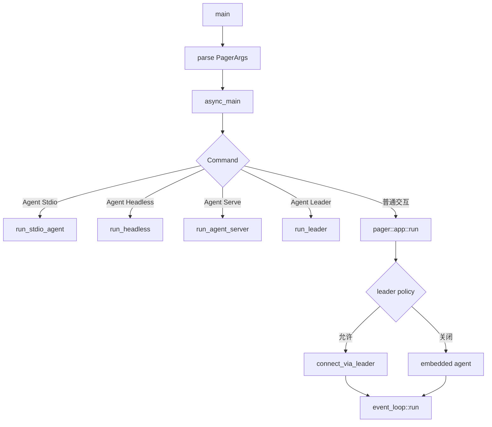

# 04 CLI 入口与启动顺序

大型 CLI 最容易让初学者迷路的地方是：参数解析、环境准备、进程拓扑、session 恢复和 TUI 初始化往往都在启动阶段发生。这里不背参数表，只追 `main` 之后的控制流。

## `main` 到 `async_main`

入口在 [`xai-grok-pager-bin/src/main.rs`](https://github.com/xai-org/grok-build/blob/ed6d543643628663873c5de28298e022ed634238/crates/codegen/xai-grok-pager-bin/src/main.rs)。`main` 负责早期子进程分支、参数解析、version/doctor、requirements 检查、崩溃与 telemetry 初始化，并建立 Tokio runtime。主逻辑进入 `async_main(args)`。

`async_main` 会先应用 cwd、配置、环境变量和 compaction 设置，再处理 completions、wrap、sandbox 等早期命令，最终根据 `Command` 进入 Agent、Inspect、Doctor、Setup、Mcp、Plugin、Models、Workspace、Sessions、Memory、Update、Login、Logout 等路径，或者进入普通 pager TUI。

## 把巨型入口拆成四个问题

打开 `main.rs` 时我会在纸上画四条线：

1. **参数线**：`PagerArgs` 和 `Command` 是什么？哪些 flag 只影响启动，哪些会进入 session？
2. **环境线**：cwd、config、auth、sandbox、remote settings 的顺序是什么？
3. **连接线**：当前进程内 Agent、leader、stdio 或 websocket 在哪里选择？
4. **收尾线**：终端恢复、active session、上传队列、退出码和更新重启谁负责？

如果一次把所有 helper 展开，入口会显得不可读；按这四条线各自追一遍，结构会清楚很多。

## Agent 命令和普通 TUI 的分叉

`app/cli.rs` 中的 `AgentCmd` 目前包括 `Stdio`、`Headless`、`Serve` 和 `Leader`。普通无管理命令时，程序会进入 `xai_grok_pager::app::run`；headless prompt 则会进入 `headless::run_single_turn` 一类路径。



leader 不是 Agent 本身的必要条件。TUI 会综合 `--leader`、`--no-leader`、配置、chat mode 和 requested sandbox profile 计算策略；leader 连接失败时，代码还有 bounded embedded fallback。这是一个部署拓扑选择，而不是模型能力选择。

## 启动顺序为什么重要

在 pager `run` 里，配置加载、认证刷新、模型/设置预取、session startup intent、screen mode、terminal writer、Agent connection 和 event loop 有先后关系。比如先确定是否允许 leader，再创建连接；先决定 fullscreen/minimal，再初始化终端；退出时必须先停止事件循环，再恢复终端。

启动顺序就是用户体验和安全行为的一部分。把认证放到错误的位置可能导致空白 TUI，把 sandbox 判断放晚可能让不该存在的子进程先启动，把 terminal restore 放在错误分支则会把 shell 留在异常状态。

## 小白的跟读方式

```bash
rg -n "fn main|async_main|run_agent_command|Command::|AgentCmd" \
  crates/codegen/xai-grok-pager-bin/src/main.rs \
  crates/codegen/xai-grok-pager/src/app/cli.rs
```

每搜到一个函数，先记录输入、输出和它调用的下一个边界；不要把函数体逐行抄进笔记。等第 06 章读运行模式时，再回到这里补进程图。

## `main` 里为什么会有很多“还没进入 Agent”的逻辑

入口文件通常同时负责产品壳和 Agent 启动。当前 binary 入口还会处理 early child process、版本/doctor、requirements、crash handler、telemetry、更新策略，以及 `headless`、`agent stdio`、`serve`、leader 管理等分支。它们不都属于一次普通对话，但它们决定普通对话能否安全开始。

阅读 [`xai-grok-pager-bin/src/main.rs`](https://github.com/xai-org/grok-build/blob/ed6d543643628663873c5de28298e022ed634238/crates/codegen/xai-grok-pager-bin/src/main.rs) 时，我会先把函数分成三类：

- **早退命令**：`--help`、`--version`、doctor 或管理命令，做完就退出。
- **进程角色命令**：运行 pager、leader、stdio agent 或 server，决定当前进程服务谁。
- **产品启动准备**：配置、认证、更新、遥测、workspace 和连接策略，给后面的 runtime 提供输入。

这能解释为什么“入口很长”不等于 Agent loop 很长。入口在做的是选择和装配；真正的 turn 还要经过 session、ChatState、sampler 和 tool runtime。

## 参数解析不是结束，它只是建立 startup intent

命令行结构把用户表达转换成 `PagerArgs`、`AgentCmd`、`HeadlessArgs`、`LeaderTargetArgs` 等类型。后续代码还会把 CLI、环境变量、配置文件和当前 workspace 合成有效配置。一个没有显式指定的字段，可能继续继承环境或文件层；一个显式指定的字段，通常才覆盖默认值。

所以追一个参数时要记两件事：它在哪个 struct 里出现，以及它在哪个函数被“应用”到 config 或 session。只看 `clap` 定义，会把“用户可以写”误读成“运行时一定使用”。

## 启动失败的时间点会改变用户体验

| 失败时间 | 用户可能看到的现象 | 阅读方向 |
| --- | --- | --- |
| 参数解析前后 | 立即打印 usage/error | CLI 类型和 early return |
| 配置/认证阶段 | TUI 还没出现，错误在 stderr | config/auth 与 exit code |
| terminal 初始化后 | 屏幕空白或 ANSI 残留 | `restore_terminal`、panic hook |
| session 连接后 | UI 已有，但 Agent 不 ready | ACP、leader、session startup |
| turn 运行中 | 需要保留历史和恢复输入 | cancellation、completion、flush |

这个时间线是排障时很有用的索引。看到“终端没有恢复”时，不要先去查模型；看到“headless 输出被 JSON 解析失败”时，先检查 tracing 是否把内容写进 stdout。
