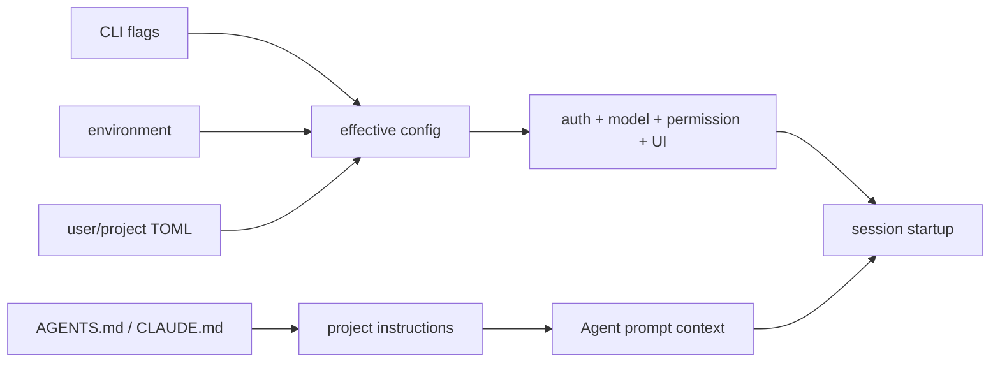

# 05 配置、认证、模型与项目规则

用户第一次运行一个 Agent，最先遇到的不是 Agent loop，而是“它用哪个模型、凭什么访问模型、当前目录的规则从哪来”。这些信息如果没有分层，读者很容易把配置、认证和 system prompt 混成一件事。

## 四种输入来源

| 来源 | 影响什么 | 例子 |
| --- | --- | --- |
| CLI flags | 当前进程的明确覆盖 | `--model`、`--cwd`、`--yolo`、`-p` |
| 环境变量 | 启动环境或外部凭据 | `XAI_API_KEY`、`GROK_MEMORY` |
| 用户/项目配置 | 默认行为和工具策略 | `config.toml`、`pager.toml` |
| 项目规则 | 告诉 Agent 如何修改当前代码库 | `AGENTS.md`、兼容的 `CLAUDE.md` |

官方用户指南把 configuration、authentication、project rules 分成不同文档，这个区分也对应源码里的不同模块。配置决定“程序怎么运行”，认证决定“能不能调用服务”，项目规则决定“模型被告知怎样工作”。

## 配置从哪里读

可以从这些入口开始：

- [`xai-grok-shell/src/config`](https://github.com/xai-org/grok-build/tree/ed6d543643628663873c5de28298e022ed634238/crates/codegen/xai-grok-shell/src/config)：有效配置、watcher、reload 和测试。
- [`xai-grok-config`](https://github.com/xai-org/grok-build/tree/ed6d543643628663873c5de28298e022ed634238/crates/codegen/xai-grok-config)：配置解析和产品配置边界。
- [`xai-grok-config-types`](https://github.com/xai-org/grok-build/tree/ed6d543643628663873c5de28298e022ed634238/crates/codegen/xai-grok-config-types)：配置类型。
- [`xai-grok-paths`](https://github.com/xai-org/grok-build/tree/ed6d543643628663873c5de28298e022ed634238/crates/codegen/xai-grok-paths)：`.grok` 相关路径。

配置 watcher 的存在说明：有些 UI 配置和工具能力不是只在进程启动时读取一次。看到 reload 命令时，要继续查它怎样通知 session、tool bridge 和 TUI，而不是只记录一个 TOML 字段名。

## 认证不是模型选择

认证模块在 [`xai-grok-shell/src/auth`](https://github.com/xai-org/grok-build/tree/ed6d543643628663873c5de28298e022ed634238/crates/codegen/xai-grok-shell/src/auth)，可以看到 credential provider、JWT、device code、external auth、refresh、storage 和 single-flight 等路径。它们解决的是凭据获得、保存、刷新和并发请求，不负责决定 Agent 应该看到哪些工具。

模型和远端模型目录可以从 [`xai-grok-models`](https://github.com/xai-org/grok-build/tree/ed6d543643628663873c5de28298e022ed634238/crates/codegen/xai-grok-models) 以及 shell 的 `agent/models.rs` 开始。模型选择会进入 request config、usage 和 session metadata，但仍要经过 sampler 才会真正发出网络请求。

## `AGENTS.md` 在哪一层

用户指南给出的规则路径是全局、仓库根目录和当前目录，越深的目录优先级越高，另兼容 `CLAUDE.md`。我把它理解成“项目上下文输入”，而不是 Rust 编译配置。

阅读源码时要问：

- 规则在哪里发现？
- 发现后是直接拼进 system prompt，还是变成 reminder/resource？
- 规则变化时，当前 session 是立即重建 Agent，还是只影响下一轮？
- 外部 client 或 headless 模式是否共享同一规则发现逻辑？

这些答案应以 `xai-grok-shell` 的 folder trust、skills、prompt 和 session agent rebuild 代码为准。

## 一次配置决策的简化图



这张图故意把“配置”和“项目规则”画成两个输入，避免把所有外部文本都叫配置。

## 安全的本地实验

不要把真实 token 写进笔记或测试。可以只运行：

```bash
cargo test -p xai-grok-config
rg -n "load_effective_config|try_ensure_fresh_auth|AGENTS.md|CLAUDE.md|SetSessionModel" \
  crates/codegen/xai-grok-shell crates/codegen/xai-grok-config
```

实验目标是画出优先级和生命周期，不需要调用真实模型。

## 有效配置是怎么形成的

我会把配置想成一组带来源的 patch，而不是一个从磁盘读出的 TOML：

```text
默认值
  -> 用户配置
  -> 项目配置 / managed configuration
  -> 环境变量
  -> CLI 显式覆盖
  -> requirements / policy 约束
  -> 有效配置
```

这不是说所有字段都严格按同一顺序合并。某些敏感字段只能从受信磁盘层读取，某些 managed 配置可以限制用户选项，某些 CLI 选项只影响当前运行。真正的判断要回到 `load_effective_config` 附近的合并代码和测试。

读配置测试时，不要只看“期望值是多少”，还要看测试在清理哪些环境变量、创建哪些临时目录，以及它把哪一层标成 trusted。配置优先级和信任边界经常是一件事的两面。

## 认证解决“能不能访问”，不解决“能做什么”

`xai-grok-shell/src/auth` 里可以看到 credential provider、device code、JWT、refresh、storage 和 single-flight。它们要回答的是：凭据从哪里来、是否过期、并发请求能不能共享一次刷新、失败时是否需要重新登录。

工具权限是另一条链。即便认证成功，Agent 仍可能被 permission rule 拒绝写文件；即便 permission allow，sandbox 仍可能限制子进程。把三者画成独立输入，比把“登录成功”当成“程序拥有全部能力”更准确。

## AGENTS.md 不是普通配置项

项目规则通常会影响 system prompt、工作目录说明、工具使用约束和某些扩展发现。它还可能有目录层级和信任条件，因此读它时要追：

- 从哪个目录开始发现？父目录规则和子目录规则如何叠加？
- 内容以 system prompt、user message、tool context 还是 metadata 进入模型？
- 文件变化后是否 watcher reload？正在运行的 turn 用旧规则还是新规则？
- 文件读取失败、解析失败或项目不可信时，Agent 是忽略、提示还是拒绝启动？

这些问题比记住“支持 AGENTS.md”更有用，也会自然连接到第 08 章的 PromptContext 和第 21 章的 skills/plugins。

## 模型选择至少有三个消费者

当前配置里的默认模型、web/search 模型、summary/image 模型和 task/subagent 模型可能不是同一个值。模型名会进入 request config，也会影响 token window、tool capability、usage 记录和 compaction 预算。追模型时，沿着“配置值 → Agent definition → sampler request → usage”走，不要只找一个 `model` 字符串。
