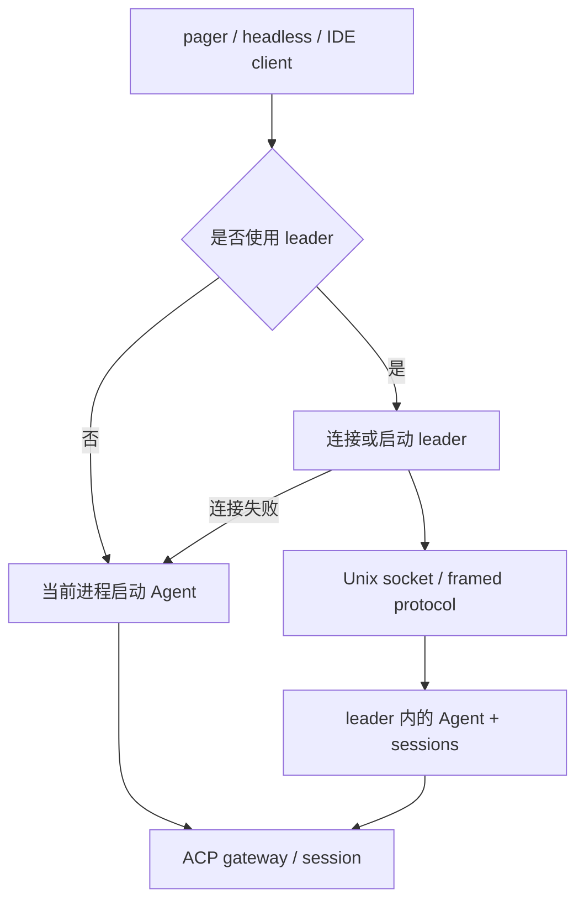

# 06 运行模式与进程拓扑

同一个 `grok` 命令可以服务人、脚本、IDE 和另一个本地进程。理解运行模式之后，很多“为什么有两种连接”“为什么 session 不在当前进程”的问题会自然消失。

## 五种常见入口

| 模式 | 主要入口 | 适合什么 |
| --- | --- | --- |
| 交互式 TUI | 普通 `grok`，pager `app::run` | 人在终端里边看边操作 |
| headless | `grok -p` / `AgentCmd::Headless` | 脚本、CI、一次性任务 |
| stdio ACP | `grok agent stdio` | IDE 或外部 client 通过 stdin/stdout 接入 |
| serve | `grok agent serve` | 以服务形式提供 agent connection |
| leader | `grok agent leader` 或自动 leader | 多 client 共享常驻 runtime |

headless 又有 plain、json、streaming-json 等输出格式；它不是“把 TUI 隐藏起来”，而是另一种输出和生命周期约束。stdio 更像协议桥，TUI 更像交互客户端。

## embedded 和 leader



leader 失败后的 embedded fallback 不是所有模式都相同，也受 sandbox、chat mode 和 policy 影响。读 `resolve_leader_mode` 时，先记录它的输入和禁用原因，再看连接函数；不要看到 `connect_or_spawn` 就认为任何情况下都会有一个后台 leader。

## `grok -p` 为什么适合教学

headless 模式能减少终端状态的噪音。先用 `--output-format json` 看一轮的 `text`、`stopReason`、`sessionId`、`requestId`，再看 `streaming-json` 的事件序列，能把 session、turn 和 tool event 的关系暴露出来。

但 headless 不等于无权限。用户指南明确说明自动化场景通常需要明确 permission mode；如果工具被阻止，错误也会返回给模型或调用方。不要在 CI 里把“非交互”理解成“天然安全”。

## `agent stdio` 的标准输入输出

[`xai-grok-shell/src/agent/app.rs`](https://github.com/xai-org/grok-build/blob/ed6d543643628663873c5de28298e022ed634238/crates/codegen/xai-grok-shell/src/agent/app.rs) 里可以看到 stdio agent 会把 stdin line reader、内部 skill reload message、ACP connection、父进程死亡检测和清理逻辑接到一起。这里的难点是：stdout 可能是机器可读协议，诊断日志不能随意混入 stdout。

这也是为什么源码里有 stdout compatibility writer、独立 stdin thread 和 LocalSet。它们不是多余的封装，而是在保护协议字节流不被 UI 或日志污染。

## 四种运行方式要分别看 I/O

我会用“谁提供输入、谁观察输出、谁拥有 Agent”来区分运行方式：

| 方式 | 输入 | 输出 | Agent 在哪里 |
| --- | --- | --- | --- |
| TUI | 键盘、paste、slash command | 终端绘制、通知、状态栏 | 当前 pager 进程或 leader |
| headless/print | 参数、stdin 或调用方 | 文本、JSON、退出码 | 当前进程的 session |
| stdio agent | ACP/JSON-RPC stdin | ACP/JSON-RPC stdout | stdio agent 进程 |
| serve | WebSocket/服务请求 | 网络响应、控制事件 | server 管理的 runtime |

它们可能复用 Agent、session 和 tool runtime，但不能把输出层当成同一层。TUI 可以把一条模型 delta 合并成多个 UI block；headless 可能要求一行机器可读 JSON；stdio 甚至不能在 stdout 打一条调试日志。

## embedded、leader 和 client 的区别

`embedded` 表示当前 client 直接在本进程创建 Agent runtime；`leader` 表示一个常驻进程拥有 runtime，多个 client 通过 IPC 复用；`client` 只描述连接的一端，不等于“轻量版 Agent”。leader 还需要处理 registration、ready、capability、idle、disconnect 和 relaunch。

画进程图时，至少标出：

```text
pager process --(ACP / leader protocol)--> leader process
     |                                           |
     |                                           +--> session actor
     |                                           +--> sampler / tools
     +--> embedded session (fallback or direct)
```

图中“ACP / leader protocol”是两个可能叠加的边界，不要画成一次 HTTP 模型请求。真正的模型请求从 session 到 sampler，再到远端 endpoint；leader 只负责复用本地 runtime。

## headless 的退出语义值得单独记录

自动化脚本关心的不只是文字，还关心 stdout 是否干净、stderr 是否有日志、非零退出码代表哪种失败、工具拒绝是否写入 JSON，以及取消时是否等待 session flush。用户指南中的 headless 选项只是入口，实际语义要看 `run_headless`、output format 和 completion 转换。

做 CI 集成时，我会先把 stdout/stderr/exit code 分别捕获，再决定怎样解析。不要用“屏幕上看起来有回答”判断命令成功，也不要把 stderr 中的 warning 当成模型输出。

## 父进程死亡不是普通取消

stdio agent 和 leader 可能监测 parent death。父进程消失时，子进程需要关闭协议、停止 session、清理 terminal/IPC 资源，避免后台 Agent 继续占用 token 或 workspace。它和用户按 Esc 的取消不同：一个是客户端生命周期结束，一个是当前动作结束。

## 练习：画三张拓扑图

分别画：

1. TUI + embedded agent；
2. TUI + leader + Unix socket；
3. headless/stdio + ACP + session。

每条箭头标明传的是 prompt、ACP payload、tool event 还是 terminal output。画完后再读第 07 章，检查“连接”有没有被你错误地画成“模型调用”。
