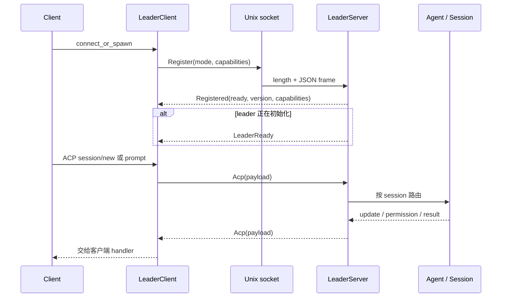

# 07 ACP 与 leader 协议

ACP 和 leader 经常同时出现，但它们解决的问题不同：ACP 描述 Agent 和客户端怎样交互，leader 描述本地多个客户端怎样找到并复用一个 Agent runtime。把两者混为一个“通信协议”，后面会很难理解 session routing 和 reconnect。

## ACP 是面向 Agent 的消息边界

在 [`xai-grok-shell/src/agent/app.rs`](https://github.com/xai-org/grok-build/blob/ed6d543643628663873c5de28298e022ed634238/crates/codegen/xai-grok-shell/src/agent/app.rs) 里，Agent 会创建 `xai_acp_lib::AgentSideConnection`，把 incoming/outgoing 和 gateway 接到 runtime。pager 的 [`app/acp_handler`](https://github.com/xai-org/grok-build/tree/ed6d543643628663873c5de28298e022ed634238/crates/codegen/xai-grok-pager/src/app/acp_handler) 再按 session、permission、background、follow-up、MCP 和 notification 分路由。

从客户端角度，ACP 关心的不是“模型用了哪个 HTTP endpoint”，而是：如何 initialize、new/load session、prompt、接收 session update、询问权限、创建 terminal、报告工具进度。

## leader 是本地进程协调器

leader 在 [`xai-grok-shell/src/leader`](https://github.com/xai-org/grok-build/tree/ed6d543643628663873c5de28298e022ed634238/crates/codegen/xai-grok-shell/src/leader)：

- lock 文件和 socket 路径帮助 client 发现目标；
- `LeaderClient` 负责连接、注册、keepalive、ACP 转发和 reconnect；
- `LeaderServer` 管理多个 client、session ownership、控制命令和关闭；
- `ClientCapabilities` 声明 yolo、model、terminal、filesystem 等能力；
- `LeaderCapabilities` 声明 control、workspace、relaunch 等服务端能力。

客户端和 leader 可能是不同版本，所以新字段使用 serde default，能力通过 capability 协商。`RelaunchForUpdate` 还允许新 client 判断旧 leader 是否支持平滑更新。

## leader frame 怎样处理字节流

[`leader/protocol.rs`](https://github.com/xai-org/grok-build/blob/ed6d543643628663873c5de28298e022ed634238/crates/codegen/xai-grok-shell/src/leader/protocol.rs) 的 frame 是：4 字节 big-endian 长度 + JSON payload，单条消息上限 64 MB。接收端可能收到半个 frame、一个 frame 或多个 frame，因此不能拿一次 `read` 当成一条消息。

这和 ACP 的 JSON-RPC 消息本身是两个层次：leader frame 解决 socket 上的消息边界，payload 里再放注册、ACP、控制或 ping 消息。



## 为什么要有 ready 和 disconnect reason

client 注册成功不代表 leader 已经完成 auth、model prefetch 和 runtime 初始化。`ready=false` 时，client 等 `LeaderReady`，避免第一条 initialize 过早到达。

断开也分 planned shutdown、connection lost 和 client initiated。自动更新触发 `ShuttingDown { AutoUpdate }` 时，client 可以预先准备 reconnect；普通连接丢失则要走不同的恢复策略。

## ACP 和 leader frame 各自负责什么

我会把协议分成三层来读：

1. **ACP 方法层**：initialize、session/new、prompt、tool/permission、session/update 等 Agent 客户端语义。
2. **leader 控制层**：register、ready、capability、shutdown、get info、relaunch 和 session 路由。
3. **传输层**：Unix socket 或其他本地连接上的 length-prefixed JSON frame，以及连接关闭/半包处理。

这样看，ACP payload 可以被 leader 搬运，但它不因此变成 leader 的业务类型。排查“模型不响应”时，要先确认 frame 到达，再确认 ACP handler 路由，接着看 session command 是否创建，不能只在 TUI 里猜。

## 一个 frame 为什么不能直接 `read_to_end`

leader frame 以 4 字节 big-endian 长度开头。网络/IPC 的一次 `read` 可能拿到半个长度、完整的一条或多条 frame；接收器需要维护 buffer，先读够 header，再读够 payload，检查上限，再反序列化 JSON。

```text
buffer += read()
while buffer contains a complete frame:
    length = parse_u32_be(buffer[0..4])
    reject if length > MAX_FRAME
    wait until 4 + length bytes exist
    payload = take(buffer[4..4+length])
    route(deserialize(payload))
```

这是解释“偶发协议错误”的关键。一个只在大输出、慢 socket 或多个通知连续发送时出错的问题，往往不是 JSON schema 本身，而是 frame 边界和 backpressure。

## handshake 是一组状态，不是一条请求

典型路径可以拆为：发现/连接 → 注册 client → 协商 capabilities → 等待 leader ready → 创建或恢复 session → 接收 update。每一步都可能失败，且失败后的动作不同：没有 leader 可以 spawn，registration 不兼容要拒绝，未 ready 要等待，session 恢复失败可能要新建或明确返回错误。

读 handler 时我会记录一张状态表：

| 状态 | 允许的消息 | 不能做什么 |
| --- | --- | --- |
| connecting | frame/transport 层消息 | 假设 session 已可用 |
| registered | ready、capability、控制回复 | 立即发送依赖 runtime 的 prompt |
| ready | session/ACP 请求 | 忽略 client capability |
| shutting down | flush、disconnect、relaunch | 接受新的长任务 |

如果源码没有显式 enum，而是几个 bool、watch state 和 handler 分支组合出来的，也要在笔记里还原出这张状态表。

## 通过日志定位协议层

协议问题不应只打印完整 prompt 或 credential。更安全的调试信息是 request id、session id 的短 hash、method 名、payload 长度、capability 名和状态转换。要区分“没有收到”“收到但没有路由”“路由了但 session 忙”“session 返回错误”这四类情况。

## 读协议代码的练习

找出下面四个对象，并写出它们出现的时机：

```bash
rg -n "Register|Registered|LeaderReady|Acp|ShuttingDown|RelaunchForUpdate" \
  crates/codegen/xai-grok-shell/src/leader
```

再回答：如果客户端支持 `fs_read` 但不支持 `fs_write`，这个能力在哪个结构里声明，leader 怎样把它注入到 `session/new`？如果找不到完整路径，就把问题记录下来，不用凭命名猜。
