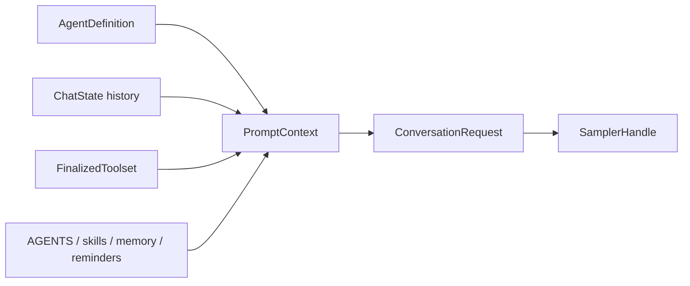

# 08 Agent 定义、系统提示词与工具环境

“Agent”在项目里不是一个单独的 while 循环。它既可能指一组模型和工具配置，也可能指运行中的 session agent。要避免混淆，先看 `xai-grok-agent` 暴露的类型，再追它怎样被 shell/session 使用。

## `xai-grok-agent` 的公开边界

[`xai-grok-agent/src/lib.rs`](https://github.com/xai-org/grok-build/blob/ed6d543643628663873c5de28298e022ed634238/crates/codegen/xai-grok-agent/src/lib.rs) 暴露了 `Agent`、`AgentBuilder`、`AgentDefinition`、`PromptContext`、`CompactionPolicy` 和 `ReminderPolicy`。从这些类型可以先得到一个朴素模型：Agent 定义打包了模型配置、系统提示、工具定义、提醒策略和上下文能力，session 再用它构造每一轮 request。

这和“Agent loop”是不同层次：

| 对象 | 更像什么 | 不应该直接推断成什么 |
| --- | --- | --- |
| `AgentDefinition` | 一组可选能力和配置 | 正在运行的会话 |
| `AgentBuilder` | 组装器 | 模型 API client |
| `PromptContext` | 生成 prompt 的输入 | 最终 HTTP body |
| `Agent` | runtime 使用的定义/服务集合 | 单文件循环 |
| `SessionActor` | 处理 prompt 和 turn 的状态机 | 只有静态配置 |

## 系统提示词不是一段常量字符串

一轮 request 的上下文可能由这些部分组成：

- base system prompt；
- 当前 agent profile 或 definition；
- AGENTS.md、skills、plugin 和 workflow 提供的说明；
- 有效工具的 definitions 和限制；
- memory reminder 或 session reminder；
- 当前 cwd、模型、trace 和权限状态；
- 对当前 session/turn 的 `x_grok_*` 元数据。

真正的组装调用可以从 [`session/acp_session_impl/turn.rs`](https://github.com/xai-org/grok-build/blob/ed6d543643628663873c5de28298e022ed634238/crates/codegen/xai-grok-shell/src/session/acp_session_impl/turn.rs) 开始，看 `chat_state_handle.build_request` 前后传入了什么，再回到 [`xai-grok-agent/src/prompt`](https://github.com/xai-org/grok-build/tree/ed6d543643628663873c5de28298e022ed634238/crates/codegen/xai-grok-agent/src/prompt) 看模板和测试。

## 工具环境要晚一点 finalize

[`xai-grok-tools/src/bridge.rs`](https://github.com/xai-org/grok-build/blob/ed6d543643628663873c5de28298e022ed634238/crates/codegen/xai-grok-tools/src/bridge.rs) 中的 `ToolBridge` 会持有 `FinalizedToolset` 和 terminal、filesystem、cwd、session folder、skills、memory、web search、LSP 等资源。工具不是单纯的名字列表，因为同一个 `read_file` 要知道读哪个 workspace、受哪种权限规则约束、输出限制是多少。

可以把 prompt 组装想成一张依赖图：

图中 `PromptContext` 是中间层，不是说所有字段最终都以同样的文本形式出现。某些信息进入 system prompt，某些变成 tool definition，某些变成 request metadata。

## 动态重建发生在哪里

session commands 里有 `SetSessionModel`、`RebuildAgentForDefinition`、`ReloadPlugins`、`RefreshSkillBaseline` 等命令。它们说明 Agent 能力不是永久固定的：模型切换、插件重载和规则刷新可能影响下一轮 request，部分操作还需要重建 prompt/tool state。

读到动态重建时，问三个问题：旧的 `FinalizedToolset` 是否被释放？历史 conversation 是否保留？正在进行的 turn 是否立即中断？只有找到 command handler 和测试，才能回答。

## `AgentDefinition` 更像一份装配说明

我会先把 `AgentDefinition` 当成“怎样创建一次 Agent runtime 的说明书”，而不是把它等同于某一个模型。它可能包含 model、system prompt、tool policy、task model slugs、compaction/reminder policy、context window 和功能开关；`AgentBuilder` 再把这些字段与 workspace、config、discovery 结果合成可运行的 Agent。

这也解释了为什么同一个 session 里会有多个 definition：主 Agent、subagent、专用 web/image/summary 模型或不同 persona 可能共享一部分基础设施，但 toolset、prompt 和预算不同。

## PromptContext 是“原料篮”，不是最终 prompt 字符串

`PromptContext` 里的工作目录、规则文件、skills、memory、插件说明和终端能力，进入模型的方式可能不一样：

| 原料 | 可能的落点 |
| --- | --- |
| 项目规则 | system/user context 或注入段落 |
| skill body | 按发现结果生成 prompt context |
| tool capability | tool schema、instruction 或隐藏元数据 |
| memory | tool 查询、恢复注入、提醒或摘要 |
| workspace | 当前目录说明、工具 resource、权限检查 |

所以不要从一段 prompt 模板是否包含“skills”就判断 skills 没有生效。要沿 discovery、builder、prompt rendering 和 request builder 看它在哪个层次落地。

## 发现顺序就是行为的一部分

规则、skills、plugins 和 AGENTS.md 往往都有发现范围、优先级、覆盖/合并和失败策略。一个文件被找到，不等于它一定进入模型；还可能被 trust、feature、model capability 或重复名校验挡住。

我会给每项发现结果记录四个值：来源路径、优先级、是否启用、最终去向。以后出现“本地明明有 skill 但模型没用”的问题，可以沿这四列缩小范围，而不是重新读整个 Agent builder。

## 重建 Agent 时哪些东西应该保留

模型切换或插件 reload 通常只应该重建定义、prompt 和 tool context；session history、用户选择的 cwd、持久化 session id 和正在等待的客户端不应被无意丢失。相反，正在执行的 tool process、网络 stream 或旧的 sampler task 可能必须取消或隔离。

这个问题最好用测试验证：搜 `RebuildAgentForDefinition`、`SetSessionModel`、`ReloadPlugins` 的调用方，分别记录命令前后的 pointer/handle、history entry、completion 和 event。若只能从类型名推测，就在笔记中标“待确认”。

## 一个必须避免的误读

“memory 在 prompt 里”这句话太粗。当前代码包含 memory tool、初始/恢复注入、flush 和 dream timer 等路径；某个 base prompt 模板没有 memory 段落，也不能证明整个产品没有 memory。第 20 章会把它单独拆开。
