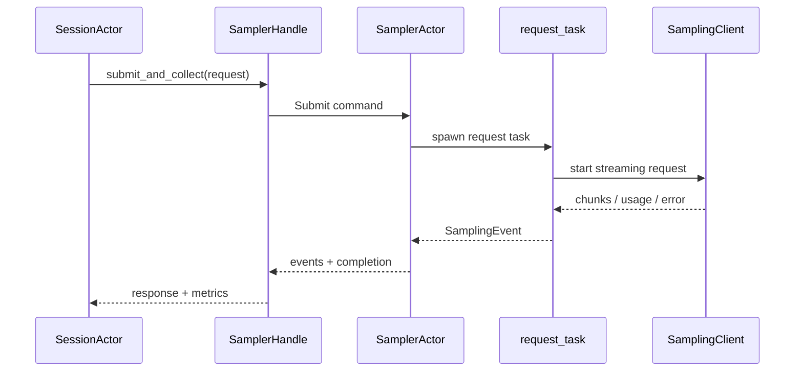

# 10 模型采样层

这一层解决的是“怎样把一份模型无关的 request 变成流式模型响应”。它不应该知道用户正在使用 TUI，也不应该决定一个 tool call 之后 session 是否继续。Grok Build 用三个层次把这些问题拆开：纯数据类型、协议 client、采样 actor。

## 纯数据类型先于网络

[`xai-grok-sampling-types/src/lib.rs`](https://github.com/xai-org/grok-build/blob/ed6d543643628663873c5de28298e022ed634238/crates/codegen/xai-grok-sampling-types/src/lib.rs) 描述 conversation、request、response、streaming 和 error。它不主动做 I/O，适合被 session、sampler 和测试共同依赖。

这样的边界让你可以先回答“模型请求长什么样”，再回答“怎样发出去”。读代码时，如果一个类型 crate 开始创建 HTTP client，说明你可能找错了入口。

## `SamplingClient` 处理协议差异

[`xai-grok-sampler/src/client.rs`](https://github.com/xai-org/grok-build/blob/ed6d543643628663873c5de28298e022ed634238/crates/codegen/xai-grok-sampler/src/client.rs) 支持 Chat Completions、Responses 和 Anthropic Messages 一类 endpoint。它要处理 headers、stream chunk、usage、错误格式和 endpoint metadata。

协议适配的目标不是把每个 API 的所有差异抹掉，而是把 session 真正关心的事件统一出来。比如 token delta、reasoning、tool call、usage、completed 和 error 进入 `SamplingEvent` 后，session 不必为每个后端写一套循环。

## `SamplerHandle` 和 `SamplerActor`

[`handle.rs`](https://github.com/xai-org/grok-build/blob/ed6d543643628663873c5de28298e022ed634238/crates/codegen/xai-grok-sampler/src/handle.rs) 的 `SamplerHandle` 是 cloneable command sender，可提交、取消、更新配置、查询状态和收集结果。真正拥有 active request map、event channel、request task 和 cancellation token 的是 [`actor/mod.rs`](https://github.com/xai-org/grok-build/blob/ed6d543643628663873c5de28298e022ed634238/crates/codegen/xai-grok-sampler/src/actor/mod.rs)。



这套 actor 结构让多个 session 可以共享采样基础设施，同时让单次请求的重试和取消不直接修改 session 的内部状态。

## 重试、空响应和取消

[`request_task.rs`](https://github.com/xai-org/grok-build/blob/ed6d543643628663873c5de28298e022ed634238/crates/codegen/xai-grok-sampler/src/actor/request_task.rs) 里要留意：idle timeout、max retries、doom-loop recovery budget、空响应重试和 cooperative cancellation。它不是无条件重试三次；错误分类和请求状态会决定下一步。

session 侧还有“刷新认证后重提”和“compact 后重提”的分支，见 [`sampler_turn.rs`](https://github.com/xai-org/grok-build/blob/ed6d543643628663873c5de28298e022ed634238/crates/codegen/xai-grok-shell/src/session/acp_session_impl/sampler_turn.rs)。因此，一次 `submit_and_collect` 的失败不一定等于本轮失败，必须看它返回的 outcome。

## token usage 为什么要回写多处

`record_response_token_usage` 会影响 task budget、ChatState token usage、last turn/model call usage 和 session signals。UI 显示的 usage、compaction 阈值和遥测都可能从不同的记录点读取，所以缺失 usage 时会有严格路径把 response 标为 incomplete。

读到 usage 字段时，记录它的三个信息：由谁产生、由谁保存、由谁消费。这样可以避免把 provider 返回的 usage、估算 token 和产品展示数字当作同一个数。

## sampler 的四层拆法

读 `xai-grok-sampler` 时，我会把它拆成四层，而不是把所有网络代码都叫 sampler：

| 层 | 负责什么 | 不负责什么 |
| --- | --- | --- |
| sampling types | request、response、stream、usage、error 的类型 | 发网络请求 |
| client | endpoint、headers、HTTP stream、provider 转换 | 决定 session 是否重试 |
| actor | active request map、并发、重试、取消、事件 | 绘制 TUI |
| handle | 给其他 crate 的异步命令接口 | 直接拥有 request 状态 |

这个分层是很实用的：如果一个 provider 的 JSON 字段不兼容，查 client/adapter；如果取消后还有 request 活着，查 actor/request_task；如果调用方拿不到结果，查 handle 的 responder 和 event channel。

## 流式响应是一台小状态机

一次 response 可能经历：连接建立、首个 chunk、文本 delta、tool call delta、usage、finish、close。任意阶段都可能遇到 timeout、空响应、认证过期、网络断开或用户取消。

```text
Created -> Connecting -> Streaming
                         |       |
                         |       +--> ToolCallAccumulating
                         |                    |
                         +--> RetryableError |
                         +--> Cancelled      |
                                              v
                                        Completed / Failed
```

“收到过文本”不代表“可以当作成功完成”。session 需要知道 finish reason、是否有完整 tool call、usage 是否可信，以及重试会不会重复一部分内容。读 `request_task.rs` 时，把每个返回分支都对应到这台状态机。

## 重试必须和幂等性一起看

模型请求本身通常可以重新发送，但工具调用或已经写入历史的 assistant message 可能不能无条件重复。Grok Build 的请求 task 还可能区分 idle timeout、max retries、doom-loop recovery、空响应和 auth refresh。重试策略不是“失败就三次”，而是错误分类、已消费事件和预算共同决定。

每次看到 retry，记录四个值：是否已经向模型发出请求、是否已经向 session 发出 delta、是否改变 retry budget、是否会生成新的 request id。没有这四列，就很容易把重复输出误诊成模型问题。

## usage 的来源可能有两种

provider 可能直接返回 token usage，产品也可能用 `xai-token-estimation` 估算 request/response。前者适合记录实际账单信息，后者适合在请求前判断 context 和预算；两者的时机和精度不同。compaction 不应拿一个尚未完成的估算值当成最终账单，UI 也不应因为 provider 没返回 usage 就假设 token 是零。

## 小实验

```bash
cargo check -p xai-grok-sampling-types
cargo check -p xai-grok-sampler
rg -n "submit_and_collect|SamplingEvent::|retry|CancellationToken|usage" \
  crates/codegen/xai-grok-sampler \
  crates/codegen/xai-grok-shell/src/session/acp_session_impl
```

尝试画一条“已经收到部分 delta 后取消”的路径：哪些事件已经写入，哪个 task 停止，session 以什么 completion 结束？这比只看 happy path 更能理解 sampler 的边界。
