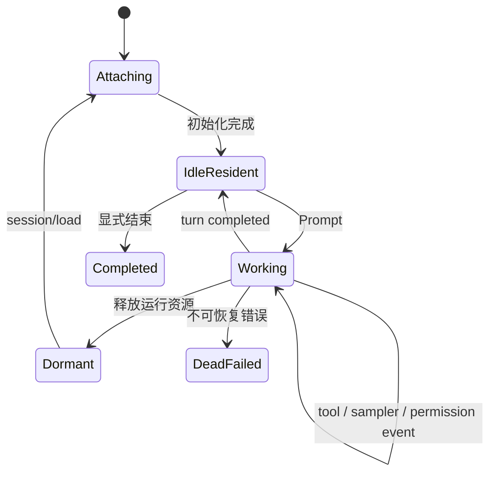

# 11 SessionActor 生命周期与持久化

session 是 Agent 产品里最容易被误解的词。它既不是一个纯数组，也不是一个永远活着的进程。Grok Build 的 session 有运行时状态、可持久化历史、外部 handle 和恢复路径。

## session 的状态不是 PID

[`xai-grok-shell/src/session/handle.rs`](https://github.com/xai-org/grok-build/blob/ed6d543643628663873c5de28298e022ed634238/crates/codegen/xai-grok-shell/src/session/handle.rs) 中的 `SessionLiveState` 包含 `Working`、`IdleResident`、`Dormant`、`Completed`、`DeadFailed` 和 `Attaching`。这些状态描述 session 在 runtime 里怎样被管理，不是操作系统进程状态。

一个可恢复 session 至少要回答：

- session id 和 cwd 是什么？
- 哪些 conversation/history 已经落盘？
- 当前 leaf/turn/queue 在哪里？
- Agent definition、model、permission 和 tool context 怎样重建？
- 外部 client 重新连接后，应该收到哪些历史和当前状态？

## `SessionHandle` 是外部控制面

`SessionHandle` 通过 mpsc sender 接收 typed `SessionCommand`，命令包括 initialize、prompt、model switch、compact、reload plugins、set yolo/auto、rewind、repair history、flush memory 和通知。完成结果用 `PromptCompletionKind` 一类状态表达。

这种 API 让 TUI、headless、leader 和测试共享同一 session 控制面。UI 不需要知道 actor 的字段布局，只需要发命令、订阅事件、显示结果。

## actor 运行在哪个线程

[`session/acp_session_impl/spawn.rs`](https://github.com/xai-org/grok-build/blob/ed6d543643628663873c5de28298e022ed634238/crates/codegen/xai-grok-shell/src/session/acp_session_impl/spawn.rs) 建立专用 OS thread、Tokio runtime 和 `LocalSet`；[`run_loop.rs`](https://github.com/xai-org/grok-build/blob/ed6d543643628663873c5de28298e022ed634238/crates/codegen/xai-grok-shell/src/session/acp_session_impl/run_loop.rs) 监听 session command、chat state event、session event、watcher、MCP 初始化、model switch 和 idle memory timer。

可以把它理解成一间“session 房间”：状态留在房间里，外面的人通过门口的 handle 递消息。房间里的 runtime 还会启动 sampler、tool、MCP 或 subagent，但这些子任务的结果要回到同一个 session 控制面。

## 持久化和运行态的关系

[`session/persistence.rs`](https://github.com/xai-org/grok-build/blob/ed6d543643628663873c5de28298e022ed634238/crates/codegen/xai-grok-shell/src/session/persistence.rs) 和 storage 相关模块负责记录会话信息。不要用“写入一份完整快照”概括所有行为：有的状态是事件或 history，有的状态是 summary/checkpoint，有的运行资源只能在恢复时重新创建。

恢复 session 时，代码要重新加载历史、恢复 cwd/标题/模型信息，再构建 Agent、tool context 和 ChatState。进程级对象，比如某个正在运行的 shell task，不能凭历史直接复活，只能以记录的结果或失败状态出现。

## 生命周期图



这是根据 `SessionLiveState` 和主循环整理的阅读图，不是说所有状态都只能按图中唯一方向变化。重点是区分 attaching、working 和 history persistence。

## SessionActor 管的是“产品会话”，不只是对话数组

一个 session 要同时记住用户消息、模型选择、cwd、tool context、权限决定、当前 turn、后台任务、压缩记录、标题和客户端连接。它还要决定哪些东西可以从持久化历史恢复，哪些东西必须重新建立。

所以我会把 session 的字段分成三类：

| 类别 | 例子 | 重启后怎么办 |
| --- | --- | --- |
| 事件/事实 | user message、tool result、completion、model change | 从 history 读取 |
| 可重建状态 | Agent definition、tool registry、ChatState handle | 按当前配置重新创建 |
| 瞬时资源 | 正在跑的 child process、HTTP stream、terminal handle | 结束、标失败或重新启动 |

如果把三类都当作“快照字段”，恢复时就会产生错误期待：一条历史里写着 `bash started`，并不代表崩溃后那个 shell 进程仍然存在。

## command、event、record 的三角关系

`SessionCommand` 是外部要求 session 做事；event 是 session 告诉 UI/ACP “现在发生了什么”；record 是用于持久化和恢复的事实。三者可能描述同一动作，但方向不同：

```text
Prompt command
  -> SessionActor starts turn
  -> event: assistant delta / tool progress
  -> record: user, assistant, tool result, completion
  -> event: turn completed
```

读代码时不要看到一个 event 就以为它已经落盘。要找 persistence 调用、flush 时机和失败时的补偿逻辑；反过来，历史里有一条 record，也不说明当前 TUI 一定收到了对应 event。

## idle、dormant 和 completed 的差异

`IdleResident` 可以理解为“session 暂时没工作，但运行资源还在”；`Dormant` 更像“历史还在，运行时资源已释放”；`Completed` 表示生命周期结束，不应再接受普通 prompt；`DeadFailed` 则记录了不可恢复或需要外部处理的失败。状态名相近，但它们决定是否能 attach、是否要 spawn、是否能继续当前 turn。

这也是 leader 复用 session 时的重要边界：连接断开不必然等于 session 结束，client 可以稍后重新 attach；进程崩溃则可能需要从持久化历史重新创建 runtime。

## 恢复一个 session 的顺序

我会用下面的顺序读 `spawn.rs`、`run_loop.rs` 和 `persistence.rs`：

1. 读取 session metadata 与历史。
2. 解析 cwd、模型、配置和分支位置。
3. 构建 Agent、workspace、权限和 tool context。
4. 创建 ChatState、sampler handle、watcher 和外部连接。
5. 进入 actor loop，向 client 发送恢复后的状态。

任何一步失败都可能改变结果：历史损坏可能拒绝加载，cwd 不存在可能降级，认证失败可能等待登录，tool resource 失效可能只禁用该工具。文档不能只写“读取 JSONL 后继续”，要把失败后的选择也记下来。

## 小实验

```bash
rg -n "SessionLiveState|SessionCommand|PromptCompletionKind|spawn_session_on_thread|run_session|persistence" \
  crates/codegen/xai-grok-shell/src/session
```

选择 `Prompt`、`CompactSession` 和 `Rewind` 三个命令，分别找发送方、actor 分支、completion 和持久化更新。这样能把“会话管理”从一个模糊名词拆成可检查的动作。
