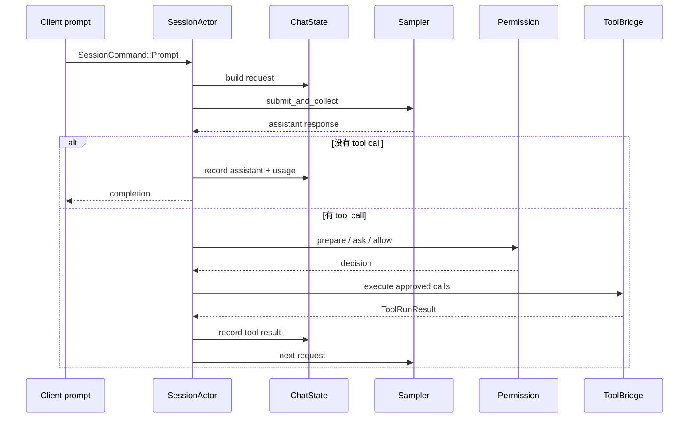

# 12 一次 Turn 的完整执行链

这是整套教程的主干。前面每一章都只讲一个边界，这里把它们接起来：用户 prompt 如何进入 session，request 如何经过 ChatState 和 sampler，工具如何执行，什么时候继续，什么时候结束。

## 从 `Prompt` 开始

入口是 session command，不是直接调用模型。session 收到 prompt 后会：

1. 读取当前 ChatState 和 Agent definition；
2. 计算有效工具、memory reminder、trace context 和 model config；
3. 构造 `ConversationRequest`；
4. 给请求加 session/turn/agent/deployment 元数据；
5. 交给 `run_turn_via_sampler`。

这条路径在 [`turn.rs`](https://github.com/xai-org/grok-build/blob/ed6d543643628663873c5de28298e022ed634238/crates/codegen/xai-grok-shell/src/session/acp_session_impl/turn.rs) 和 [`sampler_turn.rs`](https://github.com/xai-org/grok-build/blob/ed6d543643628663873c5de28298e022ed634238/crates/codegen/xai-grok-shell/src/session/acp_session_impl/sampler_turn.rs) 之间往返。

## response 有两种大方向

模型 response 没有 tool call 时，session 会记录 assistant item、更新 usage、处理 todo/structured output/interjection 和 turn completion。

有 tool call 时，session 先收集 signature，执行 `execute_tool_calls`，把工具结果转换成 conversation item，再带着结果返回 sampler。这个“再返回 sampler”才是 Agent loop 的核心；TUI 只是显示期间产生的 event。



## 为什么不是无限循环

源码里有多种停止和防护条件：

- 最大 turn 数；
- 相同 tool call 的 stationarity guard；
- true no-op 次数上限；
- 用户取消或 interjection；
- permission reject/cancel/follow-up；
- response error 或 incomplete usage；
- structured output validation；
- preflight context overflow 和 compaction；
- 工具本身要求终止，例如退出计划模式或任务完成。

旧版教程如果只写 `while (toolCalls.length > 0)`，对入门者很直观，却会让人误以为生产 Agent loop 只有一个退出条件。这一章保留简化循环，但把每个真实门禁列出来。

## “相同调用”为什么是一个安全问题

如果模型反复请求同一个没有改变状态的工具，程序可能一直消耗 token 和外部资源。当前 `turn.rs` 有重复调用计数、nudge 和 true no-op 保护。它不是判断模型“聪不聪明”，而是给 runtime 一个有限状态的停机条件。

## 取消和权限交互的插入点

取消可能发生在 sampler stream、工具等待、permission prompt 或 TUI interjection 期间。每个阶段的清理不同：停止网络流、终止或回收子进程、关闭等待的 UI 交互、记录 completion、恢复输入焦点。

读代码时，沿 `CancellationToken` 和 `Decision::Cancelled` 搜索，比只沿成功返回值搜索更容易看到完整的生命周期。

## 小实验：用事件表重放一轮

从 session tests 或 pager `app/acp_handler/tests` 里挑一个普通 turn，写成：

```text
Prompt -> request built -> inference phase -> response delta
      -> tool call? -> permission -> tool result -> next request
      -> turn completion -> session update -> UI render
```

每一箭头旁边填真实类型。填不出来的地方就是下一次源码搜索点。

## 一轮 turn 中至少有五种状态

我会把 turn 拆成：准备、推理、工具、收尾、后处理。它们不是五个固定 enum，而是读源码时用来归类的五个观察窗口。

| 窗口 | 主要工作 | 可能的失败 |
| --- | --- | --- |
| 准备 | 检查 busy、权限、预算、compaction、request context | context overflow、拒绝启动、旧 turn 未结算 |
| 推理 | 提交 sampler、接收 delta、累计 tool call | timeout、auth、空响应、取消 |
| 工具 | prepare、permission、hook、dispatch、结果归档 | 参数错、资源缺失、命令非零、拒绝 |
| 收尾 | 完成 response、usage、completion、持久化 | flush、序列化或状态转换失败 |
| 后处理 | reminder、goal、follow-up、UI/ACP 更新 | 需要继续一轮或通知客户端错误 |

这样读可以避免一个常见误会：看到 `turn.rs` 返回 `Ok`，并不代表用户已经看到最终文本；可能还要经过 session completion、event routing 和 presenter。

## 模型一次返回多个 tool call 时发生什么

模型可能同时请求多个工具。执行器通常要先把调用解析成一批候选，再逐个或按策略并发 prepare。权限、plan gate、工具依赖和资源冲突可能让这批调用产生不同决定：一个允许，一个拒绝，一个等待，一个参数无效。

因此不能把“assistant response → for each tool call execute”写成无条件顺序。要问：

- 工具是否在同一 session command 中提交？
- 哪些工具可以并发，哪些必须保持顺序？
- 其中一个失败会停止整批，还是给模型一个 tool error 继续？
- tool result 的顺序按模型调用顺序、完成顺序还是 record 顺序？

这些问题直接影响模型能否正确理解状态，也影响取消和重复调用的处理。

## 保护机制为什么都放在主链附近

max turn、duplicate tool call、no-op edit、permission、context overflow 和 cancellation 都是为了限制循环，而不只是 UI 提示。模型如果重复请求相同工具，系统需要避免无限消耗；工具返回空结果时，系统需要区分“确实没有结果”和“执行器丢了结果”；上下文不足时，必须在发出下一次 request 前处理。

我会给每个保护机制标出三件事：触发前已经发生了什么、它返回给模型/用户什么、session 是否还能继续。如果只记录“有 guard”，读者仍然不知道 guard 怎样改变 turn。

## 失败后的 history 比错误字符串更重要

一次 turn 失败可能留下 user entry、半截 assistant delta、工具调用、工具失败和 completion。不同产品选择可能不同：保留部分结果、标记 incomplete、生成 error entry，或在重试时忽略未结算片段。恢复和 compaction 都依赖这个选择。

排错时把错误分成三类：模型请求失败、工具执行失败、会话持久化失败。三类错误的重试对象不同，也不应共享同一个“重试整轮”按钮。
