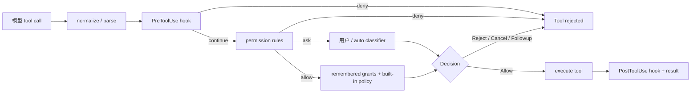

# 16 权限、Hooks 与安全策略

权限系统回答的是“这一次工具调用是否允许继续”，hooks 可以在工具生命周期前后介入，sandbox 则在更低的 OS 层限制资源。三者叠加，但不能互相替代。

## permission mode 和 rule 是两层

用户指南把 mode 和 rule 分得很清楚：

| 层 | 作用 | 例子 |
| --- | --- | --- |
| mode | 默认遇到动作时怎样处理 | ask、auto、always-approve、dontAsk |
| rule | 对具体工具/路径/命令的 allow/ask/deny | `Bash(...)`、`Edit(path)`、`MCPTool(...)` |

当前代码里还会兼容 `acceptEdits`、`plan` 和 `bypassPermissions` 等名称；CLI 的 `--yolo` 是产品侧常用别名。always-approve 也不代表 deny rules、hooks 或部分 shell ask rules 都消失。

## 一次调用的授权顺序

用户指南给出的顺序，是很好的源码阅读清单：

1. `PreToolUse` hook 可以在其他检查前拒绝；允许并不等于跳过后续检查。
2. permission rules 匹配 deny/ask/allow，deny 优先。
3. 读取已保存的项目级 grants。
4. 内建的 read-only auto approval。
5. 根据 mode 决定 prompt、auto approve 或 deny。

always-approve 会在 rules/hooks 后缩短部分路径，但不能被写成“所有操作无条件放行”。

## 源码对象

[`xai-grok-workspace/src/permission/types.rs`](https://github.com/xai-org/grok-build/blob/ed6d543643628663873c5de28298e022ed634238/crates/codegen/xai-grok-workspace/src/permission/types.rs) 定义 `AccessKind`、`Decision`、`PermissionConfig`、rule action 和 tool filter。`Bash(command)`、`Edit(path)`、`MCPTool(name,input)`、`WebFetch`、`WebSearch` 等类型让 manager 可以按动作类别、路径和域名做判断。

manager 在 [`permission/manager.rs`](https://github.com/xai-org/grok-build/blob/ed6d543643628663873c5de28298e022ed634238/crates/codegen/xai-grok-workspace/src/permission/manager.rs) 里协调规则、shell risk parsing、prompt、auto classifier、persisted grants 和 MCP domain。

## hooks 为什么不是 permission 的别名

[`xai-grok-hooks`](https://github.com/xai-org/grok-build/tree/ed6d543643628663873c5de28298e022ed634238/crates/codegen/xai-grok-hooks) 提供工具前后、compact、session 等生命周期扩展。一个 hook 可以观察、拒绝或修改某些流程，但它的输入、超时和失败策略不等于 permission decision。文章里要把 hook 的“事件扩展”与 permission 的“授权决定”分开。



图中 `Decision` 不是单纯布尔值，可能要求 follow-up message 或记录 cancellation。工具执行成功也不代表 post hook 一定成功；需要看调用方怎样处理 hook failure。

## 把一次授权决定拆成输入和输出

权限 manager 的输入至少包括工具种类、参数、路径或域名、当前 mode、匹配到的 rules、已保存 grant、session 状态和平台策略。输出不只是 `true/false`，还可能是 ask user、auto approve、deny、cancel 或要求模型继续说明。

我会用下面的表追一个具体 `Edit(path)`：

| 位置 | 要记什么 |
| --- | --- |
| 规范化前 | 模型传入的原始工具名和参数 |
| 规范化后 | 解析出的 path、command、domain 或 tool filter |
| rule match | 命中了哪条 allow/ask/deny，优先级怎样 |
| decision | 谁生成决定，是否需要用户交互 |
| side effect | grant 是否保存，tool 是否启动，事件是否记录 |

这张表能避免一个常见误导：日志里显示“permission allow”，并不说明原始参数没有被改写，也不说明文件写入已经成功。

## mode、rule、hook、sandbox 的防线位置

它们分别放在不同时间点：mode 提供默认反应，rule 针对动作匹配，hook 提供生命周期扩展，sandbox 在 OS 层限制已经启动的进程。一个安全判断必须说清楚是哪一层做的决定。

例如 `always-approve` 可能减少 ask prompt，但它不能让一个被 deny rule 拒绝的命令通过；permission allow 也不能让 child process 写入 sandbox 禁止目录；post hook 失败也不必然撤销已经完成的文件写入，除非调用方有补偿逻辑。

## 规则的可读性和可验证性

路径规则尤其容易出现“用户以为匹配，代码实际没有匹配”。绝对路径/相对路径、glob、符号链接、大小写和 workspace root 都可能影响结果。把规则写进测试时，至少覆盖命中、未命中、deny 优先、项目配置和边界路径；不要只测一个 happy path。

权限提示也要告诉用户动作、目标和原因，不能只显示一个抽象的 tool name。用户如果看不出命令将写哪里，就无法作出有意义的决定。

## 与 sandbox 的关系

permission 是“要不要让这个动作开始”，sandbox 是“即使动作开始，进程在系统层面能看到/写入/联网什么”。一个被 permission allow 的 bash，仍可能被 sandbox 限制；一个 sandbox 可见的路径，也可能被 permission deny。

## 安全实验

不要用真实仓库做危险命令实验。只阅读和运行测试：

```bash
rg -n "AccessKind|Decision::|PermissionRule|PreToolUse|PostToolUse|deny|always-approve|auto" \
  crates/codegen/xai-grok-workspace/src/permission \
  crates/codegen/xai-grok-hooks \
  crates/codegen/xai-grok-shell/src/session
```

挑一个 `Edit(path)` 规则，追它从配置文本到 permission event 再到 TUI permission view 的路径。
