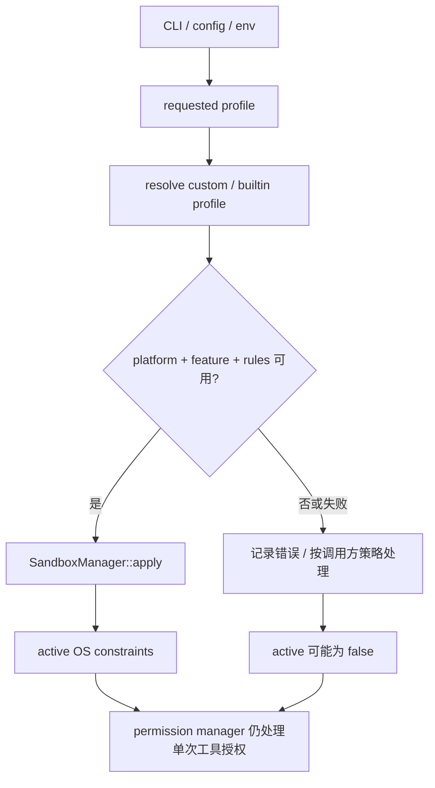

# 18 Sandbox 配置与 OS 约束

安全文档最容易过度承诺。这里只根据当前代码说明“请求了什么、尝试应用什么、哪些平台支持什么、失败后怎样处理”，不把 profile 名称写成绝对隔离保证。

## sandbox 的位置

[`xai-grok-sandbox/src/lib.rs`](https://github.com/xai-org/grok-build/blob/ed6d543643628663873c5de28298e022ed634238/crates/codegen/xai-grok-sandbox/src/lib.rs) 使用 `nono` 提供 OS 级约束，目标同时覆盖进程内 tokio filesystem 和 child processes；适用的 Linux 路径还会限制子进程网络。`enforce` feature 默认开启，但具体行为还受 OS 和 profile 影响。

内建 profile 在 [`profiles.rs`](https://github.com/xai-org/grok-build/blob/ed6d543643628663873c5de28298e022ed634238/crates/codegen/xai-grok-sandbox/src/profiles.rs)：`Workspace`、`Devbox`、`ReadOnly`、`Strict`、`Off`、`Custom`。字段涉及 read-only、read-write、deny、write-deny、default-read 和 restrict-network。

## 配置文件的合并关系

代码支持用户级 `~/.grok/sandbox.toml` 和项目级 `.grok/sandbox.toml` 一类 custom 配置；项目配置是 additive only 的约束，不能随意放宽全局限制。具体 precedence、profile 解析和失败策略要以 `profiles.rs` 和测试为准。

## requested、configured、active

这是初学者必须记住的三个词：

| 状态 | 说明 |
| --- | --- |
| requested | CLI、config 或 environment 要求使用的 profile |
| configured | 解析出的 profile 名和规则 |
| active | `SandboxManager::apply` 后实际成功生效的状态 |

请求了 `Strict` 不代表 `is_active` 就一定为 true。平台不支持、feature 未编译、profile 解析失败或 apply 失败，都可能进入调用方定义的降级路径。文档必须把“请求”和“实际应用”分开。



图中“按调用方策略处理”很重要：代码注释说明某些失败路径会继续运行，但不同调用方可能选择提示、拒绝或改变 screen/leader policy。不能一句“失败就放行”概括。

## profile 名称和实际规则要分开

`Strict`、`ReadOnly`、`Workspace` 这些名字方便用户选择，但安全含义来自具体字段：哪些目录 read-only、哪些目录 read-write、默认读取范围是什么、是否 deny 某些路径、是否限制 child network。两个 profile 名称很接近，实际风险面也可能完全不同。

读 `profiles.rs` 时，我会把每个 profile 展开成一张规则表，而不是只记名字。这样看到 custom 配置或项目 additive 规则时，才能判断它是在增加约束，还是意外改变了默认可见范围。

## sandbox apply 是一个可能失败的动作

安全边界通常要在子进程或文件操作开始前应用，但 apply 本身也可能失败：平台 API 不可用、路径解析失败、feature 没编译、权限不足、规则冲突或测试环境不支持。调用方可能选择拒绝启动、显示警告、切换 embedded/leader policy 或继续运行。

因此验证 sandbox 时要同时记录 requested、configured、apply result 和 active。只打印 profile 名称是不够的；`is_active=false` 也要知道是“未请求”“请求 Off”“应用失败”还是“当前平台不支持”。

## 进程内文件和 child process 是两面

如果 sandbox 只约束 child process，Agent 自己的 tokio filesystem 仍可能访问更大范围；如果只约束进程内文件，shell 子进程可能绕开。当前代码把两类目标放在一起讨论，但具体 OS 实现仍要分别读和测试。

网络也要单独列出：模型 API、web tool、child process network 和本地 socket 可能走不同路径。不能用“sandbox 关闭网络”这种一句话覆盖全部通信。

## 安全验证的证据分级

我会把证据分四级：配置解析测试只能证明 profile 读对；单元测试可以证明某个规则转换；平台集成测试才能观察 OS constraint；真实子进程实验才有机会确认行为，但风险最高。文档应把证据级别写出来，不能用低级别测试推导高级别隔离保证。

## macOS、Linux 和 Windows

[`deny/mod.rs`](https://github.com/xai-org/grok-build/blob/ed6d543643628663873c5de28298e022ed634238/crates/codegen/xai-grok-sandbox/src/deny/mod.rs) 展示 macOS Seatbelt、Linux bind-over 等平台实现。README 对构建主机也有平台说明，Windows 从公开树构建属于 best-effort。安全能力必须连同平台、feature 和测试环境一起描述。

## 子进程网络与 API 网络

Agent 自己必须能访问模型 API，子进程是否能联网是另一项策略。`should_restrict_child_network` 这类标记就是为了区分二者。读代码时问：限制施加在当前进程还是 child command？web tool 是否走另一路？权限 manager 是否还会询问？

## 小实验

```bash
rg -n "requested_confinement_profile|configured_profile_name|is_active|restrict_child_network|SandboxProfile|ProfileName" \
  crates/codegen/xai-grok-sandbox \
  crates/codegen/xai-grok-pager/src/app \
  crates/codegen/xai-grok-pager-bin/src
```

优先运行 profile parsing 和纯配置测试，不要为了验证 sandbox 去执行危险命令。安全实验的第一条规则是让测试对象和个人工作区隔离。
