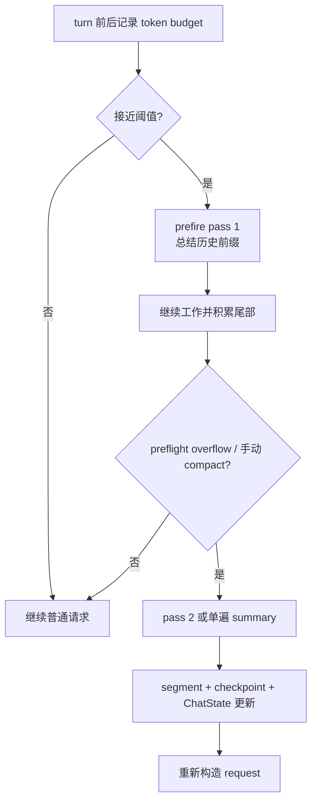

# 19 Token 预算与 Compaction

长任务里，上下文迟早会接近模型窗口。Grok Build 的 compaction 不是“删掉旧消息再写一段总结”这么简单，它还要考虑 usage、阈值、preflight overflow、两遍预压缩、历史分段、checkpoint、重提请求和 memory flush。

## 先分清三种长度

| 名字 | 含义 | 可能由谁产生 |
| --- | --- | --- |
| provider usage | 模型服务返回的 token 使用量 | sampling response |
| token estimate | 本地对历史或文本的估算 | `xai-token-estimation`、chat state |
| context budget | 当前模型允许请求携带的预算 | model config + session policy |

它们不一定相等。compaction 需要一个足够保守的提前量，不能等服务端已经拒绝请求才开始准备摘要。

## 自动压缩的入口

[`xai-grok-shell/src/session/compaction.rs`](https://github.com/xai-org/grok-build/blob/ed6d543643628663873c5de28298e022ed634238/crates/codegen/xai-grok-shell/src/session/compaction.rs) 里能看到手动 `run_compact`、自动 `run_compact_only`、`should_auto_compact`、`check_auto_compact_needed` 和 `check_preflight_overflow`。压缩可能在 turn 前检查，也可能在模型返回后发现下一次 request 已经放不下。

## 摘要输入如何准备

compaction 会从 ChatState 取 conversation、system state 和 token state，再选择 verbatim 或 lossy summarization 输入，构造 compaction tool definitions 和 hosted tools，调用 compaction sampler，校验结果，写入 segment/checkpoint 并更新 session。

算法共享在 [`xai-grok-compaction`](https://github.com/xai-org/grok-build/tree/ed6d543643628663873c5de28298e022ed634238/crates/common/xai-grok-compaction)，可以从 history、intra_compaction、inter_compaction、code_compaction、steps、select 和 templates 看细分。shell session 决定何时压缩，common crate 提供可复用的处理步骤。

## two-pass prefire

接近阈值时，代码可以后台提前总结历史前缀，得到 NOTE1；真正 overflow 或手动 compact 时，再把 NOTE1 和保留尾部合并成最终上下文。`GROK_PREFIRE_LEAD_PERCENT` 控制提前量，prefix length/fingerprint/model 改变时缓存要失效。



这张图描述的是控制流，不代表 summary 文本固定使用某个模板。具体 prompt 和验证要看 compaction 的 template、sampler 和 tests。

## 阈值不是一个数字

当前 request 能否继续，通常同时受模型 context window、历史 token estimate、system/tool prompt、预留输出空间、当前 turn 预算和 compaction policy 影响。即使历史本身没有变，切换模型或 toolset 也可能让它突然超限。

我会用这个公式化思路帮助自己定位：

```text
request_cost
  = visible_history
  + system_and_tools
  + current_input
  + reserved_output
  + provider overhead
```

实际实现未必直接用这个公式，但每项都应该能在代码或测试里找到对应的估算/保护。看到 context overflow 时，先问哪一项增长，而不是马上把更多历史删掉。

## summary 不是 history 的替身

摘要是有损投影。它可能保留目标、决定、文件改动和未完成任务，却省略具体命令输出或中间推理。历史/segment/checkpoint 仍用于恢复、审计、rewind 和下一次压缩；request builder 才决定哪些内容现在给模型。

因此压缩后出现“模型忘了某个细节”，需要区分摘要遗漏、尾部裁剪、工具结果没有被选中，还是新的 request 没有带上 system/tool context。不要只检查 summary 文本。

## 压缩失败时必须保护旧状态

生成 summary 需要模型调用，可能遇到网络、认证、context、解析或 token budget 错误。失败时不能先覆盖旧 history 再发现摘要不可用；理想的流程是先得到并验证新结果，再以 checkpoint/transaction 方式更新可见上下文。

读实现时寻找“旧状态何时被替换”“新 segment 何时提交”“失败是否能重试”“当前 turn 是否继续”。这几个时间点比 summary prompt 本身更能说明系统是否可恢复。

## 为什么 prefire 会引入指纹

提前生成的前缀摘要只有在输入前缀、模型和策略没有变时才可以复用。prefix length、history fingerprint、model slug 或 compaction mode 发生变化，都可能使 NOTE1 失效。缓存命中不是纯性能细节，它决定第二遍压缩看到的内容是否正确。

## 为什么要保存 checkpoint

摘要是给后续模型用的投影，checkpoint/segment 是给 session runtime 和恢复逻辑用的记录。压缩成功后，当前 turn 才能带着新的上下文继续；失败时，代码需要知道压缩前状态和失败原因，不能只剩一段不完整文本。

## 和 Pi 的差异

Pi 的 compaction 也会估算 token、找合法切点、保留尾部和写入 compaction entry；它更容易作为教学样例直接读。Grok Build 把 compaction 和 session actor、sampler、memory preflush、two-pass prefire 连得更紧，因而更像运行时子系统。比较时要分别解释两边的调用方，不能把 Pi 的 `CompactionEntry` 直接翻译成 Grok Build 的 segment。

## 小实验

```bash
rg -n "should_auto_compact|preflight|two_pass|GROK_PREFIRE|generate_session_compact|checkpoint|segment" \
  crates/codegen/xai-grok-shell/src/session \
  crates/common/xai-grok-compaction \
  crates/codegen/xai-token-estimation
```

写出“压缩前 token 从哪里来—阈值由谁判断—摘要由谁生成—新上下文由谁消费”的四步链。再问：如果 summary 生成失败，session 的 completion 和历史会怎样？
