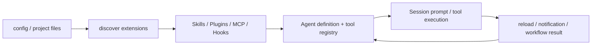

# 21 MCP、Skills、Plugins 与 Workflow

扩展系统解决的是“不要每加一个能力就修改核心 Agent”。MCP 提供外部工具，Skills 提供可复用说明，Plugins 打包多个扩展，Hooks 监听生命周期，Workflow 组织多步流程。它们都能影响模型可见的能力，但进入系统的方式不同。

## MCP：外部工具服务器

MCP 相关代码在 [`xai-grok-mcp`](https://github.com/xai-org/grok-build/tree/ed6d543643628663873c5de28298e022ed634238/crates/codegen/xai-grok-mcp) 和 shell 的 managed MCP、dispatcher、server descriptors 模块。阅读 MCP 时区分：

- server 配置和启动；
- handshake、tool catalog 和 schema；
- MCP tool call 的 permission/access kind；
- server restart、timeout 和错误；
- 工具结果如何变成本地 `ConversationItem`。

MCP 工具会进入本地 ToolBridge 的 catalog，但不等于内建工具。server 的进程、网络和凭据边界需要单独确认。

## Skills：一组可复用的说明

用户指南把 Skill 解释为 `SKILL.md` 格式的可复用 prompt package。代码搜索可以从 `xai-grok-tools/src/implementations/skills`、shell `extensions/skills.rs` 和 skill watcher 开始。

Skill 的生命周期包含发现、选择、注入、reload 和错误处理。它可能变成模型上下文，也可能通过内部 reload request 让 Agent 重新读取。它不是 Rust plugin，也不是 MCP server。

## Plugins：扩展的分发单位

插件可以把 skills、commands、agents、hooks 和 MCP servers 打包到一起，marketplace 负责安装、版本和组织治理。源码入口包括 [`xai-hooks-plugins-types`](https://github.com/xai-org/grok-build/tree/ed6d543643628663873c5de28298e022ed634238/crates/codegen/xai-hooks-plugins-types)、[`xai-grok-plugin-marketplace`](https://github.com/xai-org/grok-build/tree/ed6d543643628663873c5de28298e022ed634238/crates/codegen/xai-grok-plugin-marketplace) 和 shell plugin/extension 模块。

这里有一个重要边界：插件可以扩展产品能力，但仍然受当前 session toolset、permission、sandbox 和配置 policy 影响。

## Hooks：时间点扩展

hooks 可以在 tool use 前后、compact、session 等生命周期插入。它们解决“在某个事件发生时通知/拒绝/记录/改写”的问题，和 plugin 的分发形式、MCP 的远程工具形式都不同。

## Workflow：状态化的多步流程

`xai-workflow`、shell `session/workflow`、`workflows` 和 `workflow` tool 共同形成 workflow 路径。读它时不要只找一个 YAML/Markdown 文件，要找：定义如何解析、当前步骤保存在哪里、下一步由谁触发、失败和恢复如何处理、结果如何回到父 session。

## 扩展加载图



这张图强调“扩展可以动态重载”，但不表示每一种扩展都能在运行中任意改变；要看具体 watcher、command 和测试。

## MCP 的一条完整调用链

我会把 MCP server 当作一个受管理的外部进程/连接来读：

```text
config -> discover server -> start/connect -> initialize
       -> list tools/resources -> local registry
       -> model tool call -> permission -> MCP request
       -> result/error -> ConversationItem + notification
```

server 启动成功只说明 transport 建立，不说明 tool catalog 有效；catalog 有效也不说明当前 session 的 permission、sandbox 或 domain policy 允许调用。server restart 后，旧 tool schema、pending call 和 connection capability 怎样处理，是必须看测试的问题。

## Skill 注入不是一次字符串拼接

skill 发现通常会经过路径扫描、front matter/格式解析、名称去重、启用条件和 prompt 组织。一个 skill 可能在初始化时进入 baseline，也可能在用户选择或模型请求时才注入。文件变化后，watcher 要通知哪个 actor、是否打断当前 turn、下一轮是否使用新版本，都属于行为的一部分。

我会记录 skill 的来源、body、触发条件和注入位置。不要把 `SKILL.md` 的正文直接当作 system prompt；真实系统可能把它变成 user-context block、工具说明或只在特定命令中可见。

## Plugin 的信任与卸载

插件分发了多种资源，因此安装/解析/启用/卸载不只是复制目录。需要验证 manifest、版本、路径展开、可执行文件、MCP server、hook 和 skill 的来源；权限和 sandbox 仍然是当前 session 的约束。

卸载时重点追两件事：已创建的 tool registry entry 是否从新 session 移除，以及正在执行的插件进程如何结束。只刷新目录而不处理旧 handle，会出现“界面说已卸载，后台仍能调用”的状态错位。

## Workflow 的持久化问题

一个 workflow step 至少有定义、输入、运行状态、输出和失败原因。若它能跨 turn 或跨进程继续，就还要保存当前 step、重试次数、父 session、取消状态和恢复点。不要只读 workflow parser；要追它怎样被 session command 触发，以及中断后谁负责重新排队。

## 动态扩展的验证方法

选一个最小 skill 或 MCP tool，分别在启动前、运行中 reload、permission deny、connection failure 和 session close 时观察：模型可见 schema、当前 toolset、通知、history record 和进程清理。这样能把“扩展加载成功”拆成多个可验证断言。

## 对照用户指南阅读源码

```text
07-mcp-servers.md   -> xai-grok-mcp + managed_mcp + tool dispatch
08-skills.md         -> skills discovery + watcher + prompt injection
09-plugins.md        -> plugin types + marketplace + extension bundle
10-hooks.md          -> xai-grok-hooks + tool/session hook callers
19-plan-mode.md      -> plan_mode + enter/exit plan tools
20-background-tasks -> task registry + monitor + scheduler
```

## 小实验

```bash
rg -n "MCP|skill|plugin|hook|workflow|reload|watcher" \
  crates/codegen/xai-grok-mcp \
  crates/codegen/xai-grok-hooks \
  crates/codegen/xai-grok-shell/src/extensions \
  crates/codegen/xai-grok-shell/src/session/workflow
```

挑一个扩展，画出“文件/配置 → 发现 → 注册 → 模型看到 → reload”的链路，并注明它在哪一步需要 permission 或 sandbox。
