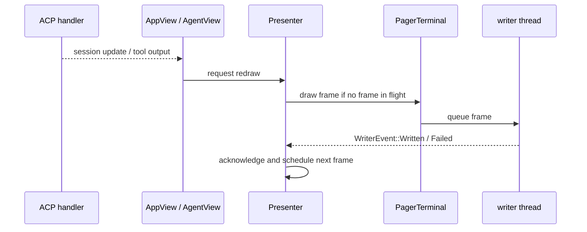

# 22 TUI 与终端渲染

TUI 不是“把文本打印到终端”。终端有输入协议、光标、alternate screen、鼠标、PTY 回压、resize、主题、滚动、媒体预览和退出恢复。Grok Build 把 Agent 客户端和 render library 又拆成了几个 crate。

## `app::run` 是客户端生命周期

[`xai-grok-pager/src/app/mod.rs`](https://github.com/xai-org/grok-build/blob/ed6d543643628663873c5de28298e022ed634238/crates/codegen/xai-grok-pager/src/app/mod.rs) 的 `run` 会加载配置、刷新认证、预取模型/设置、解析 leader policy、物化 session startup intent、决定 fullscreen/inline/minimal，初始化 terminal writer，连接 Agent，进入 event loop，退出时 restore terminal。

这里的 `run` 不负责模型推理细节，它负责把一个 ACP/Agent connection 变成用户可以操作的客户端。

## AppView、AgentView 和 handler

| 模块 | 主要职责 |
| --- | --- |
| `AppView` | 根组件、多个 agent/session 的排列、全局 modal 和状态 |
| `agent_view` | prompt、scrollback、选择、plan、queue、session UI |
| `app/acp_handler` | 把 ACP update、permission、background、MCP 等消息路由到 UI 状态 |
| `dispatch` | 输入或 slash action 触发的业务动作 |
| `views` | 较独立的 UI 组件和弹窗 |
| `xai-grok-pager-render` | markdown、scrollbar、theme、terminal output、media 等渲染基础 |

这说明 UI state 和 Agent session state 不是同一份 struct。TUI 通过 connection 和 handler 订阅 runtime event，再决定怎样展示。

## event loop 和 writer thread

[`event_loop.rs`](https://github.com/xai-org/grok-build/blob/ed6d543643628663873c5de28298e022ed634238/crates/codegen/xai-grok-pager/src/app/event_loop.rs) 需要同时等待 keyboard、ACP 消息、timer、config watcher、subagent activity、writer event 和 draw request。`Presenter` 会合并 dirty frame、限制 draw cadence、追踪尚未写完的序列。

[`pager-render/src/render/draw.rs`](https://github.com/xai-org/grok-build/blob/ed6d543643628663873c5de28298e022ed634238/crates/codegen/xai-grok-pager-render/src/render/draw.rs) 通过 writer thread 处理终端写入，避免 PTY backpressure 卡住 Tokio loop。一次 token delta 不一定就是一次物理 write；UI 先变脏，presenter 合并，writer 再刷。



## 三种 screen mode

fullscreen 使用 alternate screen 和鼠标/光标控制；inline 适合保留 shell 上下文；minimal 把 finalized blocks 写进 native scrollback，减少 mouse reporting 泄漏或终端兼容问题。screen mode 的选择还可能由 tmux/control mode、terminal probe、配置和重新启动策略决定。

## 终端输入不是普通字符串

键盘协议、CSI、Kitty keyboard、鼠标、粘贴、外部 editor 和 signal handler 都会进入输入处理。输入可能在 TUI、child process 或 external editor 之间暂时转交，退出时还要清理残留 ANSI query replies。

小白第一次读 TUI 时，建议只选一个动作，比如 `Esc` 取消：从 keyboard event 找到 dispatch，再找 session cancel 和 terminal redraw。不要从 theme 文件开始读。

## 一次输入怎样变成画面

终端动作通常会经过四个阶段：

```text
terminal event
  -> key/action normalization
  -> dispatch: 改 UI state 或发 session/ACP command
  -> dirty state / redraw request
  -> presenter + writer -> terminal bytes
```

不是每个输入都触发完整重绘。光标移动、输入框变化、模型 delta、后台 task 状态和 resize 可能有不同的 dirty 标记与 cadence。读 `dispatch` 时，我会区分“状态已改变”和“画面已刷新”，不要把函数返回当成终端已经显示。

## backpressure 为什么会让 UI 卡住

模型流、工具输出和 markdown 渲染都可能比终端写入快。若 event loop 直接同步写大量文本，writer/PTY 堵塞就会阻止它继续接收 keyboard、ACP 或 cancel。writer thread、frame queue、in-flight 标记和 draw cadence 是为了把生产者与终端速度隔开。

这套设计也意味着 UI 可能显示滞后：session 已经收到结果，presenter 还在等待上一帧；用户按 Esc 后，取消事件可能先到 session，画面稍后才更新。排障时要分别打 event time、state time 和 write time。

## screen mode 是行为选择

fullscreen、inline 和 minimal 不只是主题差异。它们决定 alternate screen、scrollback、mouse reporting、光标、vim navigation、外部 editor 和错误恢复方式。模式切换可能通过 re-exec 或 terminal restore 完成，因此要追“切换前—恢复—重启—切换后”的生命周期。

## 外部 editor 与 child terminal

打开 editor 或 PTY child 时，TUI 需要暂时释放输入控制、保存 screen 状态、等待子进程结束，再重新探测 terminal。若中间发生 signal、窗口 resize 或父进程死亡，恢复路径可能与普通退出不同。看 terminal support 文档时，找对应的 crossterm/PTY 处理和测试，不要只看键位表。

## 终端问题的证据表

遇到“乱码、卡住、退出后 shell 异常”时，我会记录 terminal type、tmux/control mode、screen mode、是否启用 Kitty/鼠标、是否有 PTY child、stdout/stderr 去向和退出信号。缺少这些环境信息，单凭一张截图很难判断是渲染、协议还是恢复问题。

## 小实验

```bash
rg -n "Presenter|WriterEvent|screen_mode|minimal|fullscreen|AgentView|AppView|request_redraw" \
  crates/codegen/xai-grok-pager/src/app \
  crates/codegen/xai-grok-pager-render/src
```

再对照用户指南的 keyboard shortcuts 和 terminal support，写出“用户按键—状态改变—是否重绘—是否发 ACP/session command”的一条链。
