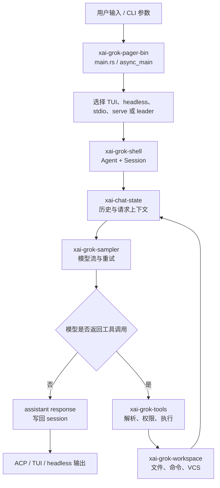

# Grok Build 学习文档

这次我把前一版目录推倒重排了。之前只有 10 章，实际上只是把 Pi 的章节数量照搬过来，没有反映 Grok Build 的真实规模。Grok Build 当前 workspace 有 81 个 package，用户指南本身又把认证、配置、MCP、skills、plugins、hooks、memory、headless、subagents、sessions、sandbox、plan、background tasks、terminal 和 permissions 分成 24 个主题。用 10 章把它们压扁，初学者既看不懂，也无法知道哪些知识点被跳过了。

现在这套笔记按“学习所需的前置概念 → 一次请求的运行链 → 产品能力 → 工程化边界 → 实践”展开，共 46 个单元。00—25 先建立源码运行链，26 是用户指南覆盖矩阵，27—45 再按产品功能把被压缩的知识点拆开。它不是要求你一次读完的长文章，而是一条可以随时停下来做实验的路线。每个单元都会尽量说明：问题是什么、应该看哪些源码、数据经过哪些对象、异常和取消怎么走、怎样用本地命令验证。

## 版本和证据边界

我本次按公开仓库提交 [`ed6d543`](https://github.com/xai-org/grok-build/commit/ed6d543643628663873c5de28298e022ed634238) 阅读，`SOURCE_REV` 是 [`d6937fe`](https://github.com/xai-org/grok-build/blob/ed6d543643628663873c5de28298e022ed634238/SOURCE_REV)。源码链接尽量固定到这个 commit；用户指南和源码含义不一致时，我会把差异写出来，不用其中一方替另一方“脑补”。

官方 README 把这个仓库描述成 `grok` CLI/TUI 和 Agent runtime 的 Rust 源码，并说明它会从内部 monorepo 周期性同步。根 `Cargo.toml` 是生成文件，仓库还包含 `crates/codegen`、`crates/common`、`crates/build`、`prod/mc` 和 `third_party`。所以文档中的“源码地图”是对这个公开快照的阅读地图，不是对内部 monorepo 的完整猜测。

## 建议的阅读顺序

如果你刚开始接触 Rust 或 Agent，按 00 → 03 先建立词汇和构建手感，再从 04 开始追代码。已经熟悉异步 Rust 的读者可以从 01 或 04 开始。

### 入门基础

- [00 阅读前先建立概念](00-阅读前先建立概念/)
- [01 仓库结构与源码地图](01-仓库结构与源码地图/)
- [02 Rust 异步、并发与 Actor](02-Rust异步并发与Actor/)
- [03 构建工具链与第一次运行](03-构建工具链与第一次运行/)

### 跟着一次请求往下读

- [04 CLI 入口与启动顺序](04-CLI入口与启动顺序/)
- [05 配置、认证、模型与项目规则](05-配置认证模型与项目规则/)
- [06 运行模式与进程拓扑](06-运行模式与进程拓扑/)
- [07 ACP 与 leader 协议](07-ACP与leader协议/)
- [08 Agent 定义、系统提示词与工具环境](08-Agent定义系统提示词与工具环境/)
- [09 ChatState、消息与请求构造](09-ChatState消息与请求构造/)
- [10 模型采样层](10-模型采样层/)
- [11 SessionActor 生命周期与持久化](11-SessionActor生命周期与持久化/)
- [12 一次 Turn 的完整执行链](12-一次Turn完整执行链/)

### 工具和主机边界

- [13 工具注册、运行时与 Bridge](13-工具注册运行时与Bridge/)
- [14 文件、Shell 与搜索工具](14-文件Shell与搜索工具/)
- [15 计划、任务、子代理、Web 与 LSP](15-计划任务子代理Web与LSP/)
- [16 权限、Hooks 与安全策略](16-权限Hooks与安全策略/)
- [17 Workspace、文件系统、VCS 与 Worktree](17-Workspace文件系统VCS与Worktree/)
- [18 Sandbox 配置与 OS 约束](18-Sandbox配置与OS约束/)

### 长任务、扩展和产品界面

- [19 Token 预算与 Compaction](19-Token预算与Compaction/)
- [20 Memory 跨会话记忆](20-Memory跨会话记忆/)
- [21 MCP、Skills、Plugins 与 Workflow](21-MCP Skills Plugins与Workflow/)
- [22 TUI 与终端渲染](22-TUI与终端渲染/)
- [23 诊断、遥测、更新与测试](23-诊断遥测更新与测试/)
- [24 学习路线与动手实验](24-学习路线与动手实验/)
- [25 Q&A 学习记录](25-Q&A学习记录/)

25 只是问题记录区：只收录你在阅读过程中实际提出的问题，不预设、不虚构 Q&A。

### 用户指南覆盖与功能深挖

- [26 用户指南覆盖矩阵](26-用户指南覆盖矩阵/)
- [27 第一次运行与基本交互](27-第一次运行与基本交互/)
- [28 键盘输入与快捷键状态机](28-键盘输入与快捷键状态机/)
- [29 Slash Commands 与命令分发](29-Slash%20Commands与命令分发/)
- [30 TUI 主题终端外观与配置](30-TUI主题终端外观与配置/)
- [31 认证全流程与凭据刷新](31-认证全流程与凭据刷新/)
- [32 自定义模型与 Provider 协议](32-自定义模型与Provider协议/)
- [33 配置系统与项目规则](33-配置系统与项目规则/)
- [34 Headless 脚本与输出协议](34-Headless脚本与输出协议/)
- [35 Agent Mode 与 ACP 客户端集成](35-Agent%20Mode与ACP客户端集成/)
- [36 Session 管理、恢复与文件格式](36-Session管理恢复与文件格式/)
- [37 Subagent、Persona 与隔离](37-Subagent、Persona与隔离/)
- [38 Plan、Background Task 与 Workflow](38-Plan、Background%20Task与Workflow/)
- [39 MCP Server 完整生命周期](39-MCP%20Server完整生命周期/)
- [40 Skills、Plugins、Hooks 扩展机制](40-Skills、Plugins、Hooks扩展机制/)
- [41 Memory 搜索、注入与 Dream](41-Memory搜索注入与Dream/)
- [42 Sandbox 与 Permission 实战](42-Sandbox与Permission实战/)
- [43 Terminal Support、Voice 与媒体](43-Terminal%20Support、Voice与媒体/)
- [44 Dashboard、Usage 与 OTEL 监控](44-Dashboard、Usage与OTEL监控/)
- [45 LSP、Codebase Graph 与 Remote](45-LSP%20Codebase%20Graph与Remote/)

## 先记住这一条主线

这不是完整的依赖图，而是学习时的“主干”。认证、配置、压缩、memory、MCP、插件、sandbox 和 telemetry 会在这条主干的不同位置插入；每个单元再把这些插入点展开。

## 这套笔记怎样使用

每读完一节，不要只记名词。至少做一件能产生证据的事：用 `rg` 找到调用方，打印 `cargo metadata` 中的 package，运行一个不触网的单 crate test，或者把一条消息/工具调用画成自己的数据流。遇到无法从公开源码确认的地方，我会明确写“待确认”，不把猜测当成实现。
