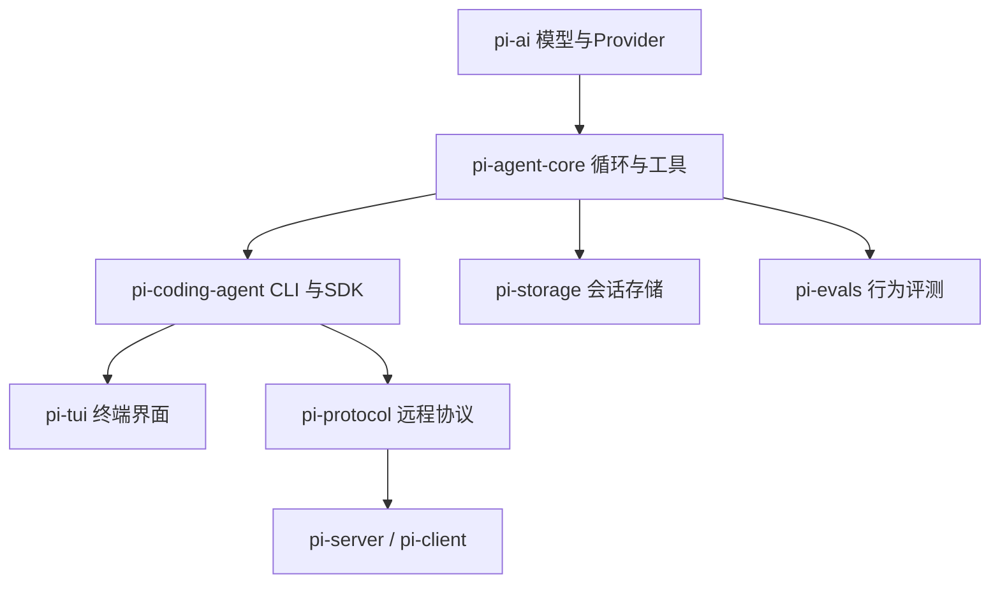
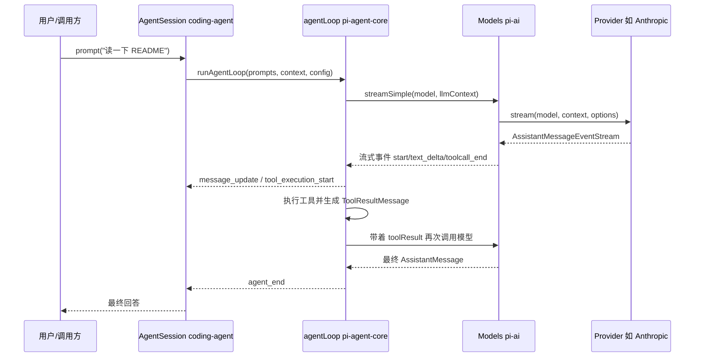

# 01 总体架构与源码地图

这套笔记的第一章，我先回答一个问题：Pi 这个仓库到底由哪些部分组成，按什么顺序读才不会迷路。读源码最怕一头扎进某个文件就出不来，所以我先把包结构、构建脚本和一次完整请求的路径摸了一遍，这一章就是那张地图。

## 包一览

| 文件 | 作用 |
| --- | --- |
| [README.md](https://github.com/earendil-works/pi/blob/main/README.md) | 项目总览，包列表，构建说明 |
| [package.json](https://github.com/earendil-works/pi/blob/main/package.json) | monorepo 工作区、脚本、依赖 |
| [packages/ai](https://github.com/earendil-works/pi/blob/main/packages/ai) | 统一多厂商 LLM API（模型、Provider、流式事件） |
| [packages/agent](https://github.com/earendil-works/pi/blob/main/packages/agent) | Agent 核心循环、Harness、会话、压缩 |
| [packages/coding-agent](https://github.com/earendil-works/pi/blob/main/packages/coding-agent) | 完整交互式 coding agent CLI 与 SDK |
| [packages/tui](https://github.com/earendil-works/pi/blob/main/packages/tui) | 终端 UI 框架，差分渲染 |
| [packages/protocol](https://github.com/earendil-works/pi/blob/main/packages/protocol) | 跨进程二进制协议（CBOR + 帧） |
| [packages/storage/sqlite-node](https://github.com/earendil-works/pi/blob/main/packages/storage/sqlite-node) | SQLite 会话存储 |
| [packages/evals](https://github.com/earendil-works/pi/blob/main/packages/evals) | 模型行为评测 |
| [packages/client](https://github.com/earendil-works/pi/blob/main/packages/client) 与 [packages/server](https://github.com/earendil-works/pi/blob/main/packages/server) | 远程会话的客户端与服务端 |

先说我的整体印象：Pi 不是一个“巨大的 CLI 文件”，而是把模型层、Agent 层、应用层、终端层拆成了独立的 npm 包。每个包都能单独使用，依赖方向也大体是单向的，这是它适合当学习蓝本的原因。



我读这张图的几个要点：

- `pi-ai` 不关心 Agent 怎么思考，它只负责把一段上下文发给某个模型，再把事件流式返回。
- `pi-agent-core` 不关心这是不是终端程序，它只负责在模型回复里看到工具调用时去执行，把结果放回上下文，然后继续循环。
- `pi-coding-agent` 才把上面两层组装成完整产品，再加上扩展、主题、会话管理这些应用层能力。

所以学习顺序可以自下而上：先懂模型层，再懂循环层，再看应用层。

## 构建脚本就是现成的依赖图

根目录 [package.json](https://github.com/earendil-works/pi/blob/main/package.json) 的 `build` 脚本把包的构建顺序写得很明白，它本身就是一张依赖图：

```json
"build": "cd packages/tui && npm run build && cd ../ai && npm run build && cd ../agent && npm run build && cd ../storage/sqlite-node && npm run build && cd ../../protocol && npm run build && cd ../client && npm run build && cd ../coding-agent && npm run build && cd ../server && npm run build"
```

这里有两个细节值得注意：

- 构建顺序是 `tui → ai → agent → storage → protocol → client → coding-agent → server`。
- `tui` 先于 `ai` 构建，但运行时依赖方向是 `coding-agent → tui`。构建顺序反映的是打包产物的生成顺序，并不完全等于运行时依赖。

`check` 脚本更像一条 CI 检查链，把格式、类型、依赖锁定、浏览器冒烟测试串在一起：

```json
"check": "biome check --write --error-on-warnings . && npm run check:pinned-deps && npm run check:ts-imports && npm run check:shrinkwrap && npm run check:install-lock:coding-agent && tsgo --noEmit && npm run check:browser-smoke"
```

读大项目时先看构建脚本，可以很快分辨哪些包能独立编译、哪些包依赖谁。

## `pi-ai` 是 Agent 的外部边界

`pi-ai` 只依赖模型 API，不依赖 Agent 循环。它定义的类型（`Model`、`Context`、`Message`、`AssistantMessageEvent`）是其他包共同的语言，定义在 [packages/ai/src/types.ts](https://github.com/earendil-works/pi/blob/main/packages/ai/src/types.ts)：

```typescript
export interface Context {
	systemPrompt?: string;
	messages: Message[];
	tools?: Tool[];
}
```

- `Context` 是一次模型调用需要的全部输入：系统提示、消息列表、工具定义。
- `Message` 由 `UserMessage | AssistantMessage | ToolResultMessage` 组成，也就是三角色消息模型。
- 工具调用结果以 `ToolResultMessage` 的形式回到 `Context`，Agent 循环因此能接续对话。

## `pi-agent-core` 是 Agent 的内部边界

`packages/agent/src/agent-loop.ts` 是我认为整个项目最值得精读的文件之一。它把“调用模型 → 看到工具调用 → 执行工具 → 把结果还给模型”写成了一段可读的循环，源码见 [agent-loop.ts](https://github.com/earendil-works/pi/blob/main/packages/agent/src/agent-loop.ts)：

```typescript
// 外层循环：处理 follow-up 消息
while (true) {
	let hasMoreToolCalls = true;

	// 内层循环：处理工具调用和 steering 消息
	while (hasMoreToolCalls || pendingMessages.length > 0) {
		// ...
		const message = await streamAssistantResponse(currentContext, config, signal, emit, streamFunction);
		// ...
		const toolCalls = message.content.filter((c) => c.type === "toolCall");
		// ...
		if (toolCalls.length > 0) {
			const executedToolBatch = await executeToolCalls(...);
			hasMoreToolCalls = !executedToolBatch.terminate;
		}
		// ...
	}
}
```

- 内层循环的退出条件是“本轮没有新的工具调用，也没有排队消息”。
- `hasMoreToolCalls` 让 Agent 能连续执行多轮工具调用，不用用户每次手动发消息。
- 这一小段就是 Agentic loop 的核心形态，第三章我会逐行展开。

## 一次请求怎么穿过这些包

把上面几层拼起来，一次完整请求会从应用层穿过循环层到达模型层，再沿原路返回：



图里每一层都只做自己职责内的事，层与层之间通过类型化的事件和数据对象通信。建议先在代码里找到这五个参与者，再对照时序图读源码。

## 概念速查

| 包 | 一句话职责 | 学习优先级 |
| --- | --- | --- |
| `pi-ai` | 统一多厂商模型调用 | 高，先读 |
| `pi-agent-core` | Agent 循环、工具、会话 | 高，核心 |
| `pi-coding-agent` | CLI、SDK、扩展 | 中，看组装方式 |
| `pi-tui` | 终端渲染 | 中，按需读 |
| `pi-protocol/storage/evals` | 协议、持久化、评测 | 低，进阶读 |

## 动手验证

1. 对照 GitHub 上的 [package.json](https://github.com/earendil-works/pi/blob/main/package.json)，把 `build` 脚本里的包顺序整理成一张依赖图。
2. 用 GitHub 的仓库内搜索（或本地临时 clone）查看 `packages/agent` 里引用了哪些 `@earendil-works/pi-ai` 类型，统计跨包边界。
3. 画出“工具调用结果是如何通过 `Context` 回到模型的”数据流图。

## 我还没想明白的问题

- `pi-agent-core` 为什么在循环层还要保留“自定义消息类型”，而不直接用 LLM 的三角色消息？
- `pi-tui` 的构建顺序排在 `pi-ai` 之前，但运行时为什么是 `coding-agent` 依赖它？构建顺序和运行时依赖为什么可以不同？
