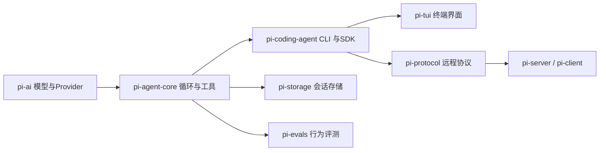
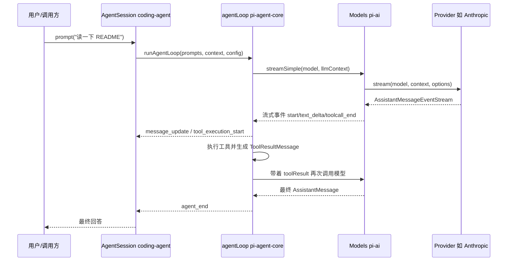

# 01 总体架构与源码地图

## 本章学习目标

- 能说清 Pi monorepo 里每个包负责什么，以及它们之间的依赖方向。
- 能从根目录 `package.json` 找到构建、检查、测试命令。
- 能画出一条“用户输入 → 最终回答”跨包调用路径。
- 知道学习时应该优先读哪几个文件。

## 源码地图

| 文件 | 作用 |
| --- | --- |
| [README.md](https://github.com/earendil-works/pi/blob/main/README.md) | 项目总览，包列表，构建说明 |
| [package.json](https://github.com/earendil-works/pi/blob/main/package.json) | monorepo 工作区、脚本、依赖 |
| [packages/ai](https://github.com/earendil-works/pi/blob/main/packages/ai) | 统一多厂商 LLM API（模型、Provider、流式事件） |
| [packages/agent](https://github.com/earendil-works/pi/blob/main/packages/agent) | Agent 核心循环、Harness、会话、压缩 |
| [packages/coding-agent](https://github.com/earendil-works/pi/blob/main/packages/coding-agent) | 完整交互式 coding agent CLI 与 SDK |
| [packages/tui](https://github.com/earendil-works/pi/blob/main/packages/tui) | 终端 UI 框架，差分渲染 |
| [packages/protocol](https://github.com/earendil-works/pi/blob/main/packages/protocol) | 跨进程二进制协议（CBOR + 帧） |
| [packages/storage/sqlite-node](https://github.com/earendil-works/pi/blob/main/packages/storage/sqlite-node) | SQLite 会话存储 |
| [packages/evals](https://github.com/earendil-works/pi/blob/main/packages/evals) | 模型行为评测 |
| [packages/client](https://github.com/earendil-works/pi/blob/main/packages/client) 与 [packages/server](https://github.com/earendil-works/pi/blob/main/packages/server) | 远程会话的客户端与服务端 |

## 正文

### 1. 内容点：Pi 是一个分层清晰的 monorepo

**结论**：Pi 不是“一个巨大的 CLI 文件”，而是把“模型层 / Agent 层 / 应用层 / 终端层”拆成独立 npm 包，每个包可以被单独使用，这是它适合当学习蓝本的根本原因。

**源码位置**：[packages/agent/README.md](https://github.com/earendil-works/pi/blob/main/packages/agent/README.md)

```text
pi-monorepo
├── packages/ai          # 统一 LLM API：多 Provider、流式事件、Token 统计
├── packages/agent       # Agent 运行时：循环、工具、Harness、会话
├── packages/coding-agent # 终端 CLI：交互、RPC、扩展、SDK
├── packages/tui         # 终端 UI 框架
├── packages/protocol    # 远程协议：CBOR 编解码、帧
├── packages/storage     # SQLite 会话后端
├── packages/client      # 远程客户端
├── packages/server      # 远程服务端
└── packages/evals       # 模型行为评测
```

依赖方向大体是单向的：



**讲解**：

- `pi-ai` 不关心“Agent 怎么思考”，它只负责“把一段上下文发给某个模型，并流式返回事件”。
- `pi-agent-core` 不关心“这是不是终端程序”，它负责“模型回复里有工具调用，就去执行，把结果放回上下文，再继续循环”。
- `pi-coding-agent` 才把上面两者组装成完整产品，并加上扩展、主题、会话管理等。

这种分层让学习时可以“从下往上”读：先懂模型层，再懂循环层，最后看应用层。

### 2. 内容点：构建与检查命令是理解包边界的第一手资料

**结论**：根目录 `package.json` 的 `build` 脚本里明确写出了包的构建顺序，这本身就是一张依赖图。

**源码位置**：[package.json](https://github.com/earendil-works/pi/blob/main/package.json)

```json
"build": "cd packages/tui && npm run build && cd ../ai && npm run build && cd ../agent && npm run build && cd ../storage/sqlite-node && npm run build && cd ../../protocol && npm run build && cd ../client && npm run build && cd ../coding-agent && npm run build && cd ../server && npm run build"
```

**讲解**：

- 构建顺序是 `tui → ai → agent → storage → protocol → client → coding-agent → server`。
- 注意 `tui` 先于 `ai` 构建，但运行时依赖方向是 `coding-agent → tui`；构建顺序主要反映打包产物生成，不完全等于运行时依赖。
- `check` 脚本则把“格式、类型、依赖锁定、浏览器冒烟测试”串成一条 CI 级检查链：

```json
"check": "biome check --write --error-on-warnings . && npm run check:pinned-deps && npm run check:ts-imports && npm run check:shrinkwrap && npm run check:install-lock:coding-agent && tsgo --noEmit && npm run check:browser-smoke"
```

学习价值：读一个大项目时，先看它的构建脚本，能快速识别“哪些包是独立可编译的、哪些包依赖谁”。

### 3. 内容点：`pi-ai` 是 Agent 的“外部边界”

**结论**：`pi-ai` 只依赖模型 API，不依赖 Agent 循环；它定义的类型（`Model`、`Context`、`Message`、`AssistantMessageEvent`）是其他包共同的语言。

**源码位置**：[packages/ai/src/types.ts](https://github.com/earendil-works/pi/blob/main/packages/ai/src/types.ts)

```typescript
export interface Context {
	systemPrompt?: string;
	messages: Message[];
	tools?: Tool[];
}
```

**讲解**：

- `Context` 是“一次模型调用需要的全部输入”：系统提示、消息列表、工具定义。
- `Message` 由 `UserMessage | AssistantMessage | ToolResultMessage` 组成，即三角色消息模型。
- 工具调用结果以 `ToolResultMessage` 的形式回到 `Context`，这正是 Agent 循环能“接续对话”的原因。

### 4. 内容点：`pi-agent-core` 是 Agent 的“内部边界”

**结论**：`packages/agent/src/agent-loop.ts` 是整个项目最值得精读的文件之一，它把“调用模型 → 看到工具调用 → 执行工具 → 把结果还给模型”写成了一个可读的循环。

**源码位置**：[packages/agent/src/agent-loop.ts](https://github.com/earendil-works/pi/blob/main/packages/agent/src/agent-loop.ts)

```typescript
// 外层循环：处理 follow-up 消息
while (true) {
	let hasMoreToolCalls = true;

	// 内层循环：处理工具调用和 steering 消息
	while (hasMoreToolCalls || pendingMessages.length > 0) {
		// ...
		const message = await streamAssistantResponse(currentContext, config, signal, emit, streamFunction);
		// ...
		const toolCalls = message.content.filter((c) => c.type === "toolCall");
		// ...
		if (toolCalls.length > 0) {
			const executedToolBatch = await executeToolCalls(...);
			hasMoreToolCalls = !executedToolBatch.terminate;
		}
		// ...
	}
}
```

**讲解**：

- 内层循环的退出条件是“本轮没有新的工具调用，也没有排队消息”。
- `hasMoreToolCalls` 让 Agent 能连续执行多轮工具调用，而不必用户每次手动发消息。
- 这一小段代码就是“Agentic loop”的核心形态，后面第三章会逐行展开。

### 5. 内容点：跨包请求路径

**结论**：一次完整请求会从应用层穿过循环层到达模型层，再沿原路返回。



**讲解**：

- 图中每一层都只做自己职责内的事，层与层之间通过类型化的事件/数据对象通信。
- 学习时建议先在代码里找到这五个参与者，再对照上面的时序读源码。

## 小结

| 包 | 一句话职责 | 学习优先级 |
| --- | --- | --- |
| `pi-ai` | 统一多厂商模型调用 | 高，先读 |
| `pi-agent-core` | Agent 循环、工具、会话 | 高，核心 |
| `pi-coding-agent` | CLI、SDK、扩展 | 中，看组装方式 |
| `pi-tui` | 终端渲染 | 中，按需读 |
| `pi-protocol/storage/evals` | 协议、持久化、评测 | 低，进阶读 |

## 练习与思考

1. 对照 GitHub 上的 [package.json](https://github.com/earendil-works/pi/blob/main/package.json)，把 `build` 脚本里的包顺序整理成一张依赖图。
2. 用 GitHub 的仓库内搜索（或本地临时 clone）查看 `packages/agent` 里引用了哪些 `@earendil-works/pi-ai` 类型，统计跨包边界。
3. 画出“工具调用结果是如何通过 `Context` 回到模型的”数据流图。

## 延伸问题

- `pi-agent-core` 为什么在循环层还要保留“自定义消息类型”，而不直接用 LLM 的三角色消息？
- `pi-tui` 的构建顺序排在 `pi-ai` 之前，但运行时为什么是 `coding-agent` 依赖它？构建顺序和运行时依赖为什么可以不同？
