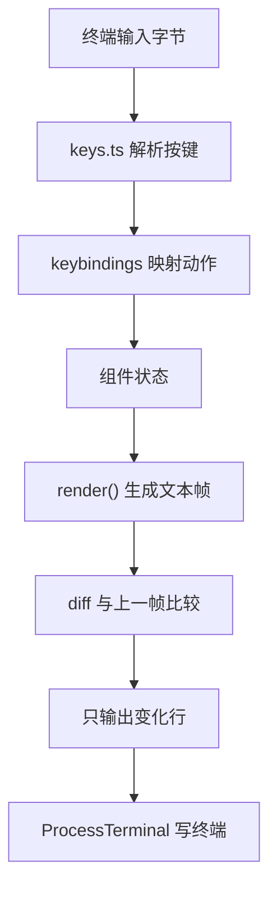

# 08 TUI 与终端渲染

前面几章都在讲 Agent 怎么想，这一章换个方向：Agent 说话的地方。`pi-tui` 是一个终端 UI 框架，负责把流式输出、编辑器、快捷键这些交互变成终端里看得见摸得着的东西。

## 先看哪些文件

| 文件 | 作用 |
| --- | --- |
| [packages/tui/README.md](https://github.com/earendil-works/pi/blob/main/packages/tui/README.md) | 框架总览与 quick start |
| [packages/tui/src/index.ts](https://github.com/earendil-works/pi/blob/main/packages/tui/src/index.ts) | 对外导出面 |
| [packages/tui/src/terminal.ts](https://github.com/earendil-works/pi/blob/main/packages/tui/src/terminal.ts) | 终端抽象与 `ProcessTerminal` |
| [packages/tui/src/keys.ts](https://github.com/earendil-works/pi/blob/main/packages/tui/src/keys.ts) | 键盘事件解析 |
| [packages/tui/src/keybindings.ts](https://github.com/earendil-works/pi/blob/main/packages/tui/src/keybindings.ts) | 快捷键管理 |
| [packages/tui/src/autocomplete.ts](https://github.com/earendil-works/pi/blob/main/packages/tui/src/autocomplete.ts) | 自动补全 |
| [packages/tui/src/components](https://github.com/earendil-works/pi/blob/main/packages/tui/src/components) | 内置组件 |

## TUI 的核心是把“终端”抽象成接口

`pi-tui` 不直接操作 stdout，而是通过 `Terminal` 接口（由 `ProcessTerminal` 实现）读写终端，UI 代码因此可测试、可替换：

```typescript
import { type TUI, Text, Editor, ProcessTerminal, TuiMainScreen, matchesKey } from "@earendil-works/pi-tui";

const terminal = new ProcessTerminal();
const tui: TUI = new TuiMainScreen(terminal);

tui.addChild(new Text("Welcome to my app!"));
const editor = new Editor(tui, editorTheme);
editor.onSubmit = (text) => {
	console.log("Submitted:", text);
	tui.addChild(new Text(`You said: ${text}`));
};
tui.addChild(editor);
tui.setFocus(editor);
tui.start();
```

- `TuiMainScreen` 渲染在主缓冲区，保留终端滚动历史；`TuiAltScreen` 使用备用缓冲区，适合全屏应用。
- 组件通过 `addChild` 组合，`setFocus` 决定键盘事件给谁。

## 差分渲染只更新变化的部分

框架比较上一帧与下一帧，只重绘变化的行或视口行，减少闪烁和输出量：

```text
Features:
- 可互换 Renderer：主屏/备用屏
- Differential Rendering：只更新变化的行或视口行
- 同步输出：使用 CSI 2026 原子更新屏幕
- Bracketed Paste：正确处理大段粘贴
```

- 差分要求组件是确定性的：同一状态渲染出同一文本，框架才能算出 diff。
- CSI 2026 是终端同步更新协议，让多段输出一次性上屏，视觉上不闪烁。

## 组件是“状态 + render()”的简单模型

内置组件覆盖文本、输入、编辑器、Markdown、滚动、选择列表、设置列表、图片等，全部实现同一个简单组件接口：

```text
components/
├── text.ts            # 纯文本
├── editor.ts          # 多行编辑器
├── input.ts           # 单行输入
├── markdown.ts        # Markdown 渲染
├── scroll-view.ts     # 滚动视口
├── select-list.ts     # 选择列表
├── settings-list.ts   # 设置列表
└── image.ts           # Kitty/iTerm2 内联图片
```

- 每个组件都接收 theme，样式与逻辑分开。
- `Editor` 支持大段粘贴、文件路径补全和 slash command 补全，是 coding agent 的核心交互组件。

## 键盘解析是独立模块

`keys.ts` 负责把原始字节解析成按键事件（支持 Kitty 键盘协议），`keybindings.ts` 负责把动作映射到快捷键：

```typescript
export {
	decodeKittyPrintable,
	isKeyRelease,
	isKeyRepeat,
	isKittyProtocolActive,
	Key,
	type KeyEventType,
	KeyId,
	matchesKey,
	parseKey,
	setKittyProtocolActive,
} from "./keys.ts";
```

- `matchesKey(data, 'ctrl+c')` 这类判断在框架层完成，应用层不需要关心终端转义序列细节。
- Kitty 协议支持修饰键精确识别，是现代化终端 UI 的基础。

## 渲染管线可以画成一条清晰的链路



- 输出方向：状态 → 帧 → diff → 终端。
- 输入方向：终端 → 按键解析 → 动作 → 改状态。
- 两条链路都通过 `Terminal` 接口，测试里可以替换成内存终端。

## 概念速查

| 模块 | 职责 |
| --- | --- |
| `Terminal` / `ProcessTerminal` | 终端 I/O 抽象 |
| `TUI` + Renderer | 组件树与渲染策略 |
| 差分渲染 | 只更新变化部分 |
| 组件 | 文本/编辑/滚动/列表等可复用 UI |
| `keys.ts` / `keybindings.ts` | 输入解析与动作映射 |

## 动手验证

1. 用 `TuiAltScreen` 重写 quick start，对比主屏/备用屏行为。
2. 给 `Text` 组件换一个 theme，观察颜色变量如何影响渲染。
3. 读 `Editor` 组件源码，找出 autocomplete 的触发条件。

## 我还没想明白的问题

- 差分渲染为什么要求组件“纯函数式输出”？如果组件持有隐藏状态会发生什么？
- CSI 2026 同步输出在哪些旧终端上不生效？框架为什么仍保留它作为默认？
- `TuiMainScreen` 与 `TuiAltScreen` 对“滚动历史”的语义有什么本质差异？
