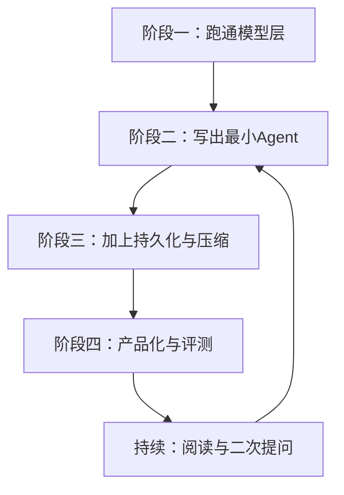

# 10 学习路线与动手实践

前九章把 Pi 的每一层都拆开看了。这一章我把自己实际走的路整理成四个阶段，每个阶段都对应可以动手的代码，而不是只读源码。读完这一章，你应该能做出一个最小的 Agent，并知道接下来往哪个方向深入。

## 四阶段学习路线

| 阶段 | 做什么 | 对照章节 |
| --- | --- | --- |
| 一 | 用 `pi-ai` 调通流式对话和工具定义 | [02](../02-模型与Provider抽象/) |
| 二 | 用 `pi-agent-core` 跑通循环与工具执行 | [03](../03-Agent核心循环/) [04](../04-工具调用与参数校验/) |
| 三 | 加会话、分支、持久化、压缩 | [05](../05-Harness与会话持久化/) [06](../06-上下文管理与Compaction/) |
| 四 | 用 `pi-coding-agent` / SDK 组装产品，写评测 | [07](../07-Coding-Agent与SDK/) [09](../09-协议存储与评测/) |

## 阶段一，先让“模型层”有手感

别急着写 Agent，先装 `@earendil-works/pi-ai`，让一个流式对话真正跑起来：

1. 用 `builtinModels()` 调一个流式对话。
2. 定义两个工具（比如 `get_time`、`read_file`），观察模型何时发出 `toolCall`。
3. 读 [pi-ai README](https://github.com/earendil-works/pi/blob/main/packages/ai/README.md) 的 Tools 一节。

做到不看文档也能说出 `Model`、`Provider`、`Context`、`AssistantMessageEvent` 各自负责什么，这一阶段就算过了。

## 阶段二，实现“最小 Agent”

用 `pi-agent-core` 的 `Agent` 类写一个 50 行以内的助手：

1. 注册 2-3 个工具，让它能回答“现在几点”和“这个目录下有什么”。
2. 给 `beforeToolCall` 加一条“禁止 bash”的规则，测试拦截效果。
3. 画出 `agent_start → turn_start → tool_execution_* → agent_end` 的事件序列。

这里最容易踩的坑是只看循环代码不动手。事件顺序和失败路径这种东西，写一遍比读十遍记得牢。

## 阶段三，让 Agent 记得住

最小 Agent 没有记忆，重启就忘了。这个阶段把会话和压缩加进去：

1. 用 `JsonlSessionRepository` 保存会话，重启进程后恢复。
2. 人为把上下文撑大，触发 `shouldCompact`，观察摘要格式。
3. 用 `Session.fork` 做一次“回退到某个用户消息之前”。

做完之后，你应该能解释“为什么压缩后模型还记得项目里改过哪些文件”。

## 阶段四，产品化与评测

最后把 Agent 变成别人能用的东西：

1. 用 `createAgentSession` 把 Agent 嵌入一个 Node 脚本或 Web 服务。
2. 仿照 `smoke.eval.ts` 写 3 个评测：基础问答、工具调用、错误恢复。
3. 读 `pi-protocol` 的 framing，尝试设计自己的 RPC 接口。

验收标准：你有一个带评测、可恢复会话、可对外调用的小产品原型。

## 进阶项目方向

| 方向 | 核心问题 | 参考源码 |
| --- | --- | --- |
| MCP 客户端 | Agent 如何接入外部工具服务器 | `xai-grok-mcp` 等（参考 [Grok Build](https://github.com/xai-org/grok-build)） |
| 沙箱执行 | 不可信代码如何隔离运行 | [containerization.md](https://github.com/earendil-works/pi/blob/main/packages/coding-agent/docs/containerization.md) |
| 子 Agent | 主 Agent 如何委派子任务 | [examples/extensions/subagent](https://github.com/earendil-works/pi/tree/main/packages/coding-agent/examples/extensions/subagent) |
| 多模型路由 | 如何按任务选择模型 | `pi-ai` 的 Models 注册表 |
| 行为评测 | 如何持续保证质量 | `pi-evals` |

## 我踩过的坑

- 只读代码不写代码：Agent 框架的知识在事件顺序和失败路径里，每章都值得写一个最小复现。
- 忽略错误路径：`stopReason: "length"`、工具抛异常、认证过期，这些才是生产 Agent 的难点。
- 不记录 Q&A：学习时的一次追问往往是理解拐点，我后来都追加到 [Q&A](../11-Q&A学习记录/)。
- 直接拿 Grok Build 入门：Rust 大仓库适合做参考，不适合做第一蓝本，先用 Pi 建立概念。

## 怎么用好 Q&A 文档

每章末尾列的问题如果答不上来，就带着问题去看源码、发起二次提问。提问后把问题、背景、回答摘要追加到 [Q&A](../11-Q&A学习记录/)，标记是否解决。我每周会回看一次未解决的问题，确认有没有必要升级成章节内容。

学习 Agent 开发不是“读一个仓库”，而是从最小循环开始，逐步加上状态、持久化、界面和评测。Pi 的分层恰好每一步都有可对照的源码。把 [01](../01-总体架构与源码地图/) 到 [09](../09-协议存储与评测/) 读完，再完成本章的项目，就可以开始设计自己的 Agent 了。

## 我还没想明白的问题

- 你自己的 Agent 需要“多租户会话”吗？如果需要，Pi 的哪些抽象可以直接复用？
- 模型调用成本里，哪部分会被 prompt caching 影响？Pi 的 `sessionId` 和 `cacheRetention` 是怎么设计的？
- 如果要支持中文项目说明，`AGENTS.md` 的规则在 Pi 里是怎么被加载的？
