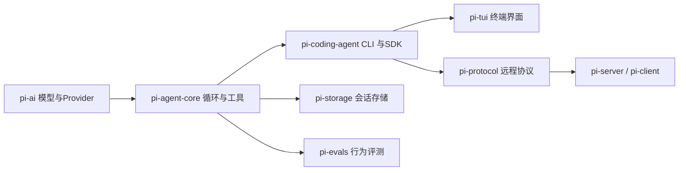
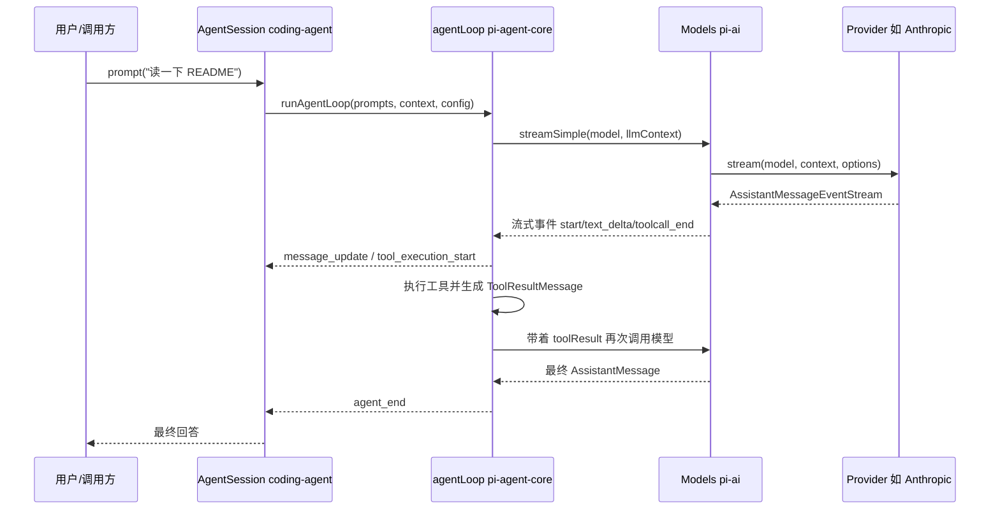

# Pi 学习文档

本套文档以 [Pi](https://github.com/earendil-works/pi)（earendil-works/pi）源码为蓝本，记录学习 Agent 开发的完整过程。

仓库是公开的，本项目不保存源码副本；所有源码引用均使用 GitHub HTTPS 链接。建议按编号顺序阅读，每一章都建立在前一章的概念之上。

## 01 总体架构与源码地图

### 本章学习目标

- 能说清 Pi monorepo 里每个包负责什么，以及它们之间的依赖方向。
- 能从根目录 `package.json` 找到构建、检查、测试命令。
- 能画出一条“用户输入 → 最终回答”跨包调用路径。
- 知道学习时应该优先读哪几个文件。

### 源码地图

| 文件 | 作用 |
| --- | --- |
| [README.md](https://github.com/earendil-works/pi/blob/main/README.md) | 项目总览，包列表，构建说明 |
| [package.json](https://github.com/earendil-works/pi/blob/main/package.json) | monorepo 工作区、脚本、依赖 |
| [packages/ai](https://github.com/earendil-works/pi/blob/main/packages/ai) | 统一多厂商 LLM API（模型、Provider、流式事件） |
| [packages/agent](https://github.com/earendil-works/pi/blob/main/packages/agent) | Agent 核心循环、Harness、会话、压缩 |
| [packages/coding-agent](https://github.com/earendil-works/pi/blob/main/packages/coding-agent) | 完整交互式 coding agent CLI 与 SDK |
| [packages/tui](https://github.com/earendil-works/pi/blob/main/packages/tui) | 终端 UI 框架，差分渲染 |
| [packages/protocol](https://github.com/earendil-works/pi/blob/main/packages/protocol) | 跨进程二进制协议（CBOR + 帧） |
| [packages/storage/sqlite-node](https://github.com/earendil-works/pi/blob/main/packages/storage/sqlite-node) | SQLite 会话存储 |
| [packages/evals](https://github.com/earendil-works/pi/blob/main/packages/evals) | 模型行为评测 |
| [packages/client](https://github.com/earendil-works/pi/blob/main/packages/client) 与 [packages/server](https://github.com/earendil-works/pi/blob/main/packages/server) | 远程会话的客户端与服务端 |

### 正文

#### 1. 内容点：Pi 是一个分层清晰的 monorepo

**结论**：Pi 不是“一个巨大的 CLI 文件”，而是把“模型层 / Agent 层 / 应用层 / 终端层”拆成独立 npm 包，每个包可以被单独使用，这是它适合当学习蓝本的根本原因。

**源码位置**：[packages/agent/README.md](https://github.com/earendil-works/pi/blob/main/packages/agent/README.md)

```text
pi-monorepo
├── packages/ai          # 统一 LLM API：多 Provider、流式事件、Token 统计
├── packages/agent       # Agent 运行时：循环、工具、Harness、会话
├── packages/coding-agent # 终端 CLI：交互、RPC、扩展、SDK
├── packages/tui         # 终端 UI 框架
├── packages/protocol    # 远程协议：CBOR 编解码、帧
├── packages/storage     # SQLite 会话后端
├── packages/client      # 远程客户端
├── packages/server      # 远程服务端
└── packages/evals       # 模型行为评测
```

依赖方向大体是单向的：



**讲解**：

- `pi-ai` 不关心“Agent 怎么思考”，它只负责“把一段上下文发给某个模型，并流式返回事件”。
- `pi-agent-core` 不关心“这是不是终端程序”，它负责“模型回复里有工具调用，就去执行，把结果放回上下文，再继续循环”。
- `pi-coding-agent` 才把上面两者组装成完整产品，并加上扩展、主题、会话管理等。

这种分层让学习时可以“从下往上”读：先懂模型层，再懂循环层，最后看应用层。

#### 2. 内容点：构建与检查命令是理解包边界的第一手资料

**结论**：根目录 `package.json` 的 `build` 脚本里明确写出了包的构建顺序，这本身就是一张依赖图。

**源码位置**：[package.json](https://github.com/earendil-works/pi/blob/main/package.json)

```json
"build": "cd packages/tui && npm run build && cd ../ai && npm run build && cd ../agent && npm run build && cd ../storage/sqlite-node && npm run build && cd ../../protocol && npm run build && cd ../client && npm run build && cd ../coding-agent && npm run build && cd ../server && npm run build"
```

**讲解**：

- 构建顺序是 `tui → ai → agent → storage → protocol → client → coding-agent → server`。
- 注意 `tui` 先于 `ai` 构建，但运行时依赖方向是 `coding-agent → tui`；构建顺序主要反映打包产物生成，不完全等于运行时依赖。
- `check` 脚本则把“格式、类型、依赖锁定、浏览器冒烟测试”串成一条 CI 级检查链：

```json
"check": "biome check --write --error-on-warnings . && npm run check:pinned-deps && npm run check:ts-imports && npm run check:shrinkwrap && npm run check:install-lock:coding-agent && tsgo --noEmit && npm run check:browser-smoke"
```

学习价值：读一个大项目时，先看它的构建脚本，能快速识别“哪些包是独立可编译的、哪些包依赖谁”。

#### 3. 内容点：`pi-ai` 是 Agent 的“外部边界”

**结论**：`pi-ai` 只依赖模型 API，不依赖 Agent 循环；它定义的类型（`Model`、`Context`、`Message`、`AssistantMessageEvent`）是其他包共同的语言。

**源码位置**：[packages/ai/src/types.ts](https://github.com/earendil-works/pi/blob/main/packages/ai/src/types.ts)

```typescript
export interface Context {
	systemPrompt?: string;
	messages: Message[];
	tools?: Tool[];
}
```

**讲解**：

- `Context` 是“一次模型调用需要的全部输入”：系统提示、消息列表、工具定义。
- `Message` 由 `UserMessage | AssistantMessage | ToolResultMessage` 组成，即三角色消息模型。
- 工具调用结果以 `ToolResultMessage` 的形式回到 `Context`，这正是 Agent 循环能“接续对话”的原因。

#### 4. 内容点：`pi-agent-core` 是 Agent 的“内部边界”

**结论**：`packages/agent/src/agent-loop.ts` 是整个项目最值得精读的文件之一，它把“调用模型 → 看到工具调用 → 执行工具 → 把结果还给模型”写成了一个可读的循环。

**源码位置**：[packages/agent/src/agent-loop.ts](https://github.com/earendil-works/pi/blob/main/packages/agent/src/agent-loop.ts)

```typescript
// 外层循环：处理 follow-up 消息
while (true) {
	let hasMoreToolCalls = true;

	// 内层循环：处理工具调用和 steering 消息
	while (hasMoreToolCalls || pendingMessages.length > 0) {
		// ...
		const message = await streamAssistantResponse(currentContext, config, signal, emit, streamFunction);
		// ...
		const toolCalls = message.content.filter((c) => c.type === "toolCall");
		// ...
		if (toolCalls.length > 0) {
			const executedToolBatch = await executeToolCalls(...);
			hasMoreToolCalls = !executedToolBatch.terminate;
		}
		// ...
	}
}
```

**讲解**：

- 内层循环的退出条件是“本轮没有新的工具调用，也没有排队消息”。
- `hasMoreToolCalls` 让 Agent 能连续执行多轮工具调用，而不必用户每次手动发消息。
- 这一小段代码就是“Agentic loop”的核心形态，后面第三章会逐行展开。

#### 5. 内容点：跨包请求路径

**结论**：一次完整请求会从应用层穿过循环层到达模型层，再沿原路返回。



**讲解**：

- 图中每一层都只做自己职责内的事，层与层之间通过类型化的事件/数据对象通信。
- 学习时建议先在代码里找到这五个参与者，再对照上面的时序读源码。

### 小结

| 包 | 一句话职责 | 学习优先级 |
| --- | --- | --- |
| `pi-ai` | 统一多厂商模型调用 | 高，先读 |
| `pi-agent-core` | Agent 循环、工具、会话 | 高，核心 |
| `pi-coding-agent` | CLI、SDK、扩展 | 中，看组装方式 |
| `pi-tui` | 终端渲染 | 中，按需读 |
| `pi-protocol/storage/evals` | 协议、持久化、评测 | 低，进阶读 |

### 练习与思考

1. 对照 GitHub 上的 [package.json](https://github.com/earendil-works/pi/blob/main/package.json)，把 `build` 脚本里的包顺序整理成一张依赖图。
2. 用 GitHub 的仓库内搜索（或本地临时 clone）查看 `packages/agent` 里引用了哪些 `@earendil-works/pi-ai` 类型，统计跨包边界。
3. 画出“工具调用结果是如何通过 `Context` 回到模型的”数据流图。

### 延伸问题

- `pi-agent-core` 为什么在循环层还要保留“自定义消息类型”，而不直接用 LLM 的三角色消息？
- `pi-tui` 的构建顺序排在 `pi-ai` 之前，但运行时为什么是 `coding-agent` 依赖它？构建顺序和运行时依赖为什么可以不同？

## 02 模型与 Provider 抽象

### 本章学习目标

- 能说清 `Model`、`Provider`、`Models`、`Context` 四者的关系。
- 能解释为什么“每个 Provider 自己实现 stream”，而调用方只面对统一接口。
- 能读懂 `AssistantMessageEventStream` 的流式协议。
- 能自己注册一个 Provider 并调用 `streamSimple`。

### 源码地图

| 文件 | 作用 |
| --- | --- |
| [packages/ai/src/types.ts](https://github.com/earendil-works/pi/blob/main/packages/ai/src/types.ts) | 核心类型：Api、Model、Context、Message、事件 |
| [packages/ai/src/models.ts](https://github.com/earendil-works/pi/blob/main/packages/ai/src/models.ts) | `Provider`、`Models`、`createModels`、`createProvider` |
| [packages/ai/src/models-store.ts](https://github.com/earendil-works/pi/blob/main/packages/ai/src/models-store.ts) | 模型目录缓存（动态 Provider 用） |
| [packages/ai/src/utils/event-stream.ts](https://github.com/earendil-works/pi/blob/main/packages/ai/src/utils/event-stream.ts) | 事件流实现 |
| [packages/ai/src/providers/anthropic.ts](https://github.com/earendil-works/pi/blob/main/packages/ai/src/providers/anthropic.ts) | 一个真实 Provider 示例 |
| [packages/ai/src/providers/faux.ts](https://github.com/earendil-works/pi/blob/main/packages/ai/src/providers/faux.ts) | 测试用假 Provider，适合入门 |
| [packages/ai/README.md](https://github.com/earendil-works/pi/blob/main/packages/ai/README.md) | 官方使用说明 |

### 正文

#### 1. 内容点：为什么要做“统一 LLM API”

**结论**：Agent 需要调用不同厂商的模型，而各家 API 在消息格式、流式协议、工具调用、思考（thinking）字段上都不一样；`pi-ai` 把这些差异收敛到一组类型和一个事件流里。

**源码位置**：[packages/ai/src/types.ts](https://github.com/earendil-works/pi/blob/main/packages/ai/src/types.ts)

```typescript
export type KnownApi =
	| "openai-completions"
	| "mistral-conversations"
	| "openai-responses"
	| "azure-openai-responses"
	| "openai-codex-responses"
	| "anthropic-messages"
	| "bedrock-converse-stream"
	| "google-generative-ai"
	| "google-vertex"
	| "pi-messages";
```

**讲解**：

- `Api` 描述的是“协议/接口风格”，不是“厂商品牌”。例如 Anthropic 走 `anthropic-messages`，OpenAI 可以走 `openai-completions` 或 `openai-responses`。
- 好处是：同一家公司未来换协议，只需要新增一个 `Api` 值；调用方按 `Model.api` 自动分派，不用改业务代码。

#### 2. 内容点：`Model` 是“可调用对象的元数据”

**结论**：`Model` 本身不包含调用逻辑，它只是描述“哪个 Provider、什么协议、支持什么输入、上下文多大、多少钱”的元数据。

**源码位置**：[packages/ai/src/types.ts](https://github.com/earendil-works/pi/blob/main/packages/ai/src/types.ts)

```typescript
export interface Model<TApi extends Api> {
	id: string;
	name: string;
	api: TApi;
	provider: ProviderId;
	baseUrl: string;
	reasoning: boolean;
	input: ("text" | "image")[];
	cost: ModelCost;
	contextWindow: number;
	maxTokens: number;
}
```

**讲解**：

- `provider` 告诉系统“找哪个 Provider 来执行”，`api` 告诉 Provider “用哪套协议”。
- `contextWindow` 和 `maxTokens` 是后续上下文管理（compaction）做判断的重要依据。
- 学习重点是“元数据与执行分离”：模型列表可以静态生成、动态刷新，但调用永远通过 Provider。

#### 3. 内容点：`Provider` 是真正的“适配器”

**结论**：`Provider` 负责认证、模型列表、流式调用三件事，是所有厂商差异的收口点。

**源码位置**：[packages/ai/src/models.ts](https://github.com/earendil-works/pi/blob/main/packages/ai/src/models.ts)

```typescript
export interface Provider<TApi extends Api = Api> {
	readonly id: string;
	readonly name: string;
	readonly baseUrl?: string;
	readonly auth: ProviderAuth;
	getModels(): readonly Model<TApi>[];
	refreshModels?(context: RefreshModelsContext): Promise<void>;
	stream<T extends TApi>(
		model: Model<T>,
		context: Context,
		options?: ApiStreamOptions<T>,
	): AssistantMessageEventStream;
	streamSimple(model: Model<TApi>, context: Context, options?: SimpleStreamOptions): AssistantMessageEventStream;
}
```

**讲解**：

- `stream` 返回 `AssistantMessageEventStream`，而不是 Promise；这是流式设计的关键，调用方可以边收边渲染。
- `auth` 是必填字段，因为每个 Provider 都要回答“我的密钥从哪来”：环境变量、凭据文件、OAuth 等。
- `getModels` 是同步读；动态 Provider 可以通过 `refreshModels` 异步更新目录。

#### 4. 内容点：一个真实 Provider 怎么组装

**结论**：用 `createProvider` 把 `auth`、`models`、`api` 组装起来，就得到一个 Provider；Anthropic 的实现是很好的模板。

**源码位置**：[packages/ai/src/providers/anthropic.ts](https://github.com/earendil-works/pi/blob/main/packages/ai/src/providers/anthropic.ts)

```typescript
export function anthropicProvider(): Provider<"anthropic-messages"> {
	return createProvider({
		id: "anthropic",
		name: "Anthropic",
		baseUrl: "https://api.anthropic.com",
		auth: {
			apiKey: anthropicApiKeyAuth(),
			oauth: lazyOAuth({ name: "Anthropic (Claude Pro/Max)", load: loadAnthropicOAuth }),
		},
		models: Object.values(ANTHROPIC_MODELS),
		api: anthropicMessagesApi(),
	});
}
```

**讲解**：

- `anthropicApiKeyAuth` 展示了认证解析的优先级：已存凭据 → `ANTHROPIC_AUTH_TOKEN_ENV` → `ANTHROPIC_OAUTH_TOKEN_ENV` → `ANTHROPIC_API_KEY_ENV`。
- `ANTHROPIC_MODELS` 是生成的模型目录（`anthropic.models.ts`），由脚本生成以保持与官方目录一致。
- `anthropicMessagesApi()` 是协议实现，负责把统一 `Context` 翻译成 Anthropic Messages API 的请求。

#### 5. 内容点：`Models` 是 Provider 的集合与统一入口

**结论**：`Models` 把多个 Provider 放进一个注册表，提供“按 provider+id 查模型、自动解析认证、统一流式入口”。

**源码位置**：[packages/ai/src/models.ts](https://github.com/earendil-works/pi/blob/main/packages/ai/src/models.ts)

```typescript
streamSimple(model: Model<Api>, context: Context, options?: ModelsSimpleStreamOptions): AssistantMessageEventStream {
	return lazyStream(model, async () => {
		const provider = this.requireProvider(model);
		const { requestModel, requestOptions } = await this.applyAuth(model, options);
		return provider.streamSimple(requestModel, context, requestOptions as SimpleStreamOptions);
	});
}
```

**讲解**：

- `requireProvider(model)` 根据 `model.provider` 找到负责执行的 Provider。
- `applyAuth` 在真正发请求前解析认证（可能是 OAuth 刷新、环境变量读取），然后把结果放进 `requestOptions`。
- `lazyStream` 允许“先拿到流对象，认证失败时再在流里报错”，这样调用方不需要专门处理同步异常。

#### 6. 内容点：统一消息与事件协议

**结论**：`Context` 与 `AssistantMessageEvent` 是 `pi-ai` 最重要的两个数据契约。

**源码位置**：[packages/ai/src/types.ts](https://github.com/earendil-works/pi/blob/main/packages/ai/src/types.ts)

```typescript
export type AssistantMessageEvent =
	| { type: "start"; partial: AssistantMessage }
	| { type: "text_start"; contentIndex: number; partial: AssistantMessage }
	| { type: "text_delta"; contentIndex: number; delta: string; partial: AssistantMessage }
	| { type: "toolcall_delta"; contentIndex: number; delta: string; partial: AssistantMessage }
	| { type: "toolcall_end"; contentIndex: number; toolCall: ToolCall; partial: AssistantMessage }
	| { type: "done"; reason: Extract<StopReason, "stop" | "length" | "toolUse">; message: AssistantMessage }
	| { type: "error"; reason: Extract<StopReason, "aborted" | "error">; error: AssistantMessage };
```

**讲解**：

- 每个增量事件都携带 `partial`，即“到目前为止的完整 `AssistantMessage`”，这让 UI 层可以无条件整体替换当前消息。
- 流必须最终以 `done` 或 `error` 结束，且 `error` 也携带一条 `AssistantMessage`（`stopReason: "error"` 或 `"aborted"`）。
- 这样设计后，任何 Provider 的错误都不会让调用方崩溃，而是变成一条可被 Agent 循环识别的消息。

#### 7. 内容点：`EventStream` 是流式基础设施

**结论**：`EventStream` 是一个自带队列、等待者和最终结果的异步迭代器，`AssistantMessageEventStream` 是它的专用子类。

**源码位置**：[packages/ai/src/utils/event-stream.ts](https://github.com/earendil-works/pi/blob/main/packages/ai/src/utils/event-stream.ts)

```typescript
export class AssistantMessageEventStream extends EventStream<AssistantMessageEvent, AssistantMessage> {
	constructor() {
		super(
			(event) => event.type === "done" || event.type === "error",
			(event) => {
				if (event.type === "done") return event.message;
				if (event.type === "error") return event.error;
				throw new Error("Unexpected event type for final result");
			},
		);
	}
}
```

**讲解**：

- 基类负责“push 事件 / 异步迭代 / 取最终结果”三件事。
- 子类只声明两件事：什么事件算结束，结束时如何提取结果。
- 学习价值：这是“流式 API 的正确封装姿势”，比到处回传回调函数更可组合。

### 小结

| 概念 | 一句话解释 | 源码入口 |
| --- | --- | --- |
| `Api` | 协议风格标识 | types.ts |
| `Model` | 模型元数据，不负责执行 | types.ts |
| `Provider` | 认证 + 模型列表 + 流式执行 | models.ts |
| `Models` | Provider 注册表 + 统一入口 | models.ts |
| `Context` | 一次模型调用的输入 | types.ts |
| `AssistantMessageEventStream` | 统一流式事件协议 | event-stream.ts |

### 练习与思考

1. 在 `faux.ts` 里找一个 `fauxToolCall` 示例，写一个会返回工具调用的假 Provider。
2. 用 `createModels()` 注册 Anthropic Provider，调用 `streamSimple` 打印 `text_delta`。
3. 阅读 `createProvider` 的 `dispatch` 实现，解释“一个 Provider 支持多个 Api”时如何分派。

### 延伸问题

- 为什么流式事件里要携带“完整 partial 消息”而不是只携带 delta？这会让网络带宽更高吗？
- `applyAuth` 失败时为什么选择在流里报错，而不是在 `streamSimple` 调用时直接抛异常？
- 动态 Provider 的模型目录刷新失败时，`refreshModels` 为什么要求“保留上一次的列表”？

## 03 Agent 核心循环

### 本章学习目标

- 能画出 Agent 循环的状态转移图，说清内层循环和外层循环的区别。
- 能解释 `AgentMessage` 与 LLM `Message` 为什么需要转换层。
- 能说清 `agentLoop`、`runAgentLoop`、`Agent` 三者的分工。
- 能读懂 `streamAssistantResponse` 的事件处理逻辑。

### 源码地图

| 文件 | 作用 |
| --- | --- |
| [packages/agent/src/agent-loop.ts](https://github.com/earendil-works/pi/blob/main/packages/agent/src/agent-loop.ts) | 低层循环：事件发射、模型调用、工具执行 |
| [packages/agent/src/agent.ts](https://github.com/earendil-works/pi/blob/main/packages/agent/src/agent.ts) | 有状态的 `Agent` 封装：订阅、队列、运行管理 |
| [packages/agent/src/types.ts](https://github.com/earendil-works/pi/blob/main/packages/agent/src/types.ts) | `AgentMessage`、`AgentTool`、`AgentLoopConfig` |
| [packages/agent/src/index.ts](https://github.com/earendil-works/pi/blob/main/packages/agent/src/index.ts) | 包导出，看边界 |

### 正文

#### 1. 内容点：一次对话在事件层面长什么样

**结论**：Pi 把一次 `prompt()` 展开成一串标准事件，UI、持久化、扩展都订阅这些事件；这是“可观察 Agent”的核心。

**源码位置**：[packages/agent/README.md](https://github.com/earendil-works/pi/blob/main/packages/agent/README.md)

```text
prompt("Hello")
├─ agent_start
├─ turn_start
├─ message_start / message_end   // 用户消息
├─ message_start / message_update / message_end  // 助手消息（流式）
├─ turn_end
└─ agent_end
```

带工具调用时，中间会出现：

```text
├─ tool_execution_start   { toolCallId, toolName, args }
├─ tool_execution_update  { partialResult }
├─ tool_execution_end     { toolCallId, result }
├─ message_start/end      { toolResultMessage }
└─ turn_end
```

**讲解**：

- `agent_start/agent_end` 标记一次完整运行的生命周期。
- `turn_start/turn_end` 标记“一次模型调用 + 它引发的工具执行”。
- `message_update` 是 UI 渲染的燃料，携带 `assistantMessageEvent` 增量。

#### 2. 内容点：`agentLoop` 是低层循环的入口

**结论**：`agentLoop` 接收 prompt、上下文和配置，返回一个 `EventStream<AgentEvent, AgentMessage[]>`，让调用方既能迭代事件，也能拿到最终消息列表。

**源码位置**：[packages/agent/src/agent-loop.ts](https://github.com/earendil-works/pi/blob/main/packages/agent/src/agent-loop.ts)

```typescript
export function agentLoop(
	prompts: AgentMessage[],
	context: AgentContext,
	config: AgentLoopConfig,
	signal: AbortSignal | undefined,
	streamFn: StreamFn,
): EventStream<AgentEvent, AgentMessage[]> {
	const stream = createAgentStream();

	void runAgentLoop(
		prompts,
		context,
		config,
		async (event) => {
			stream.push(event);
		},
		signal,
		streamFn,
	).then((messages) => {
		stream.end(messages);
	});

	return stream;
}
```

**讲解**：

- `createAgentStream()` 声明“`agent_end` 事件出现即结束”，并从该事件里提取 `messages`。
- 真正的执行在 `runAgentLoop` 里；`agentLoop` 只是把“异步执行”接到“事件流”上。
- 学习价值：把“执行”和“消费”解耦，消费方不需要 `await` 整个运行，就可以边收边渲染。

#### 3. 内容点：内外两层循环各管什么

**结论**：内层循环处理“工具调用与 steering 消息”，外层循环处理“follow-up 消息”，两者合起来就是完整的多轮工具型 Agent。

**源码位置**：[packages/agent/src/agent-loop.ts](https://github.com/earendil-works/pi/blob/main/packages/agent/src/agent-loop.ts)

```typescript
// 外层循环：follow-up 消息
while (true) {
	let hasMoreToolCalls = true;

	// 内层循环：工具调用 + steering
	while (hasMoreToolCalls || pendingMessages.length > 0) {
		if (!firstTurn) {
			await emit({ type: "turn_start" });
		} else {
			firstTurn = false;
		}

		if (pendingMessages.length > 0) {
			for (const message of pendingMessages) {
				await emit({ type: "message_start", message });
				await emit({ type: "message_end", message });
				currentContext.messages.push(message);
				newMessages.push(message);
			}
			pendingMessages = [];
		}

		const message = await streamAssistantResponse(...);
		const toolCalls = message.content.filter((c) => c.type === "toolCall");

		const toolResults: ToolResultMessage[] = [];
		hasMoreToolCalls = false;
		if (toolCalls.length > 0) {
			const executedToolBatch =
				message.stopReason === "length"
					? await failToolCallsFromTruncatedMessage(toolCalls, emit)
					: await executeToolCalls(currentContext, message, config, signal, emit);
			toolResults.push(...executedToolBatch.messages);
			hasMoreToolCalls = !executedToolBatch.terminate;
		}

		await emit({ type: "turn_end", message, toolResults });

		// 检查是否该停、是否要更新下一轮配置、是否有 steering
		if (await config.shouldStopAfterTurn?.(...)) {
			await emit({ type: "agent_end", messages: newMessages });
			return;
		}
		pendingMessages = (await config.getSteeringMessages?.()) || [];
	}

	const followUpMessages = (await config.getFollowUpMessages?.()) || [];
	if (followUpMessages.length > 0) {
		pendingMessages = followUpMessages;
		continue;
	}
	break;
}

await emit({ type: "agent_end", messages: newMessages });
```

**讲解**：

- `steering` 是“Agent 正在工作时插入的指令”（例如用户说“改成这样”），内层循环每次模型回复后都会检查。
- `followUp` 是“等 Agent 干完活再追加的任务”，所以放在外层循环，只有当内层完全停止时才检查。
- `shouldStopAfterTurn` 可以让调用方在“下一轮调用模型之前”优雅收尾，例如上下文快满了。
- `prepareNextTurn` 可以替换下一轮的 `model` / `thinkingLevel` / `context`，实现运行中换模型。

可以用状态图表示：

```mermaid
stateDiagram-v2
    [*] --> 等待消息
    等待消息 --> 调用模型: 收到 prompt/steering/follow-up
    调用模型 --> 有工具调用: stopReason=toolUse
    调用模型 --> 完成: stopReason=stop
    有工具调用 --> 执行工具
    执行工具 --> 调用模型: 注入 toolResult
    执行工具 --> 完成: terminate=true
    完成 --> 有follow-up: 队列非空
    完成 --> [*]: 无follow-up
    有follow-up --> 调用模型
```

#### 4. 内容点：`streamAssistantResponse` 是“转换 + 调用 + 归并”的三段式

**结论**：每次模型调用前，Agent 先把内部 `AgentMessage[]` 转成 LLM 认识的 `Message[]`，调用后再把流式事件归并成一条完整 `AssistantMessage` 放进上下文。

**源码位置**：[packages/agent/src/agent-loop.ts](https://github.com/earendil-works/pi/blob/main/packages/agent/src/agent-loop.ts)

```typescript
async function streamAssistantResponse(...): Promise<AssistantMessage> {
	let messages = context.messages;
	if (config.transformContext) {
		messages = await config.transformContext(messages, signal);
	}

	const llmMessages = await config.convertToLlm(messages);

	const llmContext: Context = {
		systemPrompt: context.systemPrompt,
		messages: llmMessages,
		tools: context.tools,
	};

	const resolvedApiKey =
		(config.getApiKey ? await config.getApiKey(config.model.provider) : undefined) || config.apiKey;

	const response = await streamFunction(config.model, llmContext, {
		...config,
		apiKey: resolvedApiKey,
		signal,
	});
	// ... 遍历事件，维护 partialMessage
}
```

**讲解**：

- 顺序是 `AgentMessage[] → transformContext → convertToLlm → Context → streamFunction`。
- `transformContext` 处理“内部消息如何剪裁/增强”，`convertToLlm` 处理“如何翻译给模型”。
- `getApiKey` 允许动态刷新短时效的 OAuth token，是长任务里很实用的设计。

#### 5. 内容点：事件归并时如何保证上下文一致

**结论**：流式期间，循环先把 `partial` 消息放入 `context.messages`，收到 `done` 后替换为最终消息，保证订阅者与上下文看到的始终是最新状态。

**源码位置**：[packages/agent/src/agent-loop.ts](https://github.com/earendil-works/pi/blob/main/packages/agent/src/agent-loop.ts)

```typescript
case "start":
	partialMessage = event.partial;
	context.messages.push(partialMessage);
	addedPartial = true;
	await emit({ type: "message_start", message: { ...partialMessage } });
	break;

case "text_delta":
case "toolcall_delta":
	// ...
	if (partialMessage) {
		partialMessage = event.partial;
		context.messages[context.messages.length - 1] = partialMessage;
		await emit({ type: "message_update", assistantMessageEvent: event, message: { ...partialMessage } });
	}
	break;
```

**讲解**：

- `start` 时把 partial 消息“压入”上下文，后续每个 delta 都“替换”最后一个元素。
- `done/error` 时用 `response.result()` 拿到最终消息并替换。
- 这就是为什么事件里要携带完整 `partial`：循环侧只需要做“赋值”而不是“拼接”。

#### 6. 内容点：`Agent` 类是低层循环的有状态封装

**结论**：`Agent` 拥有消息历史、订阅者集合、steering/follow-up 队列和活动运行管理，适合“长期存在、可多次 prompt”的场景。

**源码位置**：[packages/agent/src/agent.ts](https://github.com/earendil-works/pi/blob/main/packages/agent/src/agent.ts)

```typescript
export class Agent {
	private _state: MutableAgentState;
	private readonly listeners = new Set<...>();
	private readonly steeringQueue: PendingMessageQueue;
	private readonly followUpQueue: PendingMessageQueue;
	// ...

	constructor(options: AgentOptions) {
		this._state = createMutableAgentState(runtimeOptions.initialState);
		this.convertToLlm = runtimeOptions.convertToLlm ?? defaultConvertToLlm;
		this.steeringQueue = new PendingMessageQueue(runtimeOptions.steeringMode ?? "one-at-a-time");
		this.followUpQueue = new PendingMessageQueue(runtimeOptions.followUpMode ?? "one-at-a-time");
		this.toolExecution = runtimeOptions.toolExecution ?? "parallel";
	}
}
```

**讲解**：

- `PendingMessageQueue` 的 `drain()` 根据 `"one-at-a-time"` / `"all"` 决定一次注入几条消息。
- `Agent` 把低层循环的“函数参数”变成了“对象状态”，并负责把队列里的消息喂给循环的 `getSteeringMessages` / `getFollowUpMessages`。
- 学习重点：同样是循环，`agentLoop` 是函数式的、一次性的；`Agent` 是有状态的、可复用的。上层 `AgentSession` 再在这个基础上加持久化。

#### 7. 内容点：`convertToLlm` 的默认实现为什么是“过滤”

**结论**：`AgentMessage` 比 LLM 消息更宽泛（可以有自定义消息类型），默认转换只保留 LLM 能识别的三种角色，其余类型被过滤。

**源码位置**：[packages/agent/src/agent.ts](https://github.com/earendil-works/pi/blob/main/packages/agent/src/agent.ts)

```typescript
function defaultConvertToLlm(messages: AgentMessage[]): Message[] {
	return messages.filter(
		(message) => message.role === "user" || message.role === "assistant" || message.role === "toolResult",
	);
}
```

**讲解**：

- 自定义消息类型（例如“状态通知”“系统事件”）可以存在会话里，但不会发给模型。
- 调用方可以传入自己的 `convertToLlm`，把自定义消息翻译成用户消息等，实现“UI 消息也能影响模型”的效果。

### 小结

| 概念 | 作用 | 源码 |
| --- | --- | --- |
| `agentLoop` | 函数式低层循环入口 | agent-loop.ts |
| `runLoop` | 内层（工具/steering）+ 外层（follow-up） | agent-loop.ts |
| `streamAssistantResponse` | 转换上下文 → 调模型 → 归并事件 | agent-loop.ts |
| `Agent` | 有状态封装、订阅、队列 | agent.ts |
| `AgentEvent` | 生命周期/流式事件契约 | types.ts |

### 练习与思考

1. 在 `agent-loop.ts` 里用 `rg "await emit"` 列出所有事件，画出一张事件时序图。
2. 给 `Agent` 配置 `beforeToolCall` 并 `block` 一个工具，观察事件序列里是否出现错误 toolResult。
3. 自己实现一个 `convertToLlm`，让一种自定义消息类型变成 user 消息，再对比默认过滤行为。

### 延伸问题

- `stopReason === "length"` 时为什么要把所有工具调用全部标记失败，而不是执行一部分？
- `prepareNextTurn` 和 `shouldStopAfterTurn` 的执行顺序为什么是“先更新快照、再判断停止”？
- 如果 steering 消息在模型调用中途到达，为什么 Pi 不打断当前流式响应，而是等下一轮注入？

## 04 工具调用与参数校验

### 本章学习目标

- 能说清 `Tool`、`AgentTool`、`ToolCall`、`ToolResultMessage` 的关系。
- 能解释 TypeBox schema 为什么用于工具参数定义。
- 能读懂 `prepareToolCall` 中的“找不到工具 / 参数非法 / 被 hook 阻止”三条失败路径。
- 能对比 `sequential` 与 `parallel` 两种执行模式的行为差异。

### 源码地图

| 文件 | 作用 |
| --- | --- |
| [packages/ai/src/types.ts](https://github.com/earendil-works/pi/blob/main/packages/ai/src/types.ts) | `Tool`、`ToolCall`、`ToolResultMessage` |
| [packages/ai/src/utils/validation.ts](https://github.com/earendil-works/pi/blob/main/packages/ai/src/utils/validation.ts) | 参数校验与类型纠正 |
| [packages/agent/src/agent-loop.ts](https://github.com/earendil-works/pi/blob/main/packages/agent/src/agent-loop.ts) | 工具执行：prepare / execute / finalize |
| [packages/agent/src/types.ts](https://github.com/earendil-works/pi/blob/main/packages/agent/src/types.ts) | `AgentTool`、hook 类型 |
| [packages/agent/src/harness/tools](https://github.com/earendil-works/pi/blob/main/packages/agent/src/harness/tools) | 内置 read/write/edit/bash 工具 |

### 正文

#### 1. 内容点：工具在“模型侧”只是一个 schema 描述

**结论**：对 LLM 来说，工具就是“名字 + 描述 + 参数 JSON Schema”；真正的执行逻辑在 Agent 侧。

**源码位置**：[packages/ai/src/types.ts](https://github.com/earendil-works/pi/blob/main/packages/ai/src/types.ts)

```typescript
export interface Tool<TParameters extends TSchema = TSchema> {
	name: string;
	description: string;
	parameters: TParameters;
	constrainedSampling?: false | ConstrainedSamplingConfig;
}
```

**讲解**：

- `parameters` 是 TypeBox schema（运行时校验 + JSON Schema 转换）。
- `constrainedSampling` 是可选的高级能力，用于要求模型按指定格式生成参数（如 strict JSON schema 或 grammar）。
- Agent 把这些 `Tool[]` 放进 `Context.tools`，模型才能在回复里发出 `toolCall`。

#### 2. 内容点：模型返回的 `ToolCall` 是回复内容块

**结论**：`AssistantMessage.content` 是内容块数组，其中 `type: "toolCall"` 的块就是一个工具调用请求。

**源码位置**：[packages/ai/src/types.ts](https://github.com/earendil-works/pi/blob/main/packages/ai/src/types.ts)

```typescript
export interface ToolCall {
	type: "toolCall";
	id: string;
	name: string;
	arguments: Record<string, any>;
	thoughtSignature?: string;
}
```

**讲解**：

- 一条助手消息可以包含多个 `toolCall`，这就催生了“并行执行多个工具”的需求。
- `arguments` 是“模型可能没按 schema 生成”的原始参数，必须经过校验和纠正后才安全。

#### 3. 内容点：`AgentTool` 是 Agent 侧的“可执行工具”

**结论**：`AgentTool` 在 `Tool` 基础上增加了 `execute` 函数、参数预处理、流式更新回调和执行模式。

**源码位置**：[packages/agent/src/types.ts](https://github.com/earendil-works/pi/blob/main/packages/agent/src/types.ts)

```typescript
export interface AgentTool<TParameters extends TSchema = TSchema, TResult = unknown, TContext = undefined>
	extends Tool<TParameters> {
	execute(
		toolCallId: string,
		args: Static<TParameters>,
		signal: AbortSignal | undefined,
		update: (partialResult: Partial<TResult>) => void,
	): Promise<TResult>;
	prepareArguments?: (args: Record<string, any>) => Record<string, any>;
	executionMode?: ToolExecutionMode;
}
```

**讲解**：

- `execute` 接收校验后的参数（`Static<TParameters>`），返回工具结果；通过 `update` 回传流式进度。
- `prepareArguments` 允许在“校验之前”修正模型给的参数（例如把字符串路径转成对象）。
- `executionMode: "sequential"` 会强制整批工具串行执行。

#### 4. 内容点：校验前先“纠正”，能救回很多模型手滑

**结论**：`validateToolArguments` 不止校验，还会对常见类型做尽力纠正，例如把字符串 `"3"` 转成数字 3。

**源码位置**：[packages/ai/src/utils/validation.ts](https://github.com/earendil-works/pi/blob/main/packages/ai/src/utils/validation.ts)

```typescript
function coercePrimitiveByType(value: unknown, type: string): unknown {
	switch (type) {
		case "number": {
			if (value === null) return 0;
			if (typeof value === "string" && value.trim() !== "") {
				const parsed = Number(value);
				if (Number.isFinite(parsed)) return parsed;
			}
			if (typeof value === "boolean") return value ? 1 : 0;
			return value;
		}
		// ...
	}
}
```

**讲解**：

- 模型的 JSON 工具参数经常出现“类型漂移”，例如数字被序列化成字符串。
- 先纠正再校验，比直接拒绝更宽容，能减少“模型改口重试”的成本。
- 但纠正不是无条件的，无法转换的值仍会原样返回，最终由校验决定成败。

#### 5. 内容点：`prepareToolCall` 是工具执行的“安检门”

**结论**：一个工具调用在执行前要经过四道检查：工具是否存在、参数是否合法、hook 是否放行、信号是否已中止。

**源码位置**：[packages/agent/src/agent-loop.ts](https://github.com/earendil-works/pi/blob/main/packages/agent/src/agent-loop.ts)

```typescript
async function prepareToolCall(currentContext, assistantMessage, toolCall, config, signal) {
	const tool = currentContext.tools?.find((t) => t.name === toolCall.name);
	if (!tool) {
		return { kind: "immediate", result: createErrorToolResult(`Tool ${toolCall.name} not found`), isError: true };
	}

	try {
		const preparedToolCall = prepareToolCallArguments(tool, toolCall);
		const validatedArgs = validateToolArguments(tool, preparedToolCall);

		if (config.beforeToolCall) {
			const beforeResult = await config.beforeToolCall({ ... }, signal);
			if (beforeResult?.block) {
				return { kind: "immediate", result: createErrorToolResult(beforeResult.reason || "Tool execution was blocked"), isError: true };
			}
		}
		// ...
		return { kind: "prepared", toolCall, tool, args: validatedArgs };
	} catch (error) {
		return { kind: "immediate", result: createErrorToolResult(...), isError: true };
	}
}
```

**讲解**：

- “失败”不是抛异常，而是返回一条 `isError: true` 的 `ToolResultMessage`，模型会看到错误并自行决定下一步。
- `beforeToolCall` 是安全/策略钩子，例如“禁止 bash 工具”就在这一层实现。
- 四道检查全部通过，才返回 `kind: "prepared"` 进入真正的执行。

#### 6. 内容点：执行、后处理、事件发射是分开的三步

**结论**：Pi 把工具调用拆成 `executePreparedToolCall`（执行）、`finalizeExecutedToolCall`（后处理）、`emitToolExecutionEnd`（发布事件），每一步都能独立测试。

**源码位置**：[packages/agent/src/agent-loop.ts](https://github.com/earendil-works/pi/blob/main/packages/agent/src/agent-loop.ts)

```typescript
async function executePreparedToolCall(prepared, signal, emit) {
	const updateEvents: Promise<void>[] = [];
	let acceptingUpdates = true;
	try {
		const result = await prepared.tool.execute(
			prepared.toolCall.id,
			prepared.args,
			signal,
			(partialResult) => {
				if (!acceptingUpdates) return;
				updateEvents.push(Promise.resolve(emit({ type: "tool_execution_update", ... })));
			},
		);
		acceptingUpdates = false;
		await Promise.all(updateEvents);
		return { result, isError: false };
	} catch (error) {
		acceptingUpdates = false;
		await Promise.all(updateEvents);
		return { result: createErrorToolResult(...), isError: true };
	}
}
```

**讲解**：

- `acceptingUpdates` 防止工具在返回结果之后继续乱发更新事件。
- 工具抛异常会被转成 `isError: true` 的结果，而不是让整个 Agent 崩溃。
- `afterToolCall` 可以在执行后改写结果（替换内容、标记终止等），例如清理敏感输出。

#### 7. 内容点：`sequential` 与 `parallel` 的差异

**结论**：串行模式逐个执行；并行模式先逐个“preflight”，再并发执行，最后按助手消息里的原始顺序生成 toolResult 消息。

**源码位置**：[packages/agent/src/agent-loop.ts](https://github.com/earendil-works/pi/blob/main/packages/agent/src/agent-loop.ts)

```typescript
async function executeToolCalls(currentContext, assistantMessage, config, signal, emit) {
	const toolCalls = assistantMessage.content.filter((c) => c.type === "toolCall");
	const hasSequentialToolCall = toolCalls.some(
		(tc) => currentContext.tools?.find((t) => t.name === tc.name)?.executionMode === "sequential",
	);
	if (config.toolExecution === "sequential" || hasSequentialToolCall) {
		return executeToolCallsSequential(...);
	}
	return executeToolCallsParallel(...);
}
```

**讲解**：

- 并行模式下，`tool_execution_start` 仍按顺序发射（preflight），`tool_execution_end` 按完成顺序发射。
- 但写进上下文的 `ToolResultMessage` 会回到“助手消息里的原始顺序”，避免模型看到顺序错乱。
- 任何一个工具声明 `executionMode: "sequential"`，整批都会退化为串行，保证依赖顺序。

#### 8. 内容点：输出被截断时，工具调用全部作废

**结论**：当模型因 `stopReason === "length"` 被截断时，流式工具参数可能不完整；Pi 选择一个都不执行，全部返回错误让模型重发。

**源码位置**：[packages/agent/src/agent-loop.ts](https://github.com/earendil-works/pi/blob/main/packages/agent/src/agent-loop.ts)

```typescript
const executedToolBatch =
	message.stopReason === "length"
		? await failToolCallsFromTruncatedMessage(toolCalls, emit)
		: await executeToolCalls(...);
```

**讲解**：

- 截断时虽然参数能“拼出一个合法 JSON”，但语义上可能少了一半，执行有风险。
- 错误信息明确提示模型“参数可能被截断，请重新完整发出”，让模型自愈。

#### 9. 内容点：内置工具通过 `ExecutionEnv` 与外部环境解耦

**结论**：`pi-agent-core` 提供 read/write/edit/bash 工具，但它们不直接碰 `node:fs` / 子进程，而是通过 `ExecutionEnv` 抽象执行。

**源码位置**：[packages/agent/src/harness/tools/index.ts](https://github.com/earendil-works/pi/blob/main/packages/agent/src/harness/tools/index.ts)

```typescript
export {
	createReadTool,
	createWriteTool,
	createEditTool,
	createBashTool,
} from "./read.ts";
```

**讲解**：

- 具体实现见 `read.ts` / `write.ts` / `edit.ts` / `bash.ts`，它们都接收 `ExecutionToolContext` 里的 `env: ExecutionEnv`。
- 这层抽象让同一套工具既能在本地 Node 运行，也能被沙箱、测试替身替换，是“工具可测试化”的范例。

### 小结

| 阶段 | 函数 | 关键行为 |
| --- | --- | --- |
| 描述 | `Tool` | schema + 描述 |
| 解析 | `prepareToolCallArguments` | 预处理参数 |
| 校验 | `validateToolArguments` | 纠正类型 + 校验 |
| 策略 | `beforeToolCall` | 可阻止执行 |
| 执行 | `executePreparedToolCall` | 真正调用，异常转结果 |
| 后处理 | `afterToolCall` | 改写结果/终止 |
| 落库 | `createToolResultMessage` | 生成 toolResult 消息 |

### 练习与思考

1. 用 `Type.Object` 定义一个工具，故意让模型返回类型错误的参数，观察校验纠正。
2. 给 `Agent` 配 `beforeToolCall` 阻止 `bash`，确认模型收到的错误信息。
3. 读 `executeToolCallsParallel`，说明 `FinalizedToolCallEntry` 为什么是“结果或函数”的联合类型。

### 延伸问题

- 为什么“并行执行”也要先顺序 preflight？先并发 preflight 会引入什么问题？
- `terminate: true` 需要“整批都为 true”才停止，这个规则避免了什么风险？
- 工具返回 `addedToolNames` 的用途是什么？它在哪个 Provider 场景下真正生效？

## 05 Harness 与会话持久化

### 本章学习目标

- 能说清 `AgentHarness` 与低层 `agentLoop` 的分工。
- 能解释 phase 状态机为什么存在，以及 `"busy"` 错误是怎么产生的。
- 能说明“turn 快照”和“save point”解决了什么问题。
- 能对比 JSONL 会话存储与 SQLite 会话存储的差异。

### 源码地图

| 文件 | 作用 |
| --- | --- |
| [packages/agent/src/harness/agent-harness.ts](https://github.com/earendil-works/pi/blob/main/packages/agent/src/harness/agent-harness.ts) | 编排层：phase、turn 快照、持久化、hook |
| [packages/agent/src/harness/session/session.ts](https://github.com/earendil-works/pi/blob/main/packages/agent/src/harness/session/session.ts) | 会话树、上下文构建 |
| [packages/agent/src/harness/session/jsonl-repo.ts](https://github.com/earendil-works/pi/blob/main/packages/agent/src/harness/session/jsonl-repo.ts) | JSONL 会话存储 |
| [packages/agent/src/harness/session/repository.ts](https://github.com/earendil-works/pi/blob/main/packages/agent/src/harness/session/repository.ts) | `SessionRepository` 接口与 fork 语义 |
| [packages/storage/sqlite-node/src/sqlite/migrations/001_initial.sql](https://github.com/earendil-works/pi/blob/main/packages/storage/sqlite-node/src/sqlite/migrations/001_initial.sql) | SQLite 初始表结构 |
| [packages/agent/docs/agent-harness.md](https://github.com/earendil-works/pi/blob/main/packages/agent/docs/agent-harness.md) | Harness 生命周期设计文档 |

### 正文

#### 1. 内容点：为什么低层循环之上还需要一个 Harness

**结论**：`agentLoop` 是“无状态函数式”的，一次调用结束状态就没了；`AgentHarness` 补上配置管理、会话持久化、资源解析、操作锁、hook 等长任务需要的能力。

**源码位置**：[agent-harness.ts](https://github.com/earendil-works/pi/blob/main/packages/agent/src/harness/agent-harness.ts)

```typescript
export class AgentHarness<...> {
	private session: Session;
	readonly models: Models;
	private phase: AgentHarnessPhase = "idle";
	private activeAbortController?: AbortController;
	private readonly activeTasks = new Map<Promise<void>, TrackedTaskKind>();
	private pendingSessionWrites: PendingSessionWrite[] = [];
	private model: Model<any>;
	private thinkingLevel: ThinkingLevel;
	private systemPrompt: AgentHarnessSystemPrompt<...> | undefined;
	private resources: AgentHarnessResources<...>;
	private tools = new Map<string, TTool>();
	// ...
}
```

**讲解**：

- Harness 持有 `Session`（持久化会话）、`Models`（模型注册表）、工具表、资源和各种队列。
- 低层循环只负责“转起来”，Harness 负责“转完之后把状态写到哪里、下一轮用什么配置”。
- 学习价值：把“执行引擎”和“宿主应用”解耦，是 Agent 框架常见的分层方式。

#### 2. 内容点：phase 状态机是并发安全的基石

**结论**：Harness 用 `AgentHarnessPhase` 表达当前是否繁忙；结构性操作（prompt/compact/navigateTree）只允许在 `idle` 时开始，否则抛 `"busy"`。

**源码位置**：[agent-harness.ts](https://github.com/earendil-works/pi/blob/main/packages/agent/src/harness/agent-harness.ts)

```typescript
if (this.phase !== "idle") throw new AgentHarnessError("busy", "AgentHarness is busy");
this.phase = "turn";
try {
	const turnState = await this.createTurnState();
	return await this.executeTurn(turnState, text, operation.signal, options);
} finally {
	this.phase = "idle";
}
```

**讲解**：

- 在第一个 `await` 之前同步把 phase 置为 `"turn"`，避免两个 prompt 并发进入。
- `finally` 保证无论成功失败都回到 `idle`。
- `compact()` 使用 `"compaction"`、`navigateTree()` 使用 `"branch_summary"`，让外部可以区分当前在做什么。

#### 3. 内容点：turn 快照是“本轮请求的完整配置”

**结论**：每次 turn 开始，Harness 先冻结一份快照（消息、资源、system prompt、model、thinking level、工具、stream options），后续所有逻辑都基于这份快照，避免运行中配置漂移。

**源码位置**：[agent-harness.ts](https://github.com/earendil-works/pi/blob/main/packages/agent/src/harness/agent-harness.ts)

```typescript
private async createTurnState(): Promise<AgentHarnessTurnState<...>> {
	const context = await this.session.buildContext();
	const resources = this.getResources();
	const sessionMetadata = await this.session.getMetadata();
	const toolContext = await this.resolveToolContext();
	const tools = [...this.tools.values()];
	const activeTools = this.activeToolNames.map((name) => this.tools.get(name)).filter(...);
	let systemPrompt = "You are a helpful assistant.";
	if (typeof this.systemPrompt === "string") {
		systemPrompt = this.systemPrompt;
	} else if (this.systemPrompt) {
		systemPrompt = await this.systemPrompt({ session, model, thinkingLevel, activeTools, resources });
	}
	return { messages: context.messages, resources, toolContext, systemPrompt, model, thinkingLevel, tools, activeTools };
}
```

**讲解**：

- `session.buildContext()` 从会话树生成本轮消息；资源、工具上下文、系统提示都在这时解析。
- 运行中调用 `setModel()` 等 setter 只影响下一轮快照，不污染当前正在进行的请求。

#### 4. 内容点：save point 在 turn 结束后刷新状态并落盘

**结论**：`prepareNextTurn` 在下一轮开始前 flush 待写会话数据并重新创建 turn 快照；`turn_end` 事件处理完成后发射 `save_point`。

**源码位置**：[agent-harness.ts](https://github.com/earendil-works/pi/blob/main/packages/agent/src/harness/agent-harness.ts)

```typescript
prepareNextTurn: async () => {
	await this.flushPendingSessionWrites();
	const nextTurnState = await this.createTurnState();
	setTurnState(nextTurnState);
	return {
		context: this.createContext(nextTurnState),
		model: nextTurnState.model,
		thinkingLevel: nextTurnState.thinkingLevel,
	};
},
```

**讲解**：

- 这样“用户正在运行时切模型/调 thinking level”也能在下一轮生效，而不打断当前流。
- `handleAgentEvent` 对 `message_end` 立即写一条消息；对 `turn_end` flush 所有 pending 写并发射 `save_point`；对 `agent_end` 收尾并回到 `idle`。

#### 5. 内容点：会话是一棵带 leaf 指针的树

**结论**：`Session` 不把消息存成“列表”，而是存成带 parent 的 entry 树，并用 `leafId` 指向当前分支；这让 fork、分支切换成为可能。

**源码位置**：[session.ts](https://github.com/earendil-works/pi/blob/main/packages/agent/src/harness/session/session.ts)

```typescript
export function buildSessionContext(
	pathEntries: readonly SessionTreeEntry[],
	options: SessionContextBuildOptions = {},
): SessionContext {
	const state = deriveSessionContextState(pathEntries);
	const contextEntries = buildContextEntries(pathEntries, options);
	const messages = contextEntries.flatMap((entry, index) =>
		sessionEntryToContextMessages(entry, index, contextEntries, options),
	);
	return { ...state, messages };
}
```

**讲解**：

- entry 类型包括 `message`、`custom_message`、`compaction`、`branch_summary`、`model_change`、`leaf` 等。
- 构建上下文时沿当前 branch 读取 `pathEntries`，再做转换与投影，而不是直接翻全部历史。
- 这就是“分支会话”的基础：切换 leaf 等于换一条对话路径。

#### 6. 内容点：存储后端抽象与 JSONL 实现

**结论**：`SessionRepository` 定义 create/open/list/delete/fork 五件套；默认实现把每个会话写成一个版本化的 JSONL 文件。

**源码位置**：[repository.ts](https://github.com/earendil-works/pi/blob/main/packages/agent/src/harness/session/repository.ts) 与 [jsonl-repo.ts](https://github.com/earendil-works/pi/blob/main/packages/agent/src/harness/session/jsonl-repo.ts)

```typescript
export interface SessionRepository<...> extends AsyncDisposable {
	create(options: TCreateOptions): Promise<Session<TMetadata>>;
	open(metadata: TMetadata): Promise<Session<TMetadata>>;
	list(options?: TListOptions): Promise<TMetadata[]>;
	delete(metadata: TMetadata): Promise<void>;
	fork(source: TMetadata, options: SessionForkOptions & TCreateOptions): Promise<Session<TMetadata>>;
}
```

**讲解**：

- JSONL 文件第一行是 `SessionHeader`（type/version/id/cwd），后面每行一个 entry；`parseHeader` 会对版本做严格校验。
- `KeyedOperationQueue` 限制同一会话的并发写操作，避免 append 竞争。
- 学习价值：持久化被抽象成接口后，就可以无痛替换 SQLite 等后端。

#### 7. 内容点：SQLite 后端把树关系物化成表

**结论**：SQLite 后端用 `session_entries` 存原始 entry，用 `branch_entries` 和 `session_materialized` 支撑分支查询与物化视图。

**源码位置**：[001_initial.sql](https://github.com/earendil-works/pi/blob/main/packages/storage/sqlite-node/src/sqlite/migrations/001_initial.sql)

```sql
CREATE TABLE IF NOT EXISTS session_entries (
	session_id TEXT NOT NULL,
	id TEXT NOT NULL,
	entry_seq INTEGER NOT NULL,
	parent_id TEXT NULL,
	type TEXT NOT NULL,
	timestamp TEXT NOT NULL,
	payload TEXT NOT NULL,
	PRIMARY KEY (session_id, id)
);

CREATE UNIQUE INDEX IF NOT EXISTS idx_session_entries_session_seq ON session_entries(session_id, entry_seq);
```

**讲解**：

- `parent_id` 保存树结构；`entry_seq` 保证同一会话内顺序稳定。
- `branch_entries` 把“分支 → entry 顺序”显式物化，让按分支读取变成一次索引查询。
- 对比 JSONL：JSONL 简单直观，适合阅读和调试；SQLite 适合大量会话的检索与分支操作。

### 小结

| 概念 | 作用 |
| --- | --- |
| phase | 防止结构性操作并发 |
| turn 快照 | 冻结本轮完整配置 |
| save point | turn 结束后落盘并刷新 |
| 会话树 + leaf | 支持分支和恢复 |
| SessionRepository | 存储后端抽象 |
| JSONL / SQLite | 两种可替换后端 |

### 练习与思考

1. 读 `handleAgentEvent`，画出 `message_end → turn_end → agent_end` 时哪些写会落盘。
2. 对比 `jsonl-repo.ts` 的 `parseHeader` 与 SQLite 迁移文件，各写一条优缺点。
3. 用 `SessionRepository.fork` 的语义解释“在某个用户消息之前 fork”意味着什么。

### 延伸问题

- 为什么 Harness 选择“settlement 时 flush pending writes”而不是每次事件都同步写？
- 会话树里的 `model_change` 和 `thinking_level_change` entry 为什么也要参与上下文构建？
- 如果一次运行中途进程崩溃，JSONL 和 SQLite 哪个更可能丢失最后几条消息？为什么？

## 06 上下文管理与 Compaction

### 本章学习目标

- 能解释 Agent 上下文为什么必然增长，以及增长后有什么后果。
- 能说清 `shouldCompact`、`prepareCompaction`、`compact` 的分工。
- 能理解“保留 recent tail + 总结历史”为什么比“全量删除旧消息”更好。
- 能说明 `compaction` entry 在会话树里如何改变后续上下文构建。

### 源码地图

| 文件 | 作用 |
| --- | --- |
| [packages/agent/src/harness/compaction/compaction.ts](https://github.com/earendil-works/pi/blob/main/packages/agent/src/harness/compaction/compaction.ts) | 阈值判断、切点、总结、落盘准备 |
| [packages/agent/src/harness/session/session.ts](https://github.com/earendil-works/pi/blob/main/packages/agent/src/harness/session/session.ts) | 上下文构建与 compaction 变换 |
| [packages/agent/src/harness/agent-harness.ts](https://github.com/earendil-works/pi/blob/main/packages/agent/src/harness/agent-harness.ts) | `transformContext` 与 auto compaction 触发 |
| [packages/coding-agent/docs/compaction.md](https://github.com/earendil-works/pi/blob/main/packages/coding-agent/docs/compaction.md) | 用户视角的压缩说明 |

### 正文

#### 1. 内容点：Token 估算是一切决策的基础

**结论**：Pi 不依赖 Provider 实时报告，而是先用保守的字符启发式估算每条消息的 token 数，用于判断“上下文快满了”。

**源码位置**：[compaction.ts](https://github.com/earendil-works/pi/blob/main/packages/agent/src/harness/compaction/compaction.ts)

```typescript
export function estimateTokens(message: AgentMessage): number {
	let chars = 0;
	switch (message.role) {
		case "user":
			chars = estimateTextAndImageContentChars(message.content);
			return Math.ceil(chars / 4);
		case "assistant":
			for (const block of assistant.content) {
				if (block.type === "text") chars += block.text.length;
				else if (block.type === "thinking") chars += block.thinking.length;
				else if (block.type === "toolCall") chars += block.name.length + safeJsonStringify(block.arguments).length;
			}
			return Math.ceil(chars / 4);
		// ...
	}
	return 0;
}
```

**讲解**：

- 图片按固定字符数估算，避免把整张 base64 塞进估算。
- “保守”意味着宁可早压缩，不可晚到溢出。

#### 2. 内容点：压缩阈值是一个“水位线”

**结论**：`shouldCompact` 判断当前 token 是否超过 `contextWindow - reserveTokens`；`reserveTokens` 是给总结 prompt 和输出留出的余量。

**源码位置**：[compaction.ts](https://github.com/earendil-works/pi/blob/main/packages/agent/src/harness/compaction/compaction.ts)

```typescript
export const DEFAULT_COMPACTION_SETTINGS: CompactionSettings = {
	enabled: true,
	reserveTokens: 16384,
	keepRecentTokens: 20000,
};

export function shouldCompact(contextTokens: number, contextWindow: number, settings: CompactionSettings): boolean {
	if (!settings.enabled) return false;
	return contextTokens > contextWindow - settings.reserveTokens;
}
```

**讲解**：

- `keepRecentTokens` 表示压缩后保留的“近期上下文”预算。
- 阈值判断只管“要不要压缩”，真正的切点由 `prepareCompaction` 计算。

#### 3. 内容点：切点选择会避开“回合中间”

**结论**：`findCutPoint` 从尾部往回累计 token，只允许在合法边界（turn 边界）切，避免把一轮对话拦腰斩断；必要时会保留 turn 前缀摘要。

**源码位置**：[compaction.ts](https://github.com/earendil-works/pi/blob/main/packages/agent/src/harness/compaction/compaction.ts)

```typescript
export function findCutPoint(entries, startIndex, endIndex, keepRecentTokens): CutPointResult {
	const cutPoints = findValidCutPoints(entries, startIndex, endIndex);
	// 从后往前累计 token，找到第一个超过 keepRecentTokens 的合法切点
	// ...
	const cutEntry = entries[cutIndex];
	const isUserMessage = cutEntry.type === "message" && cutEntry.message.role === "user";
	const turnStartIndex = isUserMessage ? -1 : findTurnStartIndex(entries, cutIndex, startIndex);
	return {
		firstKeptEntryIndex: cutIndex,
		turnStartIndex,
		isSplitTurn: !isUserMessage && turnStartIndex !== -1,
	};
}
```

**讲解**：

- `isSplitTurn` 表示“切点落在某个回合中间”，此时需要把该回合的前半段单独总结，后半段仍保留。
- 这是“不破坏对话连续性”的关键细节：直接按 token 数硬切会让模型丢掉上下文。

#### 4. 内容点：压缩结果由“摘要 + retainedTail + 文件操作”组成

**结论**：`prepareCompaction` 算出要总结的历史、保留的尾部、被修改的文件列表，然后交给 `compact` 调用模型生成结构化摘要。

**源码位置**：[compaction.ts](https://github.com/earendil-works/pi/blob/main/packages/agent/src/harness/compaction/compaction.ts)

```typescript
return ok({
	firstKeptEntryId,
	messagesToSummarize,
	turnPrefixMessages,
	retainedTail,
	isSplitTurn: cutPoint.isSplitTurn,
	tokensBefore,
	previousSummary,
	fileOps,
	settings,
});
```

**讲解**：

- `messagesToSummarize` 是会被总结掉的历史；`retainedTail` 是保留下来的近期消息。
- `fileOps` 记录历史中读过/改过哪些文件，摘要提示词会参考它，避免模型忘记项目状态。
- `tokensBefore` 保留压缩前的用量，用于统计与调试。

#### 5. 内容点：摘要提示词是“可读的结构化检查点”

**结论**：压缩不是简单“把旧消息删掉”，而是让模型输出一份带 Goal / Progress / 文件上下文的结构化总结。

**源码位置**：[compaction.ts](https://github.com/earendil-works/pi/blob/main/packages/agent/src/harness/compaction/compaction.ts)

```text
Create a structured context checkpoint summary that another LLM will use to continue the work.

Use this EXACT format:

## Goal
[What is the user trying to accomplish? ...]

## Progress
### Done
- [x] ...
### In Progress
- [ ] ...
### Blocked
...
```

**讲解**：

- 摘要的受众是“另一个 LLM”，所以格式必须稳定、信息密度高。
- 学习价值：Agent 产品里很多“看不见的 LLM 调用”都有类似精心设计的 prompt。

#### 6. 内容点：compaction entry 在会话树里如何生效

**结论**：上下文构建时，`defaultContextEntryTransform` 发现 `compaction` entry 后，会用“摘要 + 保留尾部”替换压缩掉的历史。

**源码位置**：[session.ts](https://github.com/earendil-works/pi/blob/main/packages/agent/src/harness/session/session.ts)

```typescript
export function defaultContextEntryTransform(pathEntries: SessionTreeEntry[]): SessionTreeEntry[] {
	let compaction: CompactionEntry | null = null;
	for (const entry of pathEntries) {
		if (entry.type === "compaction") compaction = entry;
	}
	if (!compaction) return [...pathEntries];

	const entries: SessionTreeEntry[] = [compaction];
	// 保留 firstKeptEntryId 之后的尾部
	// ...
	return entries;
}
```

**讲解**：

- 历史 entry 仍然存在（不删除数据），只是不再进上下文。
- `retainedTail` 存在 compaction entry 上，保证“最近的内容”不会因为切换分支而丢失。
- 这正是“会话树 + 不可变 entry”设计的好处：压缩只改变投影，不破坏原始记录。

#### 7. 内容点：Harness 把压缩挂到循环的钩子上

**结论**：Harness 通过 `transformContext` 钩子介入每一次模型调用前的上下文，让低层循环完全不知道“压缩”的存在。

**源码位置**：[agent-harness.ts](https://github.com/earendil-works/pi/blob/main/packages/agent/src/harness/agent-harness.ts)

```typescript
transformContext: async (messages) => {
	const result = await this.emitHook({ type: "context", messages: [...messages] });
	return result?.messages ?? messages;
},
```

**讲解**：

- 低层循环只调用 `transformContext`；Harness 在这里让扩展/自身决定是否替换消息。
- 学习价值：把“策略”放在钩子里，核心循环保持简单，是良好的可扩展设计。

### 小结

| 阶段 | 函数 | 产出 |
| --- | --- | --- |
| 估算 | `estimateTokens` | 每条消息 token 数 |
| 判断 | `shouldCompact` | 是否压缩 |
| 切点 | `findCutPoint` | 合法的 firstKept 位置 |
| 准备 | `prepareCompaction` | 摘要输入 + retainedTail + fileOps |
| 生成 | `compact` | 结构化摘要 |
| 生效 | `defaultContextEntryTransform` | 后续上下文只看到摘要+尾部 |

### 练习与思考

1. 给一组消息手工计算 `estimateTokens`，再对照 `shouldCompact` 阈值。
2. 解释为什么 `findCutPoint` 会返回 `isSplitTurn`，并描述该情况下 `turnPrefixMessages` 的作用。
3. 在 `session.ts` 中找 `createCompactionSummaryMessage`，说出它最终变成什么角色消息。

### 延伸问题

- 压缩后的 `previousSummary` 会在下一次压缩时被再次传给模型吗？这会导致“摘要套娃”吗？
- 为什么 `estimateTokens` 对 `image` 用固定字符数而不是 base64 真实长度？
- 如果 Provider 报告的真实 usage 与启发式估算差距很大，Pi 以哪个为准？为什么？

## 07 Coding Agent 与 SDK

### 本章学习目标

- 能说清 `AgentSession` 在 `Agent` 之上补了哪些能力。
- 能解释 `streamingBehavior: "steer"` 与 `"followUp"` 的区别。
- 能看懂 `pi-coding-agent` 的三种运行模式（interactive / print / rpc）。
- 知道如何通过 SDK 把 Pi 嵌入自己的应用。

### 源码地图

| 文件 | 作用 |
| --- | --- |
| [packages/coding-agent/src/core/agent-session.ts](https://github.com/earendil-works/pi/blob/main/packages/coding-agent/src/core/agent-session.ts) | 核心会话类：生命周期、订阅、压缩、扩展 |
| [packages/coding-agent/src/core/event-bus.ts](https://github.com/earendil-works/pi/blob/main/packages/coding-agent/src/core/event-bus.ts) | 轻量事件总线 |
| [packages/coding-agent/src/index.ts](https://github.com/earendil-works/pi/blob/main/packages/coding-agent/src/index.ts) | 对外导出面 |
| [packages/coding-agent/src/modes/interactive/interactive-mode.ts](https://github.com/earendil-works/pi/blob/main/packages/coding-agent/src/modes/interactive/interactive-mode.ts) | 交互 TUI 模式 |
| [packages/coding-agent/src/modes/print-mode.ts](https://github.com/earendil-works/pi/blob/main/packages/coding-agent/src/modes/print-mode.ts) | 一次性输出模式 |
| [packages/coding-agent/src/modes/rpc/rpc-mode.ts](https://github.com/earendil-works/pi/blob/main/packages/coding-agent/src/modes/rpc/rpc-mode.ts) | RPC/JSONL 模式 |
| [packages/coding-agent/docs/sdk.md](https://github.com/earendil-works/pi/blob/main/packages/coding-agent/docs/sdk.md) | SDK 使用文档 |

### 正文

#### 1. 内容点：`AgentSession` 是“产品级 Agent 外壳”

**结论**：`AgentSession` 在 `Agent` 之上补了持久化、扩展、模型切换、压缩、bash 执行、会话管理，是所有运行模式共享的核心类。

**源码位置**：[agent-session.ts](https://github.com/earendil-works/pi/blob/main/packages/coding-agent/src/core/agent-session.ts)

```typescript
export class AgentSession {
	readonly agent: Agent;
	readonly sessionManager: SessionManager;
	readonly settingsManager: SettingsManager;

	private _extensionRunner!: ExtensionRunner;
	private _resourceLoader: ResourceLoader;
	private _modelRuntime: ModelRuntime;
	private _customTools: ToolDefinition[];
	private _baseToolDefinitions: Map<string, ToolDefinition> = new Map();
	// ...

	constructor(config: AgentSessionConfig) {
		this.agent = config.agent;
		this.sessionManager = config.sessionManager;
		this.settingsManager = config.settingsManager;
		this._modelRuntime = config.modelRuntime;
		this._resourceLoader = config.resourceLoader;
		// 始终订阅 agent 事件：持久化、扩展、自动压缩、重试
		this._unsubscribeAgent = this.agent.subscribe(this._handleAgentEvent);
		this._installAgentToolHooks();
		this._installAgentNextTurnRefresh();
		this._buildRuntime({ activeToolNames: this._initialActiveToolNames, includeAllExtensionTools: true });
	}
}
```

**讲解**：

- 三个只读依赖（`agent`、`sessionManager`、`settingsManager`）说明它的定位：把执行引擎、存储、配置粘在一起。
- 构造时立刻 `agent.subscribe(_handleAgentEvent)`，所以从第一个事件开始就会做持久化。
- `_buildRuntime` 把扩展工具、内置工具、模型运行时装配成 Agent 的最终配置。

#### 2. 内容点：`prompt()` 的流式行为由调用方声明

**结论**：当 Agent 正在运行时，`prompt()` 必须显式声明 `streamingBehavior`：`"steer"` 表示立即插入指令，`"followUp"` 表示排队等干完再执行。

**源码位置**：[agent-session.ts](https://github.com/earendil-works/pi/blob/main/packages/coding-agent/src/core/agent-session.ts)

```typescript
export interface PromptOptions {
	/** 是否展开文件型 prompt template（默认 true） */
	expandPromptTemplates?: boolean;
	/** 图片附件 */
	images?: ImageContent[];
	/** 流式时如何排队："steer"（打断）或 "followUp"（等待）。流式时必填。 */
	streamingBehavior?: "steer" | "followUp";
	/** 输入来源，供扩展 input 事件使用 */
	source?: InputSource;
	/** RPC 模式用来观察 preflight 是否被接受 */
	preflightResult?: (success: boolean) => void;
}
```

**讲解**：

- `steer` 对应低层循环里的 `getSteeringMessages`：消息在下一轮模型调用前注入。
- `followUp` 对应 `getFollowUpMessages`：等 Agent 自然结束后再处理。
- 学习价值：产品层把“插话/排队”语义变成显式参数，比让用户猜行为更可靠。

#### 3. 内容点：事件订阅既是 UI 管道，也是持久化管道

**结论**：`subscribe()` 返回取消函数；内部通过同一个订阅机制完成会话落盘，保证 UI 看到的和存下来的是一致的。

**源码位置**：[agent-session.ts](https://github.com/earendil-works/pi/blob/main/packages/coding-agent/src/core/agent-session.ts)

```typescript
subscribe(listener: AgentSessionEventListener): () => void {
	// 加入用户监听器，返回 unsubscribe
}
```

**讲解**：

- `_handleAgentEvent` 是内部监听器：负责持久化、扩展事件转发、自动压缩检查、重试状态更新。
- 用户监听器在内部监听器之后收到事件，因此能看到已经持久化的状态。
- 这种“内部消费者优先”的顺序保证了持久化先于 UI 更新，崩溃时 UI 状态不会超前于磁盘。

#### 4. 内容点：三种运行模式共享同一颗核心

**结论**：`interactive-mode`（TUI）、`print-mode`（一次性）、`rpc-mode`（JSONL over stdio）都只做“输入输出适配”，业务逻辑全在 `AgentSession`。

**源码位置**：[packages/coding-agent/src/modes](https://github.com/earendil-works/pi/blob/main/packages/coding-agent/src/modes)

```text
modes/
├── interactive/interactive-mode.ts   # 全屏 TUI：编辑器、进度、快捷键
├── print-mode.ts                     # 单次提问，输出到 stdout
└── rpc/rpc-mode.ts                   # stdin/stdout JSONL 协议
```

**讲解**：

- 这是“核心逻辑与 I/O 分离”的教科书级示范：未来新增 IDE 集成时，只需要再写一个 mode。
- RPC 模式是 IDE/自动化集成的关键入口，配合 `pi-protocol` 或 JSONL 使用。

#### 5. 内容点：SDK 让第三方应用直接创建会话

**结论**：SDK 暴露 `createAgentSession`，应用只需要提供模型运行时和 session manager 就能嵌入 Agent。

**源码位置**：[sdk.md](https://github.com/earendil-works/pi/blob/main/packages/coding-agent/docs/sdk.md)

```typescript
import { createAgentSession, ModelRuntime, SessionManager } from "@earendil-works/pi-coding-agent";

const modelRuntime = await ModelRuntime.create();
const { session } = await createAgentSession({
	sessionManager: SessionManager.inMemory(),
	modelRuntime,
});

session.subscribe((event) => {
	if (event.type === "message_update" && event.assistantMessageEvent.type === "text_delta") {
		process.stdout.write(event.assistantMessageEvent.delta);
	}
});

await session.prompt("What files are in the current directory?");
```

**讲解**：

- `createAgentSession` 隐藏了资源加载、系统提示、工具注册等细节。
- `SessionManager.inMemory()` 让测试和简单场景不需要文件系统。
- 学习价值：一个好的 Agent 框架，最终要能像这样“几行代码启动”。

#### 6. 内容点：扩展系统通过事件和 API 双向注入

**结论**：`pi-coding-agent` 的扩展可以注册工具、命令、快捷键、UI 组件，并监听生命周期事件。

**源码位置**：[index.ts](https://github.com/earendil-works/pi/blob/main/packages/coding-agent/src/index.ts)

```typescript
export {
	defineTool,
	discoverAndLoadExtensions,
	ExtensionRunner,
	type Extension,
	type ExtensionFactory,
	type ExtensionAPI,
	type ToolDefinition,
	// ...
} from "./core/extensions/index.ts";
```

**讲解**：

- 扩展核心概念是 `ExtensionFactory` + `ExtensionAPI`：工厂拿到运行环境，返回扩展对象。
- `defineTool` 把普通函数包装成可被模型调用的工具定义。
- 目录里还有 `examples/extensions`（subagent、plan-mode 等），适合照着做。

### 小结

| 层 | 职责 | 关键类/文件 |
| --- | --- | --- |
| Agent | 循环与工具 | `Agent` |
| Session | 生命周期、持久化、扩展 | `AgentSession` |
| Mode | I/O 适配 | interactive / print / rpc |
| SDK | 对外嵌入入口 | `createAgentSession` |
| Extension | 能力扩展 | `defineTool` / `ExtensionRunner` |

### 练习与思考

1. 读 `_handleAgentEvent`，列出它会响应哪些事件，以及每个事件触发什么副作用。
2. 在 SDK quick start 上增加一个自定义工具，验证工具定义如何到达模型。
3. 对比 `print-mode` 与 `rpc-mode` 的输入输出形态，说明 RPC 为什么更适合 IDE。

### 延伸问题

- 为什么 `subscribe` 的取消函数要保留内部监听器重连逻辑（`resubscribe`）？
- `streamingBehavior` 不传时为什么直接报错而不是默认排队？
- 扩展系统为什么把事件分成“观察型”和“可修改型”（hook），而不是统一回调？

## 08 TUI 与终端渲染

### 本章学习目标

- 能说清 `TUI` 接口、`ProcessTerminal`、渲染器三者的关系。
- 能解释“差分渲染”和“同步输出”解决什么问题。
- 能读懂 Pi 的 TUI quick start，并知道组件如何组合。
- 知道 keybindings 与 autocomplete 在哪个目录实现。

### 源码地图

| 文件 | 作用 |
| --- | --- |
| [packages/tui/README.md](https://github.com/earendil-works/pi/blob/main/packages/tui/README.md) | 框架总览与 quick start |
| [packages/tui/src/index.ts](https://github.com/earendil-works/pi/blob/main/packages/tui/src/index.ts) | 对外导出面 |
| [packages/tui/src/terminal.ts](https://github.com/earendil-works/pi/blob/main/packages/tui/src/terminal.ts) | 终端抽象与 `ProcessTerminal` |
| [packages/tui/src/keys.ts](https://github.com/earendil-works/pi/blob/main/packages/tui/src/keys.ts) | 键盘事件解析 |
| [packages/tui/src/keybindings.ts](https://github.com/earendil-works/pi/blob/main/packages/tui/src/keybindings.ts) | 快捷键管理 |
| [packages/tui/src/autocomplete.ts](https://github.com/earendil-works/pi/blob/main/packages/tui/src/autocomplete.ts) | 自动补全 |
| [packages/tui/src/components](https://github.com/earendil-works/pi/blob/main/packages/tui/src/components) | 内置组件 |

### 正文

#### 1. 内容点：TUI 的核心是把“终端”抽象成接口

**结论**：`pi-tui` 不直接操作 stdout，而是通过 `Terminal` 接口（由 `ProcessTerminal` 实现）读写终端，UI 代码因此可测试、可替换。

**源码位置**：[README.md](https://github.com/earendil-works/pi/blob/main/packages/tui/README.md)

```typescript
import { type TUI, Text, Editor, ProcessTerminal, TuiMainScreen, matchesKey } from "@earendil-works/pi-tui";

const terminal = new ProcessTerminal();
const tui: TUI = new TuiMainScreen(terminal);

tui.addChild(new Text("Welcome to my app!"));
const editor = new Editor(tui, editorTheme);
editor.onSubmit = (text) => {
	console.log("Submitted:", text);
	tui.addChild(new Text(`You said: ${text}`));
};
tui.addChild(editor);
tui.setFocus(editor);
tui.start();
```

**讲解**：

- `TuiMainScreen` 渲染在主缓冲区，保留终端滚动历史；`TuiAltScreen` 使用备用缓冲区，适合全屏应用。
- 组件通过 `addChild` 组合，`setFocus` 决定键盘事件给谁。

#### 2. 内容点：差分渲染只更新变化的部分

**结论**：框架比较上一帧与下一帧，只重绘变化的行或视口行，减少闪烁和输出量。

**源码位置**：[README.md](https://github.com/earendil-works/pi/blob/main/packages/tui/README.md)

```text
Features:
- 可互换 Renderer：主屏/备用屏
- Differential Rendering：只更新变化的行或视口行
- 同步输出：使用 CSI 2026 原子更新屏幕
- Bracketed Paste：正确处理大段粘贴
```

**讲解**：

- “差分”要求组件是确定性的：同一状态渲染出同一文本，框架才能算出 diff。
- CSI 2026 是终端同步更新协议，让多段输出一次性上屏，视觉上不闪烁。

#### 3. 内容点：组件是“状态 + render()”的简单模型

**结论**：内置组件覆盖文本、输入、编辑器、Markdown、滚动、选择列表、设置列表、图片等，全部实现同一个简单组件接口。

**源码位置**：[components 目录](https://github.com/earendil-works/pi/blob/main/packages/tui/src/components)

```text
components/
├── text.ts            # 纯文本
├── editor.ts          # 多行编辑器
├── input.ts           # 单行输入
├── markdown.ts        # Markdown 渲染
├── scroll-view.ts     # 滚动视口
├── select-list.ts     # 选择列表
├── settings-list.ts   # 设置列表
└── image.ts           # Kitty/iTerm2 内联图片
```

**讲解**：

- 每个组件都接收 theme，因此样式与逻辑分离。
- `Editor` 支持大段粘贴、文件路径补全和 slash command 补全，是 coding agent 的核心交互组件。

#### 4. 内容点：键盘解析是独立模块

**结论**：`keys.ts` 负责把原始字节解析成按键事件（支持 Kitty 键盘协议），`keybindings.ts` 负责把动作映射到快捷键。

**源码位置**：[keys.ts](https://github.com/earendil-works/pi/blob/main/packages/tui/src/keys.ts) 与 [keybindings.ts](https://github.com/earendil-works/pi/blob/main/packages/tui/src/keybindings.ts)

```typescript
export {
	decodeKittyPrintable,
	isKeyRelease,
	isKeyRepeat,
	isKittyProtocolActive,
	Key,
	type KeyEventType,
	KeyId,
	matchesKey,
	parseKey,
	setKittyProtocolActive,
} from "./keys.ts";
```

**讲解**：

- `matchesKey(data, 'ctrl+c')` 这类判断在框架层完成，应用层不需要关心终端转义序列细节。
- Kitty 协议支持修饰键精确识别，是现代化终端 UI 的基础。

#### 5. 内容点：渲染管线可以画成一条清晰的链路


**讲解**：

- 输出方向：状态 → 帧 → diff → 终端。
- 输入方向：终端 → 按键解析 → 动作 → 改状态。
- 两条链路都通过 `Terminal` 接口，因此可以在测试里替换成内存终端。

### 小结

| 模块 | 职责 |
| --- | --- |
| `Terminal` / `ProcessTerminal` | 终端 I/O 抽象 |
| `TUI` + Renderer | 组件树与渲染策略 |
| 差分渲染 | 只更新变化部分 |
| 组件 | 文本/编辑/滚动/列表等可复用 UI |
| `keys.ts` / `keybindings.ts` | 输入解析与动作映射 |

### 练习与思考

1. 用 `TuiAltScreen` 重写 quick start，对比主屏/备用屏行为。
2. 给 `Text` 组件换一个 theme，观察颜色变量如何影响渲染。
3. 读 `Editor` 组件源码，找出 autocomplete 的触发条件。

### 延伸问题

- 差分渲染为什么要求组件“纯函数式输出”？如果组件持有隐藏状态会发生什么？
- CSI 2026 同步输出在哪些旧终端上不生效？框架为什么仍保留它作为默认？
- `TuiMainScreen` 与 `TuiAltScreen` 对“滚动历史”的语义有什么本质差异？

## 09 协议、存储与评测

### 本章学习目标

- 能说清 `pi-protocol` 的帧格式和为什么用 CBOR。
- 能读懂 SQLite 会话存储的关键表设计。
- 能看懂 `pi-evals` 如何用真实 `AgentSession` 跑行为评测。
- 知道协议、存储、评测分别在什么场景使用。

### 源码地图

| 文件 | 作用 |
| --- | --- |
| [packages/protocol/README.md](https://github.com/earendil-works/pi/blob/main/packages/protocol/README.md) | 协议设计说明 |
| [packages/protocol/src/framing.ts](https://github.com/earendil-works/pi/blob/main/packages/protocol/src/framing.ts) | 4 字节长度前缀 + 帧解码 |
| [packages/protocol/src/schemas.ts](https://github.com/earendil-works/pi/blob/main/packages/protocol/src/schemas.ts) | 严格消息 schema |
| [packages/storage/sqlite-node/src/sqlite/migrations/001_initial.sql](https://github.com/earendil-works/pi/blob/main/packages/storage/sqlite-node/src/sqlite/migrations/001_initial.sql) | 存储表结构 |
| [packages/evals/README.md](https://github.com/earendil-works/pi/blob/main/packages/evals/README.md) | 评测框架说明 |
| [packages/evals/src/pi-harness.ts](https://github.com/earendil-works/pi/blob/main/packages/evals/src/pi-harness.ts) | Pi 评测 harness |
| [packages/evals/src/smoke.eval.ts](https://github.com/earendil-works/pi/blob/main/packages/evals/src/smoke.eval.ts) | 最小评测示例 |

### 正文

#### 1. 内容点：协议 = 帧 + CBOR 载荷

**结论**：每条协议消息是 `[4 字节大端长度][CBOR 载荷]`；帧解决“消息边界”，CBOR 解决“紧凑编码与严格校验”。

**源码位置**：[framing.ts](https://github.com/earendil-works/pi/blob/main/packages/protocol/src/framing.ts)

```typescript
export function encodeFrame(payload: Uint8Array): Uint8Array {
	if (payload.byteLength > MAX_UINT32) throw new RangeError("Frame payload exceeds the unsigned 32-bit length limit");
	const frame = new Uint8Array(FRAME_HEADER_LENGTH + payload.byteLength);
	const length = payload.byteLength;
	frame[0] = length >>> 24;
	frame[1] = length >>> 16;
	frame[2] = length >>> 8;
	frame[3] = length;
	frame.set(payload, FRAME_HEADER_LENGTH);
	return frame;
}
```

**讲解**：

- 大端 4 字节长度让接收端可以增量解析任意分片/合并的字节流。
- `FrameDecoder` 处理“一个 chunk 可能包含多个帧、或只包含半个帧”的流式情况。

#### 2. 内容点：schema 刻意做成“严格模式”

**结论**：协议消息用 TypeBox 定义，并默认 `additionalProperties: false`，未知字段直接拒绝，保证跨语言实现不会产生歧义。

**源码位置**：[schemas.ts](https://github.com/earendil-works/pi/blob/main/packages/protocol/src/schemas.ts)

```typescript
const StrictObject = <const T extends Parameters<typeof Type.Object>[0]>(properties: T) =>
	Type.Object(properties, { additionalProperties: false });

export const ModelRefSchema = StrictObject({
	provider: IdSchema,
	id: IdSchema,
});
```

**讲解**：

- “拒绝未知字段”意味着新旧版本之间需要显式版本升级，而不是静默吞掉。
- 学习价值：跨进程/跨语言协议里，严格 schema 是减少 bug 的最便宜手段。

#### 3. 内容点：SQLite 表设计服务于“分支读取”

**结论**：会话原始数据进 `session_entries`，分支关系进 `branch_entries`，物化视图加速常用查询。

**源码位置**：[001_initial.sql](https://github.com/earendil-works/pi/blob/main/packages/storage/sqlite-node/src/sqlite/migrations/001_initial.sql)

```sql
CREATE TABLE IF NOT EXISTS branch_entries (
	session_id TEXT NOT NULL,
	branch_id TEXT NOT NULL,
	entry_id TEXT NOT NULL,
	entry_seq INTEGER NOT NULL,
	PRIMARY KEY (session_id, branch_id, entry_id)
);

CREATE INDEX IF NOT EXISTS idx_branch_entries_session_branch_seq
	ON branch_entries(session_id, branch_id, entry_seq);
```

**讲解**：

- `branch_id + entry_seq` 索引让“按分支顺序读”变成顺序扫描。
- `session_materialized` 存整条会话的快照载荷，适合频繁读取的场景。
- 与 JSONL 后端相比，SQLite 的查询能力（FTS、物化视图）更强，代价是存储结构更复杂。

#### 4. 内容点：评测用真实 Agent 会话而不是 mock

**结论**：`pi-harness.ts` 创建真实的 `AgentSession`，把 prompt 跑成真实消息序列，再转成 `vitest-evals` 的 transcript 做断言。

**源码位置**：[pi-harness.ts](https://github.com/earendil-works/pi/blob/main/packages/evals/src/pi-harness.ts)

```typescript
async function promptAgent(session: AgentSession, input: string, signal: AbortSignal | undefined): Promise<string> {
	signal?.throwIfAborted();
	const previousMessageCount = session.messages.length;
	await session.prompt(input);
	const assistant = session.messages
		.slice(previousMessageCount)
		.reverse()
		.find((message) => message.role === "assistant");
	if (!assistant) throw new Error("Agent run completed without an assistant message.");
	if (assistant.stopReason !== "stop") {
		throw new Error(assistant.errorMessage ?? `Agent run ended with unexpected stop reason: ${assistant.stopReason}.`);
	}
	const output = session.getLastAssistantText();
	if (!output) throw new Error("Agent run produced no assistant text.");
	return output;
}
```

**讲解**：

- 评测直接驱动真实会话，才能测出 prompt、工具、skill、model 之间的真实交互。
- `toTranscriptEvents` 把会话消息转成 tool_call / tool_result 等结构化事件，方便断言模型行为。

#### 5. 内容点：最小评测长这样

**结论**：用 `describeEval` + harness，一个断言就能验证“端到端能跑通”。

**源码位置**：[smoke.eval.ts](https://github.com/earendil-works/pi/blob/main/packages/evals/src/smoke.eval.ts)

```typescript
import { expect } from "vitest";
import { describeEval } from "vitest-evals";
import { createPiCodingAgentHarness } from "./pi-harness.ts";

const piCodingAgentHarness = createPiCodingAgentHarness({ noTools: "all" });

describeEval("Pi Coding Agent smoke", { harness: piCodingAgentHarness }, (it) => {
	it("runs a basic prompt end to end", async ({ run }) => {
		const result = await run("What's the capital of France? Respond with only the city name.");
		expect(result.output.trim()).toBe("Paris");
		expect(result.errors).toEqual([]);
		expect(result.usage.totalTokens).toBeGreaterThan(0);
	});
});
```

**讲解**：

- 运行方式（见 [evals/README.md](https://github.com/earendil-works/pi/blob/main/packages/evals/README.md)）：

```bash
npm run eval -- --provider openai --model gpt-5.6-sol
```

- 学习价值：Agent 项目的回归测试离不开“真实模型评测”，这套结构可以直接借用。

### 小结

| 模块 | 解决什么问题 | 关键设计 |
| --- | --- | --- |
| `pi-protocol` | 跨进程通信 | 帧 + CBOR + 严格 schema |
| `pi-storage` | 会话持久化 | entry 树 + 分支索引 + 物化视图 |
| `pi-evals` | 行为回归 | 真实会话 + transcript + 断言 |

### 练习与思考

1. 用 `encodeFrame` 手工构造一帧，再用 `FrameDecoder` 分两次喂入，观察解码结果。
2. 在 SQLite 表结构里找“分支读取”需要的全部索引，说明查询路径。
3. 给 `smoke.eval.ts` 增加一个“必须调用指定工具”的断言。

### 延伸问题

- 为什么协议版本号放在消息 schema 里而不是只靠包版本？
- `branch_entries` 和 `session_entries.entry_seq` 各承担什么职责？可以只留一个吗？
- 评测里 `noTools: "all"` 关闭全部工具后，为什么还能验证“端到端”？

## 10 学习路线与动手实践

### 本章学习目标

- 能把前九章的知识点串成一条可执行的学习路线。
- 能设计一个“最小 Agent 项目”并说出它复用了 Pi 的哪些设计。
- 知道进阶项目的方向，以及每个方向对应哪一章源码。
- 知道如何把学习过程中的二次提问沉淀到 Q&A 文档。

### 正文

#### 1. 内容点：四阶段学习路线


| 阶段 | 做什么 | 对照章节 |
| --- | --- | --- |
| 一 | 用 `pi-ai` 调通流式对话和工具定义 | [02](#02-模型与provider抽象) |
| 二 | 用 `pi-agent-core` 跑通循环与工具执行 | [03](#03-agent-核心循环) [04](#04-工具调用与参数校验) |
| 三 | 加会话、分支、持久化、压缩 | [05](#05-harness-与会话持久化) [06](#06-上下文管理与-compaction) |
| 四 | 用 `pi-coding-agent` / SDK 组装产品，写评测 | [07](#07-coding-agent-与-sdk) [09](#09-协议存储与评测) |

#### 2. 内容点：阶段一，先让“模型层”有手感

**建议动作**：

1. 安装 `@earendil-works/pi-ai`，用 `builtinModels()` 调一个流式对话。
2. 定义两个工具（比如 `get_time`、`read_file`），观察模型何时发出 `toolCall`。
3. 读 [pi-ai README](https://github.com/earendil-works/pi/blob/main/packages/ai/README.md) 的 Tools 一节。

**验收标准**：你能不看文档说出 `Model`、`Provider`、`Context`、`AssistantMessageEvent` 各自负责什么。

#### 3. 内容点：阶段二，实现“最小 Agent”

**建议动作**：

1. 用 `pi-agent-core` 的 `Agent` 类写一个 50 行以内的助手。
2. 注册 2-3 个工具，让它能回答“现在几点”和“这个目录下有什么”。
3. 给 `beforeToolCall` 加一条“禁止 bash”的规则，测试拦截效果。

**验收标准**：你能画出 `agent_start → turn_start → tool_execution_* → agent_end` 的事件序列。

#### 4. 内容点：阶段三，让 Agent 记得住

**建议动作**：

1. 用 `JsonlSessionRepository` 保存会话，重启进程后恢复。
2. 人为把上下文撑大，触发 `shouldCompact`，观察摘要格式。
3. 用 `Session.fork` 做一次“回退到某个用户消息之前”。

**验收标准**：你能解释“为什么压缩后模型还记得项目里改过哪些文件”。

#### 5. 内容点：阶段四，产品化与评测

**建议动作**：

1. 用 `createAgentSession` 把 Agent 嵌入一个 Node 脚本或 Web 服务。
2. 仿照 `smoke.eval.ts` 写 3 个评测：基础问答、工具调用、错误恢复。
3. 读 `pi-protocol` 的 framing，尝试设计自己的 RPC 接口。

**验收标准**：你有一个带评测、可恢复会话、可对外调用的小产品原型。

#### 6. 内容点：进阶项目方向

| 方向 | 核心问题 | 参考源码 |
| --- | --- | --- |
| MCP 客户端 | Agent 如何接入外部工具服务器 | `xai-grok-mcp` 等（参考 [Grok Build](https://github.com/xai-org/grok-build)） |
| 沙箱执行 | 不可信代码如何隔离运行 | [containerization.md](https://github.com/earendil-works/pi/blob/main/packages/coding-agent/docs/containerization.md) |
| 子 Agent | 主 Agent 如何委派子任务 | [examples/extensions/subagent](https://github.com/earendil-works/pi/tree/main/packages/coding-agent/examples/extensions/subagent) |
| 多模型路由 | 如何按任务选择模型 | `pi-ai` 的 Models 注册表 |
| 行为评测 | 如何持续保证质量 | `pi-evals` |

#### 7. 内容点：常见坑

- **只读代码不写代码**：Agent 框架的知识在“事件顺序”和“失败路径”里，建议每章都写一个最小复现。
- **忽略错误路径**：`stopReason: "length"`、工具抛异常、认证过期，这些才是生产 Agent 的难点。
- **不记录 Q&A**：学习时的一次追问往往是理解拐点，务必追加到 [Q&A](#11-qa学习记录)。
- **直接读 Grok Build 入门**：Rust 大仓库适合做参考，不适合做第一蓝本，先用 Pi 建立概念。

#### 8. 内容点：如何用好 Q&A 文档

- 每章“延伸问题”列出的问题，如果答不上来，就发起二次提问。
- 提问后把问题、背景、回答摘要追加到 [Q&A](#11-qa学习记录)，标记是否解决。
- 每周回看一次未解决问题，确认是否需要升级为章节内容。

### 小结

学习 Agent 开发不是“读一个仓库”，而是“从最小循环开始，逐步加上状态、持久化、界面和评测”。Pi 的分层恰好每一步都给了可对照的源码。把 [01](#01-总体架构与源码地图) 到 [09](#09-协议存储与评测) 读完，再完成本章的项目，就可以开始设计自己的 Agent 了。

### 延伸问题

- 你自己的 Agent 需要“多租户会话”吗？如果需要，Pi 的哪些抽象可以直接复用？
- 你的模型调用成本里，哪部分会被 prompt caching 影响？Pi 的 `sessionId` 和 `cacheRetention` 是怎么设计的？
- 如果你的 Agent 要支持中文项目说明，`AGENTS.md` 的规则在 Pi 里是怎么被加载的？

## 11 Q&A 学习记录

本文件记录学习过程中“没看懂、发起二次提问”的问题。

### 记录格式

每条记录固定包含：

```markdown
### Qn：<一句话问题>

- 日期：YYYY-MM-DD
- 背景：<为什么会有这个问题>
- 源码位置：<可选的链接>
- 回答摘要：<关键答案>
- 是否解决：是 / 否
```

### 已记录问题

#### Q1：Pi 和 Grok Build 应该以哪个为学习蓝本？

- 日期：2026-08-03
- 背景：开始学习 Agent 开发，面临两个候选仓库，不确定先读哪个。
- 源码位置：
  - [Pi](https://github.com/earendil-works/pi)
  - [Grok Build](https://github.com/xai-org/grok-build)
- 回答摘要：先以 Pi 为蓝本。理由：Pi 是 TypeScript 分层的 agent toolkit，核心循环在单个可读文件里，有架构文档、SDK 示例和评测；Grok Build 是 Rust 大仓库（约百万行、近百 crate），适合掌握基础后研究生产级细节，不适合入门通读。
- 是否解决：是

### 待记录区

以下区域保留给后续提问：

```markdown
### Q3：<等你来写>
```
